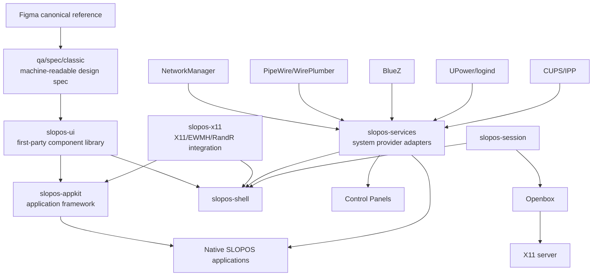
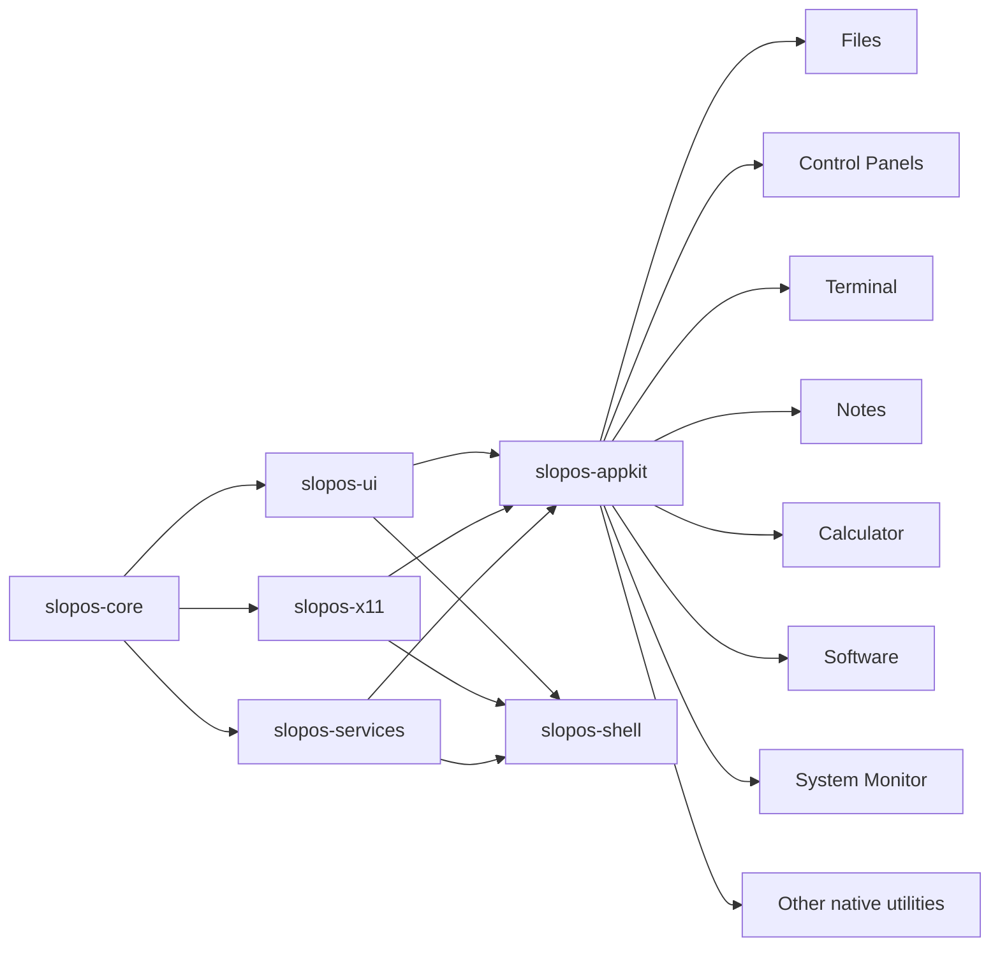
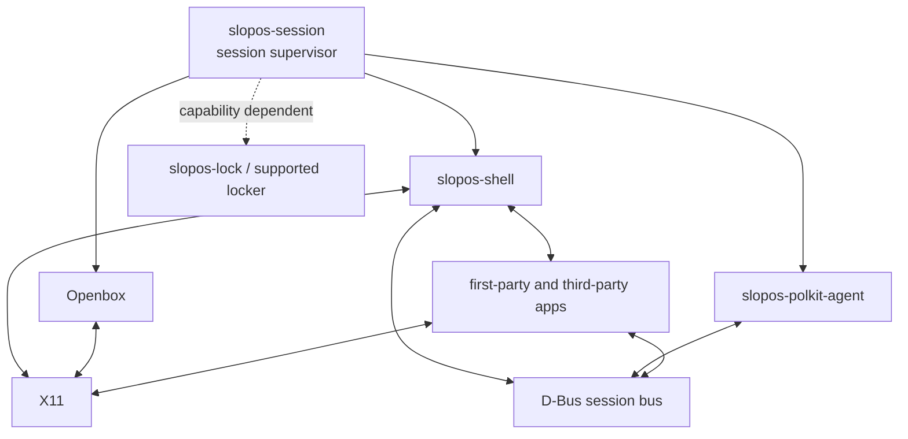
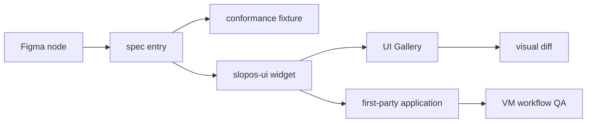
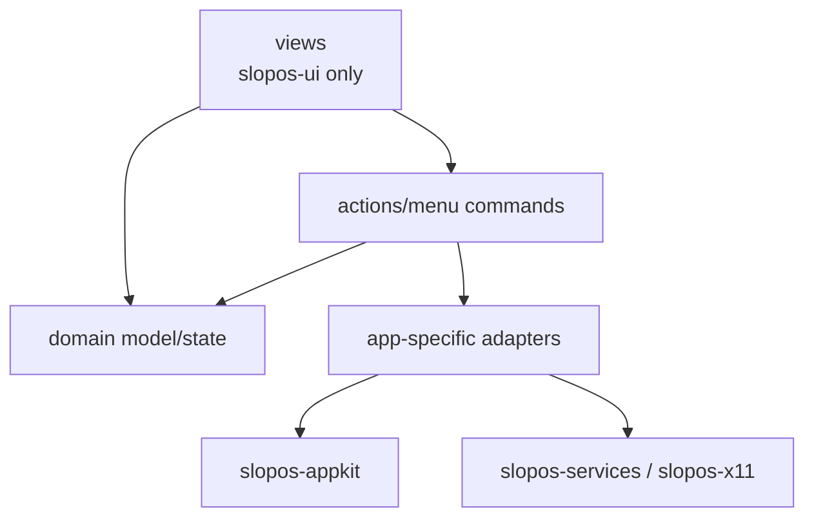

# AGENTS.md — SLOPOS-I Engineering Contract

**Status:** normative  
**Product generation:** SLOPOS-I  
**Primary branch:** `main`  
**Execution target:** Linux/X11 only  
**Canonical visual reference:** Classic Macintosh UI Kit (Community), Figma file `LGMlwNCoVdakZxDBvPKg1W`, root node `0:1`  
**Current audit/evidence ledger:** embedded in Part II of this file

This file is the single authoritative project-wide engineering, planning, audit, and evidence document for SLOPOS-I.

Project-wide architecture, plans, audit findings, readiness state, blockers, QA evidence, and agent instructions belong here. Do **not** create separate project-wide Markdown plans, truth ledgers, roadmaps, audit reports, status files, or design documents.

The only Markdown files permitted outside this file are:
- the root `README.md`;
- scoped project/subproject `README.md` files whose purpose is user/developer orientation for that directory.

A scoped README must not redefine project architecture, readiness, roadmap, or source-of-truth rules. Those belong here.

When old screenshots, old QA reports, stale branches, comments, generated assets, model assumptions, historical plans, or earlier completion claims disagree with this file, this file wins.

SLOPOS-I is not complete because an agent says it is complete. Completion is established only by current evidence tied to the exact source revision.

---

# 1. Product mission

SLOPOS-I is a first-party Linux desktop environment designed to be viable for normal daily use and engineered to the quality level expected of mature environments such as GNOME and KDE while retaining its own deliberately compact Classic-Macintosh-inspired interaction and visual language.

The goal is not to create a themed collection of unrelated GTK applications.

The goal is to create one coherent desktop platform:

```text
SLOPOS design specification
        ↓
SLOPOS UI component library
        ↓
SLOPOS application framework
        ↓
SLOPOS system/platform adapters
        ↓
SLOPOS first-party applications
        ↓
SLOPOS shell + session
        ↓
complete daily-use desktop
```

The system must feel intentional from login to shutdown:

- session startup and recovery;
- desktop composition;
- windows, focus and workspaces;
- global application menus;
- application launching and search;
- file browsing and removable media;
- network, audio, displays, Bluetooth and power;
- settings and defaults;
- clipboard and drag-and-drop;
- notifications;
- screenshots and screen recording;
- file dialogs and application choosers;
- accessibility;
- first-party utilities;
- normal third-party X11 application compatibility;
- packaging, installation, upgrade, removal and recovery.

The product must never contain an enabled control that merely looks functional.

---

# 2. Non-negotiable architectural principle

## 2.1 The UI library comes first

The first architectural dependency of every first-party SLOPOS surface is the SLOPOS UI component library.

The project must create:

```text
crates/slopos-ui
```

before attempting to finish or visually polish the native application suite.

Every visible first-party component is designed as a SLOPOS component.

First-party applications must not independently invent:

- buttons;
- checkboxes;
- radio controls;
- text fields;
- menus;
- list rows;
- scrollbars;
- dialogs;
- alerts;
- toolbars;
- status bars;
- icon grids;
- file items;
- spacing;
- typography;
- focus treatment;
- selection treatment;
- window-content chrome.

Applications consume the component system; they do not define it.

## 2.2 No raw-GTK first-party UI architecture

GTK3/GDK/Pango/GIO may remain mature infrastructure beneath SLOPOS.

They are not the first-party design system.

The intended dependency direction is:

```text
GTK3 / GDK / Pango / GIO / AT-SPI
                 ↓
              slopos-ui
                 ↓
            slopos-appkit
                 ↓
       first-party applications
```

A first-party application crate must not directly build its user interface from arbitrary `gtk::Button`, `gtk::Entry`, `gtk::Dialog`, `gtk::ListBox`, CSS fragments, or ad-hoc layout constants.

Direct GTK/GDK/Pango UI dependencies are permitted only in explicitly designated boundary crates such as:

- `slopos-ui`;
- low-level engine adapters where required;
- compatibility adapters whose API is hidden behind SLOPOS-owned abstractions.

CI must enforce this architectural boundary.

A native application that needs a missing control must stop application work, add the control to `slopos-ui`, bring that control to conformance, and only then continue the application.

## 2.3 "Designed from scratch" definition

"Designed from scratch" means SLOPOS owns:

- geometry;
- measurement;
- padding;
- visual hierarchy;
- colors;
- state appearance;
- interaction state machines;
- focus behavior;
- accessible semantics;
- keyboard behavior;
- hit testing;
- drawing composition;
- public widget API;
- conformance tests.

It does **not** require reimplementing invisible mature infrastructure such as:

- Unicode shaping;
- text rasterization;
- input-method protocols;
- AT-SPI transport;
- terminal escape parsing;
- PDF rendering engines;
- video codecs;
- TLS;
- filesystem syscalls.

SLOPOS owns the user-facing component. Mature engines may remain underneath it.

---

# 3. Scope and non-goals

## 3.1 In scope

SLOPOS-I is:

- Linux-only;
- X11-only for this generation;
- Openbox-based unless an evidence-backed limitation requires another solution;
- implemented primarily in Rust;
- allowed to use GTK3/GDK/Pango/GIO underneath the SLOPOS component system;
- allowed to use mature engines such as VTE, WebKitGTK, Poppler, libarchive and libmpv where appropriate;
- allowed to delegate system ownership to NetworkManager, PipeWire/WirePlumber or PulseAudio-compatible APIs, BlueZ, UPower, systemd/logind, udev, CUPS/IPP and XRandR.

## 3.2 Out of scope

Do not introduce:

- a Wayland session or fallback in SLOPOS-I;
- a custom display server merely for ownership;
- a custom kernel;
- a speculative future SLOPOS generation;
- a general-purpose GUI toolkit unrelated to SLOPOS;
- a persistent bottom dock or retired Application Strip;
- Aqua / modern macOS visual language;
- GNOME/libadwaita card-heavy design;
- KDE Breeze design;
- Windows Fluent design;
- touch-first spacing as the default desktop density;
- fake compatibility;
- fake state;
- fake application actions.

Wayland work remains paused until the X11 product is mature.

---

# 4. Source-of-truth precedence

When requirements disagree, use this order:

1. this engineering contract;
2. the Figma-derived machine-readable SLOPOS design specification;
3. approved clean-room SLOPOS assets and interaction specifications;
4. `slopos-ui` component contracts;
5. implementation;
6. current VM-generated test and visual evidence;
7. historical screenshots, historical QA, old branches and old prose.

The existing files under `qa/reference/` predate the atomic reset. They may remain as historical composition references while the replacement specification is built, but they must not override Figma-derived geometry or component state rules.

No previous numeric readiness score is authoritative.

---

# 5. Canonical visual reference

The canonical visual/component reference is:

- **Classic Macintosh UI Kit (Community)**
- Figma file key: `LGMlwNCoVdakZxDBvPKg1W`
- root node: `0:1`

Treat the Figma file as a component specification, not vague inspiration.

Observed examples from the 2026-09-24 audit include:

- menu bar example: 19 px high;
- menu row example: 16 px high;
- large Finder item example: 71×44 px;
- large Finder icon example: 32×32 px;
- large Finder label region example: 71×12 px;
- regular button example: 80×20 px;
- default button example: 88×28 px;
- secondary button example: 80×16 px;
- explicit Rest / Pressed / Disabled button states;
- Action / Hierarchical menu row variants;
- Active / Hover / Disabled menu states;
- Active / Inactive title-bar variants;
- 1-bit and 8-bit reference variants.

These measurements are examples only. The implementation must extract all relevant component data into the machine-readable specification before claiming exact conformance.

## 5.1 Clean-room rule

SLOPOS may reproduce:

- geometry;
- hierarchy;
- spacing;
- density;
- interaction affordances;
- state treatment;
- visual grammar.

Do not ship:

- Apple logos;
- proprietary Macintosh artwork;
- copied proprietary icons;
- proprietary Apple fonts;
- proprietary sounds;
- copied wallpapers;
- copied documentation text.

Third-party assets or fonts require verified redistribution licenses.

If a reference font cannot legally be redistributed, choose or create a redistributable metrically appropriate replacement and document the decision.

---

# 6. High-level architecture

## 6.1 System architecture



## 6.2 Dependency direction



Higher layers may depend on lower layers. Lower layers must never import application code.

## 6.3 Runtime process topology



## 6.4 UI construction pipeline



No application-specific styling step exists in this pipeline.

---

# 7. Target repository structure

The long-term repository should converge toward this shape:

```text
rust-slopos/
├── Cargo.toml
├── AGENTS.md
├── TRUTH.md
├── README.md
│
├── crates/
│   ├── slopos-core/
│   │   ├── config/
│   │   ├── error/
│   │   ├── ids/
│   │   ├── paths/
│   │   └── ipc/
│   │
│   ├── slopos-ui/
│   │   ├── foundation/
│   │   ├── render/
│   │   ├── input/
│   │   ├── layout/
│   │   ├── primitives/
│   │   ├── controls/
│   │   ├── containers/
│   │   ├── menus/
│   │   ├── dialogs/
│   │   ├── views/
│   │   ├── accessibility/
│   │   ├── theme/
│   │   └── testing/
│   │
│   ├── slopos-appkit/
│   │   ├── application/
│   │   ├── actions/
│   │   ├── menus/
│   │   ├── documents/
│   │   ├── undo/
│   │   ├── clipboard/
│   │   ├── drag_drop/
│   │   ├── file_dialogs/
│   │   ├── recent_items/
│   │   ├── mime/
│   │   ├── state_restore/
│   │   ├── jobs/
│   │   └── errors/
│   │
│   ├── slopos-x11/
│   │   ├── connection/
│   │   ├── ewmh/
│   │   ├── windows/
│   │   ├── monitors/
│   │   ├── randr/
│   │   ├── workspaces/
│   │   ├── clipboard/
│   │   └── input/
│   │
│   ├── slopos-services/
│   │   ├── network/
│   │   ├── audio/
│   │   ├── bluetooth/
│   │   ├── power/
│   │   ├── session/
│   │   ├── timedate/
│   │   ├── displays/
│   │   ├── printers/
│   │   ├── removable_media/
│   │   └── storage/
│   │
│   ├── slopos-session/
│   └── slopos-shell/
│
├── apps/
│   ├── files/
│   ├── control-panels/
│   ├── terminal/
│   ├── notes/
│   ├── calculator/
│   ├── software/
│   ├── system-monitor/
│   ├── screenshot/
│   ├── image-viewer/
│   ├── archive-utility/
│   ├── disks/
│   ├── fonts/
│   ├── help/
│   ├── system-information/
│   ├── media/
│   └── documents/
│
├── utilities/
│   ├── polkit-agent/
│   ├── lock-screen/
│   ├── open-with/
│   ├── default-apps/
│   ├── file-chooser/
│   └── session-dialogs/
│
├── tools/
│   ├── slopos-ui-gallery/
│   ├── slopos-conformance/
│   ├── slopos-qa-driver/
│   └── figma-spec-import/
│
├── qa/
│   ├── spec/
│   │   └── classic/
│   ├── goldens/
│   ├── interaction/
│   ├── journeys/
│   ├── fixtures/
│   └── evidence/
│
├── assets/
├── packaging/
├── scripts/
└── .github/workflows/
```

Existing crates may be migrated incrementally. Do not rename everything at once merely for neatness. Preserve bisectability and working behavior while moving toward this structure.

---

# 8. slopos-core

`slopos-core` contains shared non-UI, non-platform primitives.

It may define:

- application IDs;
- stable IPC identifiers;
- common result/error types;
- XDG path handling;
- configuration serialization;
- version/build metadata;
- resource lookup;
- logging conventions;
- capability descriptors.

It must not depend on GTK.

It must not become a dumping ground for unrelated helpers.

---

# 9. slopos-ui — first-party component library

`slopos-ui` is the foundation of every native SLOPOS interface.

Its public API must make the correct visual language easier than bypassing it.

## 9.1 UI library responsibilities

`slopos-ui` owns:

- all first-party visual tokens;
- all first-party component geometry;
- state rendering;
- input state machines;
- focus behavior;
- accessibility semantics;
- layout primitives;
- icon rendering;
- menu presentation;
- dialog presentation;
- list/table/icon views;
- common content chrome;
- deterministic test rendering.

Applications supply data, actions and domain logic.

Applications do not draw their own design language.

## 9.2 Foundation modules

Required foundation concepts:

```text
foundation/
├── geometry.rs
├── scale.rs
├── metrics.rs
├── insets.rs
├── color.rs
├── typography.rs
├── font_metrics.rs
├── patterns.rs
├── bevel.rs
├── border.rs
├── focus.rs
├── selection.rs
├── icon_metrics.rs
├── animation.rs
└── theme.rs
```

Canonical 1× geometry is the primary coordinate system.

Supported integer HiDPI scaling must preserve deterministic geometry.

Fractional scaling is not required until explicitly added to this contract.

## 9.3 Rendering

Use mature rendering/text infrastructure underneath the SLOPOS API.

Acceptable low-level facilities include:

- Cairo;
- GDK;
- Pango;
- GdkPixbuf;
- GTK widget subclassing/composition where appropriate.

SLOPOS-owned components must not rely on arbitrary distro GTK theme defaults for their canonical appearance.

Pixel-oriented artwork must use pixel-preserving scaling.

Do not use bilinear filtering for reference pixel art where it produces blur.

## 9.4 Required primitive components

At minimum:

- `Surface`
- `Text`
- `Icon`
- `Image`
- `Separator`
- `Rule`
- `PatternFill`
- `Bevel`
- `FocusRing`
- `SelectionHighlight`
- `Spacer`

## 9.5 Required layout components

At minimum:

- `Row`
- `Column`
- `Grid`
- `Overlay`
- `Stack`
- `SplitPane`
- `ScrollView`
- `GroupBox`
- `Inset`
- `Align`
- `FixedCanonicalLayout` for exact reference compositions where appropriate.

Do not use arbitrary magic padding in application crates.

## 9.6 Required input/control components

At minimum:

### Buttons

- Regular Button
- Default Button
- Secondary Button
- Icon Button
- Repeat/Arrow Button where referenced

Required states:

- rest;
- hover if the platform uses hover feedback;
- pressed;
- focused;
- disabled;
- default;
- destructive only if explicitly defined by the SLOPOS language.

### Selection controls

- Checkbox
- Radio Button
- Toggle where a real use case exists
- Disclosure Triangle

Required states include:

- unchecked/unselected;
- checked/selected;
- pressed;
- focused;
- disabled;
- mixed/indeterminate where semantically required.

### Text entry

- Text Field
- Search Field
- Password Field
- Multi-line Text Area
- Numeric Field
- Editable Label where required for file rename

Text-editing implementation may reuse mature GTK text infrastructure internally, but visible geometry, focus, selection, disabled state and surrounding chrome are SLOPOS-owned.

### Choice controls

- Pop-up Button
- Combo/Choice control
- Stepper
- Slider
- segmented control only if the canonical specification explicitly requires one.

### Progress/state controls

- determinate progress;
- indeterminate progress;
- busy indicator if required;
- meter where required.

## 9.7 Required collection/view components

At minimum:

- List View;
- List Row;
- Table View;
- Table Header;
- Tree/Outline View;
- Icon View;
- File Item;
- Desktop Item;
- Empty State;
- Status Row.

Collection components must support keyboard navigation and accessible selection semantics.

## 9.8 Required scrolling components

At minimum:

- Vertical Scrollbar;
- Horizontal Scrollbar;
- Scroll Thumb;
- Scroll Arrow;
- Track;
- Corner/resize affordance where applicable.

Scrolling behavior must be consistent across all native apps.

## 9.9 Required menu components

At minimum:

- Menu Bar;
- Menu;
- Menu Item;
- Hierarchical/Submenu Item;
- Checked Menu Item;
- Radio Menu Item where needed;
- Disabled Menu Item;
- Separator;
- Shortcut/Command label;
- Application menu host;
- Context menu.

Menu state and geometry must derive from the Figma specification.

## 9.10 Required dialog/window-content components

Window-manager decorations are owned by the WM/theme integration, but native window content uses SLOPOS components.

Required:

- Alert;
- Confirmation Dialog;
- Error Dialog;
- Information Dialog;
- Progress Dialog;
- File Open Dialog;
- File Save Dialog;
- Open With Dialog;
- Properties Dialog;
- Preferences/Control Panel content;
- About/System Information content;
- utility-window layout;
- modal/transient host behavior.

## 9.11 Required navigation/content components

Where needed:

- Toolbar;
- Status Bar;
- Path/Location Bar;
- Breadcrumb/Path control if adopted by Files;
- Sidebar only where an explicit application workflow requires it and where it can be reconciled with the canonical visual language;
- Tab strip only where product requirements justify tabs;
- Inspector/Info panel;
- split-view divider.

Do not default to modern sidebars or cards merely because GTK makes them convenient.

## 9.12 Icon system

SLOPOS must define:

- canonical icon sizes;
- device icons;
- folder icons;
- file-type icons;
- action icons;
- status icons;
- application icons;
- high-DPI variants.

Assets must be original or license-compatible.

The UI library controls icon alignment and scaling.

## 9.13 Typography

The library must define shared roles:

- global menu text;
- window/title text;
- body text;
- secondary text;
- list text;
- icon-label text;
- section title;
- utility display text;
- monospace text.

Each role defines:

- family;
- size;
- weight;
- baseline;
- line height;
- scaling rule.

First-party applications may not invent unrelated font sizes.

## 9.14 Accessibility

Every public interactive component must expose:

- accessible role;
- accessible name;
- state;
- selection where applicable;
- keyboard reachability;
- logical focus order;
- disabled semantics.

Accessibility is part of component completion, not a later application patch.

## 9.15 UI Gallery

Create:

```text
tools/slopos-ui-gallery
```

The gallery must display every component and every required state without needing to launch a production application.

It is the canonical component-development environment.

The gallery must support:

- deterministic window size;
- deterministic component fixture data;
- 1× capture;
- integer HiDPI capture;
- keyboard navigation;
- pointer-state tests;
- accessibility inspection;
- stable screenshot names.

No component is complete until it appears in the gallery and its state matrix passes.

---

# 10. Figma-derived machine-readable design specification

Create:

```text
qa/spec/classic/
```

The exact format may be JSON, TOML or another reviewable text format.

It must include:

```text
qa/spec/classic/
├── manifest.*
├── colors.*
├── typography.*
├── metrics.*
├── patterns.*
├── icons.*
├── buttons.*
├── selection-controls.*
├── text-fields.*
├── menus.*
├── scrollbars.*
├── lists.*
├── windows.*
├── file-items.*
└── dialogs.*
```

For each Figma component classify it:

- `REQUIRED`
- `OPTIONAL_VARIANT`
- `NOT_USED`

`NOT_USED` requires a reason.

Each required component/state records as appropriate:

- Figma node/source;
- width;
- height;
- padding;
- margins;
- text baseline;
- icon box;
- border;
- bevel;
- pattern;
- colors;
- state transitions;
- hit target;
- keyboard behavior;
- accessibility semantics.

A completed release may not have required `UNKNOWN` specification entries.

---

# 11. slopos-ui conformance testing

For every required atom/state produce:

- specification fixture;
- rendered fixture;
- geometry assertion;
- state assertion;
- accessibility assertion;
- visual comparison where useful.

Geometry has zero tolerance unless a documented platform-specific exception exists.

Anti-aliased text may use a fixed justified raster threshold, but geometry remains exact.

Do not increase tolerance merely to pass a regression.

Goldens must never auto-update during normal CI.

Changing a golden requires an explicit reviewed specification change.

---

# 12. slopos-appkit — native application framework

`slopos-appkit` is the common application layer above `slopos-ui`.

It prevents every native application from separately reinventing normal desktop behavior.

## 12.1 Application lifecycle

Provide:

- stable application identity;
- single-instance policy where appropriate;
- open-file/open-URI dispatch;
- new-window behavior;
- quit lifecycle;
- session shutdown handling;
- state restoration hooks;
- clean error propagation.

## 12.2 Action/command model

All native apps use a real action model.

Actions define:

- ID;
- label;
- enabled state;
- checked/stateful value where needed;
- shortcut;
- callback;
- menu visibility.

The same action must back:

- menu entries;
- toolbar entries;
- keyboard shortcuts;
- contextual commands.

Do not duplicate action logic across UI surfaces.

## 12.3 Global menu export

Native SLOPOS apps must export their menu/action model in the one supported application-menu architecture so `slopos-shell` can display the same real actions in the global menu bar.

No guessed keyboard injection is allowed.

## 12.4 Standard application services

Provide shared APIs for:

- clipboard;
- drag-and-drop;
- undo/redo;
- recent files;
- MIME/default apps;
- file open/save dialogs;
- open-with dialogs;
- error presentation;
- background jobs;
- progress/cancellation;
- notifications;
- preferences;
- persistent window geometry;
- restoration of documents/windows;
- application help;
- About integration.

## 12.5 Document model

For document-based apps define a reusable document lifecycle:

```text
new
→ edited
→ save/save-as
→ clean
→ external modification handling
→ close
```

Support:

- unsaved-change confirmation;
- autosave/recovery where appropriate;
- atomic writes;
- recent documents;
- reopen;
- failure recovery.

## 12.6 Asynchronous work

Long-running work must not block the UI event loop.

Use cancellable jobs for:

- filesystem operations;
- network operations;
- installation;
- archive operations;
- thumbnail generation;
- media metadata;
- document rendering.

Standardize progress/error/cancellation presentation.

---

# 13. Platform integration libraries

## 13.1 slopos-x11

Maintain one authoritative X11 layer using `x11rb` and stable X11 mechanisms.

It owns:

- active window;
- EWMH state;
- root properties;
- window metadata;
- workspaces;
- monitor/RandR model;
- work area;
- placement;
- input integration where appropriate;
- clipboard/selection integration where appropriate.

Do not use `xdotool`, `xprop`, `wmctrl` or `xrandr` as high-frequency polling infrastructure.

Tests may use those tools to drive an isolated VM session.

## 13.2 slopos-services

System providers must be typed and testable.

Required provider modules:

- NetworkManager;
- audio;
- BlueZ;
- UPower/logind;
- timedate;
- display/RandR;
- CUPS/IPP printers;
- removable media/udisks/GIO;
- storage;
- session;
- default applications;
- MIME database;
- desktop entry/application index.

Providers expose real state and real actions.

No provider may return sample state in production.

Fixtures are allowed only behind test-only code paths.

---

# 14. SLOPOS shell

`slopos-shell` is a first-party application of the same design system, not a separate visual universe.

It must consume `slopos-ui`.

The shell owns:

- global top menu bar;
- system menu;
- application-menu host;
- desktop surface integration;
- desktop objects;
- launcher/search;
- notifications;
- workspace integration;
- session actions;
- status items;
- global keyboard shortcuts.

The shell must not create its own duplicate versions of controls that already exist in `slopos-ui`.

## 14.1 Global menu

There must be exactly one application-menu bridge.

Native SLOPOS applications export their real action model.

Third-party applications may be integrated only when they expose a supported real menu/action protocol.

If a third-party app does not export one:

- leave its own local menu intact; or
- expose only guaranteed shell/window actions.

Do not fabricate Cut/Copy/Paste/Select All by blindly injecting shortcuts.

## 14.2 Desktop

The desktop supports:

- desktop objects;
- selection;
- keyboard navigation;
- drag/drop;
- Trash;
- mounted volumes where exposed;
- context menus;
- wallpaper;
- multi-monitor placement.

PCManFM may remain temporarily during migration but is not the final source of first-party desktop UI if it prevents conformance.

## 14.3 Notifications

Implement the freedesktop notification protocol truthfully.

Support:

- stable notification IDs;
- replacement/update;
- expiry;
- close;
- application attribution;
- actions only where correctly supported;
- monitor-aware placement;
- do-not-disturb policy if added.

---

# 15. First-party application suite

A mature SLOPOS desktop needs a coherent set of native applications. The applications below are the canonical first-party product inventory.

Applications are divided into release-critical core applications and extended daily-use applications.

Every first-party application must use `slopos-ui` through `slopos-appkit` unless explicitly documented as a lower-level system utility.

---

# 16. Release-critical core applications

These applications are required for a first-class SLOPOS desktop release.

## 16.1 SLOPOS Files

Target path:

```text
apps/files
```

Purpose: first-party file management and desktop filesystem interaction.

Required functionality:

- directory navigation;
- back/forward/up;
- location/path navigation;
- icon view;
- list view if included;
- keyboard navigation;
- single/multiple selection;
- open;
- default-application/MIME launch;
- rename;
- new folder;
- create supported basic files where exposed;
- copy;
- cut/move;
- paste;
- duplicate if exposed;
- Trash;
- restore from Trash if exposed;
- empty Trash;
- permanent-delete confirmation;
- file/folder properties;
- context menus;
- drag-and-drop;
- hidden files;
- filesystem change watching;
- error handling;
- removable volumes;
- mount/unmount/eject where supported;
- thumbnailing where appropriate;
- network mounts if exposed.

Suggested mature backends:

- GIO/GVfs;
- freedesktop MIME database;
- udisks/GIO volume APIs.

PCManFM is a temporary migration dependency only if it cannot meet the final visual/interaction contract.

## 16.2 SLOPOS Control Panels

Target path:

```text
apps/control-panels
```

This replaces the current first-party Settings UI architecture.

Required panels for production daily use:

### Desktop and appearance
- Appearance
- Desktop / Wallpaper
- Fonts
- Notifications
- Default Applications

### Hardware
- Displays
- Sound
- Keyboard
- Mouse
- Touchpad where present
- Bluetooth
- Printers

### Connectivity
- Network
- Wi-Fi
- Wired
- VPN integration through NetworkManager where available
- Proxy if supported by platform policy

### System
- Power
- Date & Time
- Region & Language
- Users
- Storage
- Removable Media
- Autostart / Session
- Keyboard Shortcuts
- Accessibility
- About / System Information entry point

Every panel reads real provider state.

No sample SSIDs, IPs, device names, volume values or hardware state may appear in production.

## 16.3 SLOPOS Terminal

Target path:

```text
apps/terminal
```

Use a mature terminal engine such as VTE.

SLOPOS owns:

- window;
- menus;
- tabs if supported;
- preferences;
- keyboard shortcut model;
- appearance;
- dialogs;
- search UI;
- profile UI.

Required:

- shell launch;
- terminal resize;
- scrollback;
- copy/paste;
- selection;
- search;
- Unicode;
- IME compatibility;
- links;
- working-directory launch;
- command exit behavior;
- accessibility;
- tabs only if completed coherently.

Do not write a terminal emulator parser from scratch.

## 16.4 SLOPOS Notes

Target path:

```text
apps/notes
```

Purpose: lightweight first-party writing and text-note application.

Required:

- new/open;
- save/save-as;
- plain text;
- Unicode;
- undo/redo;
- cut/copy/paste;
- find;
- basic formatting only if explicitly supported;
- modified-document warning;
- autosave/recovery if adopted;
- recent documents;
- drag/drop file opening;
- print only when genuinely implemented.

It may later support Markdown, but unsupported formatting controls must not be exposed.

## 16.5 SLOPOS Calculator

Target path:

```text
apps/calculator
```

Calculator is both a real utility and an early conformance proving ground.

Required:

- keyboard and pointer input;
- basic arithmetic;
- decimal;
- sign;
- clear;
- backspace;
- operator precedence policy documented/tested;
- divide-by-zero/error state;
- copy result;
- predictable focus.

Its UI must be composed entirely from `slopos-ui`.

## 16.6 SLOPOS Software

Target path:

```text
apps/software
```

This evolves from `slopos-catalogue`.

It manages SLOPOS-curated application delivery according to the release policy.

Required:

- catalogue search;
- application detail;
- install;
- integrity verification;
- launch;
- uninstall;
- version display;
- error reporting;
- background/cancellable downloads;
- progress;
- architecture validation.

Distribution package management remains owned by the base distribution unless the product contract explicitly expands scope.

## 16.7 SLOPOS System Monitor

Target path:

```text
apps/system-monitor
```

Required:

- process list;
- CPU usage;
- memory usage;
- storage activity where practical;
- network activity where practical;
- per-process resource state;
- search/filter;
- terminate process;
- force-kill with confirmation;
- process details;
- refresh without UI stalls.

Use procfs/sysfs and stable system APIs.

## 16.8 SLOPOS Screenshot & Recorder

Target path:

```text
apps/screenshot
```

Required:

- full screen;
- selected window;
- selected region;
- clipboard/save;
- configurable delay;
- multi-monitor awareness;
- predictable filename;
- visible success/error feedback.

Screen recording should be implemented using a mature capture stack such as PipeWire/FFmpeg/GStreamer where viable on X11.

Do not ship a Record control until recording is functional.

## 16.9 SLOPOS System Information / About

Target path:

```text
apps/system-information
```

Required:

- SLOPOS version;
- source/build revision where appropriate;
- OS;
- kernel;
- architecture;
- CPU;
- memory;
- storage summary;
- graphics/display information where available;
- X11/session information;
- license/credits.

Every displayed value must be real.

This app also provides the canonical compact About composition required for visual QA.

---

# 17. Extended first-party daily-use applications

These are part of the target SLOPOS application suite. They may be implemented after the release-critical core is stable, but they must follow the same architecture.

## 17.1 SLOPOS Image Viewer

Target:

```text
apps/image-viewer
```

Required:

- common image formats through mature loaders;
- next/previous;
- zoom;
- fit;
- actual pixels;
- rotate where supported;
- fullscreen;
- file metadata;
- copy;
- set as wallpaper integration where appropriate.

## 17.2 SLOPOS Archive Utility

Target:

```text
apps/archive-utility
```

Use mature engines such as `libarchive`.

Required:

- inspect common archive formats;
- extract;
- create supported archive formats;
- drag/drop integration;
- overwrite/conflict handling;
- path traversal protection;
- progress/cancel;
- error reporting.

Files should invoke it transparently for archive operations.

## 17.3 SLOPOS Disks

Target:

```text
apps/disks
```

Purpose: storage inspection and safe user-level disk operations.

Use mature storage APIs such as UDisks2.

Required scope may include:

- device/partition information;
- mount/unmount;
- eject;
- SMART information where safely available;
- filesystem usage;
- formatting only when properly authorized and guarded by explicit destructive confirmations.

Destructive functionality must not be enabled until thoroughly tested.

## 17.4 SLOPOS Fonts

Target:

```text
apps/fonts
```

Required:

- browse installed fonts;
- preview;
- metadata;
- install user font;
- remove user-installed font;
- refresh font cache;
- clear distinction between system-owned and user-owned fonts.

## 17.5 SLOPOS Help

Target:

```text
apps/help
```

Required:

- offline-first SLOPOS help;
- searchable topics;
- keyboard navigation;
- deep links from applications/settings;
- release-appropriate troubleshooting;
- no stale generated feature claims.

## 17.6 SLOPOS Media

Target:

```text
apps/media
```

Use a mature media engine such as libmpv or GStreamer.

SLOPOS owns:

- menus;
- transport controls;
- playlist;
- open dialogs;
- subtitles/audio track UI;
- fullscreen UI;
- preferences.

Do not implement codecs from scratch.

## 17.7 SLOPOS Documents

Target:

```text
apps/documents
```

Purpose: PDF/document viewing.

Use a mature rendering engine such as Poppler for PDF.

Required:

- open;
- page navigation;
- zoom;
- search;
- thumbnails if implemented;
- print only if fully integrated;
- metadata;
- keyboard navigation.

## 17.8 SLOPOS Browser — optional ecosystem application

A first-party browser shell may be built only around a maintained secure engine such as WebKitGTK.

Do not build a browser engine.

Until this application exists and meets security/update expectations, SLOPOS must integrate established browsers such as Firefox/Chromium cleanly.

A browser is not allowed to delay core desktop correctness.

---

# 18. System utilities and agents

These are not ordinary document applications but are necessary for a mature desktop.

## 18.1 Authentication agent

Target:

```text
utilities/polkit-agent
```

Provide a SLOPOS-native Polkit authentication UI backed by the real Polkit agent API.

Required:

- requesting application/action identity;
- password prompt;
- cancellation;
- error state;
- correct secure entry;
- no credential logging.

## 18.2 Lock screen

Target:

```text
utilities/lock-screen
```

SLOPOS may initially use a mature external locker if necessary.

A first-party lock screen becomes acceptable only when:

- PAM/authentication path is correct;
- secure keyboard handling is reviewed;
- failure cannot expose the session;
- multi-monitor behavior is correct;
- suspend/resume behavior is correct.

Security takes priority over ownership.

## 18.3 File chooser

Native SLOPOS apps use a SLOPOS file chooser implemented through `slopos-appkit` and `slopos-ui`.

It must support:

- open;
- save;
- folder selection;
- filters;
- recent locations;
- filename validation;
- overwrite confirmation;
- keyboard operation.

Third-party GTK apps may continue using GTK dialogs unless a safe toolkit integration mechanism exists.

## 18.4 Open With / Default Apps

Provide:

- application chooser;
- default association selection;
- MIME-aware candidate list;
- persistent default update;
- one-time open without changing default.

## 18.5 Session dialogs

Provide SLOPOS-native:

- Log Out;
- Restart;
- Shut Down;
- Sleep confirmation where appropriate.

Actions must use real logind/session provider capability checks.

## 18.6 Crash/error presentation

Unexpected first-party application failures should produce useful logs and recoverable user-facing errors where practical.

Do not silently restart forever or hide repeated failure.

---

# 19. Native application anatomy

Every native application should follow a common internal structure:

```text
apps/<name>/
├── Cargo.toml
├── src/
│   ├── main.rs
│   ├── app.rs
│   ├── actions.rs
│   ├── menu.rs
│   ├── model/
│   ├── services/
│   ├── views/
│   └── tests/
└── resources/
```

Recommended layering:



Views must not directly shell out to command-line tools.

Views must not contain system-provider logic.

---

# 20. Architectural enforcement

Add automated architecture tests.

At minimum enforce:

- first-party app crates do not directly depend on `gtk`, `gdk`, `pango` or arbitrary CSS files;
- first-party app UI goes through `slopos-ui`/`slopos-appkit`;
- duplicated UI constants are rejected where practical;
- production source does not contain known fixture/sample SSIDs, IP addresses or hardware labels;
- there is one global-menu implementation;
- no new `xdotool` runtime application-action injection;
- no enabled empty callbacks;
- no TODO placeholder controls in release-visible code.

Exceptions require an explicit comment in this contract or a reviewed architecture exception file.

---

# 21. Migration strategy from the current tree

The current implementation is a functional donor, not the final UI architecture.

Do not rewrite everything in one commit.

Use this sequence.

## Phase 0 — preserve current behavior and freeze visual expansion

- no new ad-hoc GTK first-party surfaces;
- fix only critical regressions in legacy UI;
- keep existing shell/session usable while the new stack is built.

## Phase 1 — design specification

- extract Figma components;
- create `qa/spec/classic`;
- define typography, metrics, patterns, colors and states;
- define legal clean-room assets.

## Phase 2 — slopos-ui foundation

Implement:

- geometry;
- typography;
- drawing;
- icons;
- focus;
- selection;
- layouts;
- accessibility base.

## Phase 3 — atomic controls

Implement and validate:

- buttons;
- checkboxes/radios;
- text fields;
- lists;
- menus;
- scrollbars;
- dialogs;
- icon/file items.

Build `slopos-ui-gallery`.

## Phase 4 — slopos-appkit

Implement:

- application lifecycle;
- action/menu model;
- global-menu export;
- file dialogs;
- clipboard;
- drag/drop;
- undo/redo;
- document lifecycle;
- jobs/errors;
- state restoration.

## Phase 5 — small proof applications

Build native:

1. Calculator;
2. System Information/About.

These must prove the stack before larger apps migrate.

## Phase 6 — Files

Build the first-party file manager.

Do not retain PCManFM as the permanent first-party file UI if it cannot meet the contract.

## Phase 7 — Control Panels

Replace the current Settings presentation with `slopos-ui`.

At the same time replace fake/sample provider state.

## Phase 8 — Terminal and Notes

Build daily-use core apps on the common framework.

## Phase 9 — Shell migration

Move shell-owned visible surfaces onto `slopos-ui`:

- top bar;
- menus;
- launcher;
- notifications;
- dialogs.

## Phase 10 — Software and System Monitor

Migrate Software Catalogue and implement System Monitor.

## Phase 11 — extended utilities

Implement:

- Screenshot/Recorder;
- Image Viewer;
- Archive Utility;
- Disks;
- Fonts;
- Help;
- Media;
- Documents.

## Phase 12 — integrated daily-use acceptance

Run complete desktop workflows in the Linux VM.

Only after this phase can broad production-readiness claims be considered.

---

# 22. System providers and truthful state

An enabled control must execute the behavior it advertises.

A stateful control must display real state.

## 22.1 Network

Use NetworkManager APIs/D-Bus.

Support real:

- Ethernet adapters;
- Wi-Fi adapters;
- Wi-Fi enabled state;
- AP enumeration;
- SSID;
- signal;
- security;
- active connection;
- IP information;
- connect/disconnect;
- errors;
- VPN entries where supported.

No synthetic production networks.

## 22.2 Audio

Use the active PipeWire/WirePlumber/PulseAudio-compatible APIs.

Support:

- outputs;
- default output;
- volume;
- mute;
- inputs;
- default input;
- microphone level;
- microphone mute;
- device hotplug.

Read back changes.

## 22.3 Bluetooth

Use BlueZ D-Bus.

Support:

- adapter availability;
- power;
- discovery;
- device list;
- pairing;
- connect/disconnect;
- trusted/paired state where exposed.

## 22.4 Power

Use UPower/logind.

Support:

- battery status;
- charge;
- power source;
- suspend capability;
- lid behavior where supported;
- power profiles only when provider support is real.

## 22.5 Date/time

Prefer `org.freedesktop.timedate1`.

Support:

- current timezone;
- current NTP state;
- real date/time;
- authorized changes;
- permission errors.

## 22.6 Displays

Use XRandR/X11 state.

Support:

- real outputs;
- modes;
- current mode;
- layout;
- primary display;
- rotation where supported;
- apply and rollback on failure;
- hotplug.

## 22.7 Printers

Use CUPS/IPP.

Support:

- printer discovery;
- queue status;
- default printer;
- jobs;
- add/remove only when correctly authorized.

## 22.8 Removable media

Use GIO/UDisks2 as appropriate.

Support:

- mount;
- unmount;
- eject;
- errors;
- volume labels;
- safe removal.

---

# 23. Window management and X11

Openbox provides ICCCM/EWMH window management.

SLOPOS integration must support:

- overlapping windows;
- predictable focus;
- drag and resize;
- minimize;
- maximize;
- restore;
- fullscreen;
- transient/modal relationships;
- Alt+Tab;
- workspaces;
- top-bar reserved area;
- multi-monitor placement;
- dynamic monitor changes;
- integer HiDPI.

If Openbox prevents a required behavior:

1. reproduce the limitation;
2. document it;
3. test alternatives;
4. change architecture only with evidence.

Never lower the UI specification merely to match Openbox limitations.

---

# 24. Multi-monitor and scaling

Maintain an explicit monitor model.

Define which monitor owns:

- primary menu bar;
- launcher;
- notifications;
- desktop objects;
- new first-party dialogs.

Respond to RandR topology changes without restarting the session.

Fullscreen apps must not be obstructed.

Canonical geometry is 1×.

Support integer scaling predictably.

---

# 25. Accessibility

Production quality requires accessibility parity as a core feature.

At minimum:

- AT-SPI names/roles/states;
- keyboard-only navigation;
- logical focus order;
- visible focus;
- screen-reader-compatible labels;
- accessible collection selection;
- disabled-state semantics;
- high-contrast mode only if fully specified;
- scalable text policy without layout corruption.

Accessibility must be tested in the UI library and again in application workflows.

---

# 26. Application interoperability

SLOPOS must remain a good Linux citizen.

Support:

- `.desktop` entries;
- XDG MIME applications;
- default applications;
- XDG user directories;
- XDG autostart;
- clipboard;
- drag/drop;
- notifications;
- X11 ICCCM/EWMH;
- standard D-Bus services;
- portals only where useful on X11 and supported.

Third-party apps must remain usable even when they cannot adopt SLOPOS global menus or styling.

---

# 27. Visual acceptance

Required current composed scenes include:

- UI Gallery component sheets;
- empty desktop;
- menu open;
- Files;
- Control Panels;
- Terminal;
- Notes;
- Calculator;
- System Information/About;
- launcher;
- notification;
- modal alert;
- Software;
- System Monitor;
- representative upstream GTK application;
- representative ordinary X11 application.

Required resolutions:

- 800×600 canonical composition;
- 1280×800;
- 1920×1080;
- 3440×1440;
- supported integer HiDPI.

The 800×600 canonical scene must be produced by real components, not a mockup.

---

# 28. Mandatory VM-only execution policy

This applies to every local human or autonomous coding agent.

## 28.1 Native host restrictions

The native host may be used only for:

- reading/editing source and docs;
- Git operations;
- launching/managing a hypervisor;
- copying final artifacts;
- checking host free disk space.

Do not execute SLOPOS project code on the native host.

Forbidden on the host:

- `cargo build`;
- `cargo test`;
- `cargo run`;
- `cargo clippy`;
- SLOPOS binaries;
- repo QA scripts;
- package builds;
- ISO/image builds;
- X11 runtime tests;
- visual QA;
- project Docker/Podman QA as a substitute for a VM.

Formatting/lint/test validation also runs in the Linux guest.

## 28.2 Required Linux guest

All local compilation, execution and visual QA must occur inside a Linux VM hosted by one of:

- UTM;
- QEMU;
- VirtualBox;
- VMware.

Ubuntu LTS is preferred for normal development.

Debian or Arch guests may be used for distribution-specific acceptance.

The compiled working tree must live on guest storage.

Do not place `target/`, package caches, build directories or QA scratch output on host shared folders.

## 28.3 Graphical QA

Primary visual QA must run in a real graphical X11 session inside the VM.

Xvfb/container tests may run **inside the VM** as deterministic secondary tests.

They do not replace graphical VM acceptance.

## 28.4 Hosted CI

Hosted CI supplements local VM evidence and may be the canonical release-artifact builder.

Hosted CI does not authorize local native-host execution.

---

# 29. Disk-space safety policy

Before compilation or QA record:

- host free space;
- guest free space;
- repository size;
- `target/` size if present;
- QA artifact size;
- Cargo cache size when material.

## 29.1 Routine development budget

Before a routine build/test run:

- host free space >= 20 GiB;
- guest free space >= 12 GiB.

If below threshold, do not begin a large build.

Clean only known SLOPOS-owned guest data or expand/move the VM.

## 29.2 Release/media budget

Before package, ISO, architecture-image or installed-VM generation:

- host free space >= 30 GiB;
- guest free space >= 25 GiB.

Prefer a dedicated larger guest/build volume.

## 29.3 Storage discipline

Use:

- sparse virtual disks;
- one maintained development VM rather than many full copies;
- snapshots sparingly;
- guest-local `CARGO_TARGET_DIR`;
- bounded QA retention;
- compressed archived evidence where useful.

Clean stale guest-only:

- obsolete `target/`;
- old package staging;
- old ISO/image output;
- superseded screenshots;
- package caches when required;
- disposable container caches.

Never perform broad cleanup of unrelated host data.

Never delete unrelated VM images.

---

# 30. Development quality gates

Routine development gates must include:

- `cargo fmt --all -- --check`;
- `cargo clippy --workspace --all-targets -- -D warnings`;
- `cargo test --workspace`;
- script syntax checks;
- architecture-boundary tests;
- UI atomic conformance;
- interaction tests;
- X11 integration;
- accessibility;
- representative visual regression.

All local invocations occur inside the Linux VM.

Mandatory failures must fail.

Do not mask required errors with `|| true`.

---

# 31. Required end-to-end daily-use journeys

A production-ready desktop must pass workflows, not just unit tests.

## Session

```text
login/session start
→ desktop
→ shell healthy
→ launch apps
→ logout
→ clean shutdown
```

## Applications

```text
launcher
→ search
→ keyboard selection
→ launch
→ global menu
→ switch
→ minimize
→ maximize
→ restore
→ close
```

## Files

```text
open Files
→ navigate
→ create folder
→ create/open document
→ rename
→ copy
→ move
→ Trash
→ restore where supported
→ empty Trash
→ removable media
```

## Network

```text
Control Panels
→ real adapters
→ Wi-Fi state
→ AP list
→ connect/disconnect fixture or real network
→ read-back
```

## Audio

```text
Control Panels
→ actual output
→ volume
→ mute
→ input
→ mic level
→ read-back
```

## Displays

```text
detect monitor
→ available modes
→ apply supported mode
→ verify
→ recover/rollback
```

## Documents

```text
Notes
→ edit
→ save
→ reopen
→ modify
→ unsaved close prompt
→ recover from error
```

## Terminal

```text
launch
→ shell prompt
→ type command
→ output
→ select/copy/paste
→ search
→ exit
```

## Screenshot

```text
capture region/window/screen
→ preview/save/clipboard
→ verify output
```

## Software

```text
search
→ install trusted fixture
→ verify integrity
→ launch
→ uninstall
```

---

# 32. Release engineering

Source installation is not consumer readiness.

Release engineering must eventually prove:

- Debian/Ubuntu package;
- Arch package;
- clean install;
- upgrade;
- removal;
- X11 session registration;
- exact source provenance;
- checksums;
- bootable x86_64 media;
- boot to usable SLOPOS;
- installation from release artifact;
- post-install app launch;
- rollback/recovery where applicable.

Public package repositories may be advertised only after they actually exist and are signed and tested.

Architecture support is evidence-based.

ARM64 or RISC-V is not "supported" merely because a manifest names it.

---

# 33. No-cheating rules

Do not achieve a passing state by:

- weakening the specification;
- raising diff tolerance to hide regressions;
- deleting required tests;
- hard-coding test results into production;
- replacing a real workflow with a mock;
- screenshotting a mockup;
- using old screenshots as current evidence;
- marking UNKNOWN as PASS;
- silently disabling required behavior;
- changing goldens to match incorrect output;
- claiming an upstream limitation without evidence;
- inventing hardware/system state;
- self-awarding completion;
- adding application-specific CSS to hide missing UI-library work;
- bypassing `slopos-ui` to finish an app faster.

A required feature may be removed only through an explicit product-contract change.

---

# 34. Documentation and single-source truth

`AGENTS.md` is the single project-wide source of truth.

It contains both:
- **Part I — normative engineering/product contract**: what SLOPOS must become and the rules agents must follow;
- **Part II — current audit/evidence ledger**: what is actually true on the present tree.

`README.md` describes only user-visible behavior that exists and links back to this file for architecture/readiness details.

Scoped subproject `README.md` files may document:
- how to build/use that subproject;
- its public API;
- directory-local developer orientation;
- narrowly scoped operational instructions.

They must not contain competing:
- product roadmaps;
- readiness scores;
- audit ledgers;
- architectural authority;
- global design specifications;
- release claims.

Do not create new Markdown files such as:
- `TRUTH.md`;
- `ROADMAP.md`;
- `PLAN.md`;
- `STATUS.md`;
- `AUDIT.md`;
- `DESIGN.md`;
- `ARCHITECTURE.md`;
- dated QA/evidence Markdown reports.

Put that information into the appropriate section of this file instead.

When a task materially changes implementation truth, the same change set should update **Part II** with:
- exact audited commit/revision;
- static evidence;
- VM-executed evidence;
- CI evidence;
- visual evidence;
- known fake/placeholder behavior;
- visual deviations;
- blockers;
- VM/hypervisor environment;
- relevant disk-space observations;
- claims that are and are not currently justified.

Never preserve a score or PASS state from another revision without fresh evidence.

Historical conflicting Markdown should be removed rather than retained as noise. Git history is the archive.

---

# 35. Definition of component completion

A `slopos-ui` component is complete only when:

- its spec entry exists;
- geometry is defined;
- states are defined;
- behavior is defined;
- keyboard behavior is defined;
- accessibility is defined;
- implementation exists;
- UI Gallery fixture exists;
- unit/state tests pass;
- visual conformance passes;
- HiDPI behavior passes.

"Looks correct in one screenshot" is not completion.

---

# 36. Definition of application completion

A first-party application is complete only when:

- it uses `slopos-ui`/`slopos-appkit`;
- no ad-hoc raw GTK presentation remains except approved engine adapters;
- every enabled action works;
- data shown is real;
- errors are visible;
- keyboard workflow passes;
- accessibility passes;
- application/global menu actions are real;
- persistence works;
- failure cases are tested;
- visual QA passes;
- end-to-end VM journey passes.

---

# 37. Definition of SLOPOS-I production readiness

SLOPOS-I may be described as production-ready for daily use only when all of the following are simultaneously true.

## UI platform

- Figma-derived design specification complete;
- `slopos-ui` complete for all required components;
- `slopos-ui-gallery` complete;
- atomic conformance green;
- no first-party ad-hoc toolkit UI remains.

## Application platform

- `slopos-appkit` provides common application behavior;
- global actions/menus are real;
- file dialogs, clipboard, drag/drop and MIME handling pass;
- state restoration/error handling pass.

## Core applications

Release-critical applications pass:

- Files;
- Control Panels;
- Terminal;
- Notes;
- Calculator;
- Software;
- System Monitor;
- Screenshot/Recorder for exposed functionality;
- System Information/About.

## Shell

- menu bar;
- launcher;
- desktop;
- notifications;
- workspaces;
- session actions;
- global menu;
- multi-monitor;
- fullscreen

all pass.

## System integration

- Network;
- Audio;
- Displays;
- Bluetooth;
- Power;
- Date/Time;
- Input;
- Printers where shipped;
- Removable Media

all report real state and pass real/fixture actions.

## Quality

- fmt;
- clippy;
- tests;
- UI conformance;
- interaction tests;
- accessibility;
- VM runtime;
- visual QA;
- release-candidate packaging

all pass.

## Release

- consumer artifacts exist;
- installation is verified;
- upgrade/removal is verified;
- published documentation matches reality;
- no release-blocking defect remains.

The only valid terminal states for a full autonomous completion task are:

- `COMPLETE` — every required gate has current evidence;
- `BLOCKED` — all possible work is complete, but a precisely identified external dependency prevents a remaining required gate.

There is no "close enough" completion state.


---

# Part II — Current Audit and Evidence Ledger

This part is descriptive, not aspirational. It records what is actually known about the current implementation and must be updated as implementation evidence changes.

## A. Audit identity

**Ledger refresh date:** 2026-09-25  
**Current main revision at consolidation start:** `19ad06b4a77c9b092f6886b5502e15f8fdc27129`  
**Last production-code baseline statically audited:** `a39dc523526dde0d02736ac29134c6af2cd63d3b`  
**Intervening PRs #11 and #12:** documentation/reference-contract changes only; the production-code findings below therefore still apply unless later code commits supersede them.  
**Audit type represented here:** static source audit plus Figma metadata inspection.  
**Fresh compliant Linux-VM build/runtime evidence:** none yet.  
**Production readiness:** NOT PROVEN.  
**Completion state:** NOT COMPLETE.

No SLOPOS code was compiled or executed while producing the documentation/consolidation audit because Part I requires all local project execution to occur inside a compliant Linux VM.

## B. Current implementation shape

The current Cargo workspace still contains the legacy first-party crates:

- `crates/slopos-session`;
- `crates/slopos-shell`;
- `crates/slopos-catalogue`;
- `crates/slopos-settings`.

The target platform crates and native-app structure defined in Part I, including `slopos-ui`, `slopos-appkit`, `slopos-core`, `slopos-services`, `slopos-x11`, and the `apps/` suite, are not yet implemented as the final architecture.

The current Rust GTK stack is GTK3-era:

- `gtk = 0.18`;
- `gdk = 0.18`;
- `glib = 0.18`;
- `gio = 0.18`;
- `gdk-pixbuf = 0.18`;
- `pango = 0.18`.

X11 integration uses `x11rb`.

The current runtime architecture is still broadly:

```text
Linux services
  ↓
X11
  ↓
Openbox
  ↓
slopos-session
  ↓
slopos-shell
  ├─ global menu/system bar
  ├─ launcher/search
  ├─ notifications
  └─ desktop integration
  ↓
slopos-settings / slopos-catalogue / third-party X11 apps
```

This remains an acceptable migration base, but it is not the final first-party application/UI architecture specified in Part I.

## C. Design-system truth

The Figma Classic Macintosh UI Kit is now the visual/component authority.

The existing files under `qa/reference/` are legacy/non-normative composition references.

A complete Figma-derived machine-readable specification under `qa/spec/classic/` does not yet exist.

Therefore:

- exact atom inventory: NOT COMPLETE;
- canonical token extraction: NOT COMPLETE;
- canonical component state matrix: NOT COMPLETE;
- `slopos-ui`: NOT IMPLEMENTED as the required final component platform;
- `slopos-ui-gallery`: NOT IMPLEMENTED;
- atomic visual conformance: NOT PROVEN.

## D. Visual audit findings

### D.1 Current GTK styling is internally mixed

The current CSS still contains modern styling inconsistent with the strict Figma-derived Classic contract, including observed examples such as:

- approximately 26 px top-bar minimum height rather than the observed 19 px Figma menu-bar example;
- generic buttons with rounded corners;
- rounded menus/popovers;
- large soft shadows;
- rounded launcher/search surfaces;
- rounded notifications/alerts;
- tooltip rounding;
- legacy card-like control-panel styling.

Some later rules moved toward harder-edged classic controls, but the stylesheet is not yet generated from one canonical token/component system.

**Current canonical visual conformance:** FAIL / reconstruction required.

### D.2 Window chrome

Openbox currently has classic-oriented theme rules with:

- compact borders;
- interlaced/striped active-title treatment;
- active/inactive distinction;
- square title buttons.

This is directionally useful but has not been measured against the Figma title-bar specification.

**Exact window-chrome conformance:** UNKNOWN.

### D.3 Top global menu bar

A full-width top bar exists and the bottom Application Strip has been retired.

However:

- geometry is not yet driven by the Figma-derived specification;
- presentation and service/action logic are heavily mixed;
- the top bar still contains fake network state described below.

**Presence:** statically present.  
**Canonical conformance:** NOT PROVEN.

### D.4 File browsing

PCManFM remains the current file-browser/desktop integration path.

The source audit found no evidence that it can currently achieve the required first-party Files visual/interaction contract.

**Functional baseline:** delegated.  
**Final first-party Files requirement:** NOT IMPLEMENTED.  
**Canonical visual conformance:** NOT PROVEN.

### D.5 Control Panels

The current Settings shell has moved toward a Control Panels icon-grid direction, but:

- it is still composed directly from GTK widgets;
- several panels delegate to external utilities;
- several native panels contain fake or disconnected state;
- geometry is not produced by `slopos-ui`.

**Direction:** useful migration donor.  
**Final Control Panels architecture:** NOT IMPLEMENTED.  
**Functional truth:** contains release-blocking fake/partial state.

### D.6 Missing native proof surfaces

The final architecture requires native proof applications and canonical utility surfaces.

Current status:

- SLOPOS Calculator: MISSING;
- proper first-party System Information/About application: MISSING;
- `slopos-ui` UI Gallery: MISSING.

A basic message dialog is not equivalent to the required System Information/About application.

## E. Functional audit findings

### E.1 Network Settings contains fabricated production state

`crates/slopos-settings/src/panels/network.rs` currently hard-codes example data such as:

- `eth0`;
- `1000 Mbps Full Duplex`;
- `192.168.1.100`;
- `192.168.1.1`;
- `SLOPOS-Fast-5G`;
- `Home-Network-Guest`;
- `CoffeeShop_Free_WiFi`.

The Wi-Fi switch and Connect controls are not fully backed by real NetworkManager actions.

**Status:** FAIL.

Required remediation is defined in Part I: typed real NetworkManager state/actions or a truthful unavailable state.

### E.2 Top-bar network menu fabricates state

The current top-bar implementation contains static Ethernet/Wi-Fi status labels including example interface/network names.

**Status:** FAIL.

### E.3 Sound Settings is only partially connected to real state

The current Sound panel constructs sample device choices and sample initial levels.

Output volume/mute may invoke `pactl` or `amixer`, but the audited implementation does not fully prove:

- real initial device enumeration;
- selected output-device application;
- real microphone level;
- real microphone mute;
- complete read-back.

**Status:** FAIL / incomplete.

### E.4 Date & Time is not fully evidence-backed

The panel contains `timedatectl` write paths, but the audit did not establish correct real-state initialization and read-back for all displayed values.

**Status:** UNKNOWN / incomplete.

### E.5 Generic fallback global-menu actions are not truthful

The top bar contains fallback Edit actions that synthesize `Ctrl+X`, `Ctrl+C`, `Ctrl+V`, and `Ctrl+A` through `xdotool`.

This is not a real application action model and violates Part I.

**Status:** FAIL.

### E.6 Global-menu implementation is duplicated

The audited tree contains both:

- `crates/slopos-shell/src/gmenu.rs`;
- `crates/slopos-shell/src/menu/gmenu.rs`.

They overlap in GTK remote-menu bridging.

**Status:** FAIL / consolidation required.

### E.7 Top-bar module is mixed-responsibility

The audited `topbar.rs` is a large module combining presentation, application menus, service status, dialogs, process spawning, session actions, and fallback app commands.

This conflicts with the target separation into `slopos-ui`, `slopos-appkit`, `slopos-services`, and shell presentation.

**Status:** migration/refactor required.

## F. Session and X11 truth

Static source shows:

- session supervision;
- bounded restart/backoff behavior;
- Openbox supervision;
- shell supervision;
- X11 event integration;
- EWMH helpers;
- monitor/RandR modeling;
- window-state helpers.

The architecture is directionally appropriate for the X11 generation.

No fresh compliant-VM runtime pass is recorded in this ledger.

**Static direction:** acceptable.  
**Current runtime reliability:** UNKNOWN.

## G. QA truth

The repository contains substantial QA infrastructure, including:

- workspace tests;
- Xvfb/Openbox smoke;
- AT-SPI checks;
- resolution QA;
- packaging QA;
- installed-VM/media tooling;
- screenshot capture.

However the current QA stack does not yet prove the new atomic component contract.

Existing whole-desktop screenshot capture does not by itself prove:

- exact component geometry;
- all widget states;
- pointer state machines;
- text baselines;
- hit rectangles;
- accessibility per component;
- system-effect truth;
- first-party application architecture;
- Figma-derived conformance.

Xvfb remains useful only as a secondary deterministic layer inside the Linux VM. Primary visual acceptance must come from the graphical Linux VM as required by Part I.

**Fresh current-revision VM QA:** MISSING.  
**Fresh current-revision graphical visual QA:** MISSING.  
**Atomic conformance harness:** MISSING.

## H. Documentation consolidation truth

Project-wide Markdown has now been intentionally consolidated.

Allowed Markdown sources of ongoing truth are:

- `AGENTS.md` — all project-wide architecture, plans, audit/evidence, blockers and agent instructions;
- root/subproject `README.md` files — scoped orientation and usage only.

The former standalone `TRUTH.md` is obsolete after this consolidation and must not be recreated.

Old dated QA ledgers were already removed. Git history is the archive.

## I. Current subsystem ledger

| Area | Current state |
|---|---|
| X11-only product direction | PASS as contract |
| Openbox migration base | present |
| Session supervision/backoff | present statically; runtime revalidation required |
| Bottom Application Strip | retired |
| Figma-derived machine spec | MISSING |
| `slopos-ui` | MISSING |
| `slopos-ui-gallery` | MISSING |
| `slopos-appkit` | MISSING |
| architecture boundary enforcement | MISSING |
| top-bar exact geometry | NOT PROVEN |
| window-chrome exact parity | UNKNOWN |
| protocol-backed GTK menu bridge | partial/present |
| duplicate global-menu code | FAIL |
| fake generic Edit fallback | FAIL |
| launcher | legacy implementation present; VM revalidation required |
| notifications | legacy implementation present; VM revalidation required |
| Control Panels | migration donor only |
| Network Control Panel | FAIL — fake state |
| Sound Control Panel | FAIL — partial/fake state |
| Date & Time | UNKNOWN/PARTIAL |
| Bluetooth | delegated/UNKNOWN |
| Power | delegated/UNKNOWN |
| Displays | delegated/UNKNOWN |
| native Files | MISSING |
| native Terminal | MISSING |
| native Notes | MISSING |
| native Calculator | MISSING |
| native System Information/About | MISSING |
| Software | legacy catalogue present; migration/revalidation required |
| System Monitor | MISSING |
| Screenshot/Recorder | MISSING as final native app |
| Image Viewer | MISSING as final native app |
| Archive Utility | MISSING |
| Disks | MISSING |
| Fonts | MISSING |
| Help | MISSING |
| Media | MISSING |
| Documents | MISSING |
| Polkit agent | NOT PROVEN as first-party target |
| first-party file chooser | MISSING |
| current graphical VM visual QA | MISSING |
| public official APT/Pacman repository | NOT PUBLISHED |
| release-ready package/media evidence | NOT CURRENT |

## J. Current blocking set

The current release/completion blockers include:

1. Figma-derived machine-readable design specification does not exist.
2. `slopos-ui` does not exist as the mandatory first-party component library.
3. UI Gallery and atom/state conformance harness do not exist.
4. First-party applications still rely on the legacy GTK-heavy architecture.
5. Current styling contains modern rounded/shadow/card drift.
6. Network Settings contains fabricated production state.
7. Top-bar network status contains fabricated production state.
8. Sound Settings contains fabricated/partially disconnected state.
9. Date/time real-state/read-back is not proven.
10. Generic `xdotool` application Edit fallbacks misrepresent application capabilities.
11. Global-menu bridge code is duplicated.
12. Native Files is not implemented.
13. Native Control Panels is not implemented on `slopos-ui`.
14. Native Calculator proof app is missing.
15. Native System Information/About proof app is missing.
16. Core daily-use native apps listed in Part I are not yet implemented.
17. Current-revision build/test evidence has not been produced in a compliant Linux VM.
18. Current-revision graphical visual QA has not been produced in a compliant Linux VM.
19. Atomic accessibility/conformance evidence is absent.
20. Public signed SLOPOS package repositories are not established.
21. Current release-candidate package/media evidence is absent.

## K. Claims currently justified

The following claims are currently supportable:

- SLOPOS-I is an experimental X11/Linux desktop-environment project.
- It currently uses Openbox and a GTK3-era Rust stack.
- It contains a shell, Settings/Control Panels migration donor, Software Catalogue, launcher, notifications, X11 integration and substantial QA/release infrastructure.
- The project has adopted the Classic Macintosh UI Kit Figma document as its canonical component/geometry reference.
- The project has committed to building its own first-party `slopos-ui` component system and native application suite.
- The current tree contains known visual and functional gaps.

The following claims are **not** currently justified:

- production ready;
- complete daily-use replacement for GNOME/KDE;
- pixel-perfect Classic Macintosh conformance;
- all Settings controls are real;
- all first-party native apps exist;
- all current CI/VM acceptance is green;
- public SLOPOS package repositories are live;
- ARM64/RISC-V are production-supported;
- current screenshots prove the new component contract.

## L. Audit update protocol

After any implementation tranche that materially changes product truth, update this Part II in the same branch/PR.

At minimum record:

- exact source revision;
- which findings were closed;
- newly discovered findings;
- Linux VM/hypervisor used;
- guest distribution/version;
- host free space before heavy work;
- guest free space before heavy work;
- fmt/clippy/test results;
- atomic conformance results;
- graphical visual-QA evidence;
- end-to-end journey results;
- packaging/release evidence where relevant.

Do not create a new audit Markdown file.

If evidence is missing, write `UNKNOWN`, `MISSING`, or `BLOCKED`. Never infer PASS from intent or old evidence.
