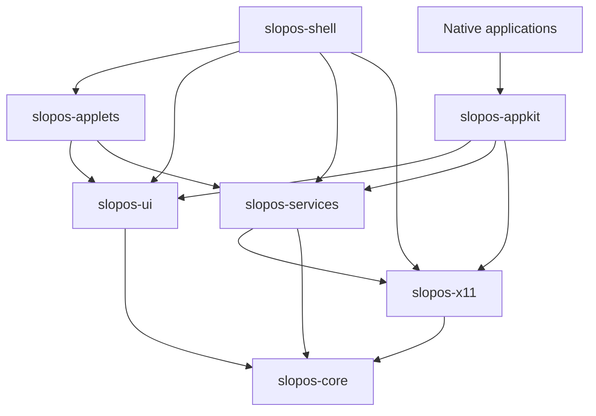
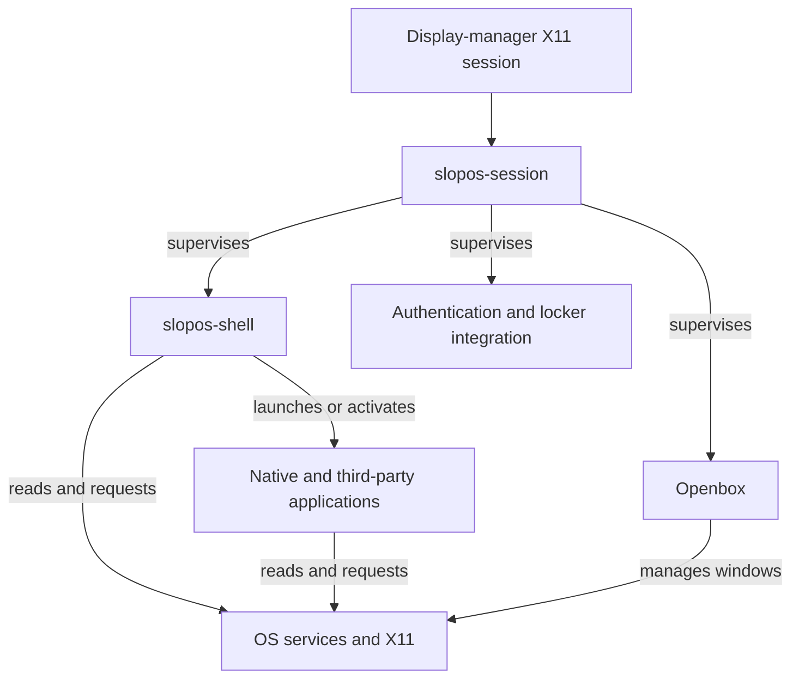
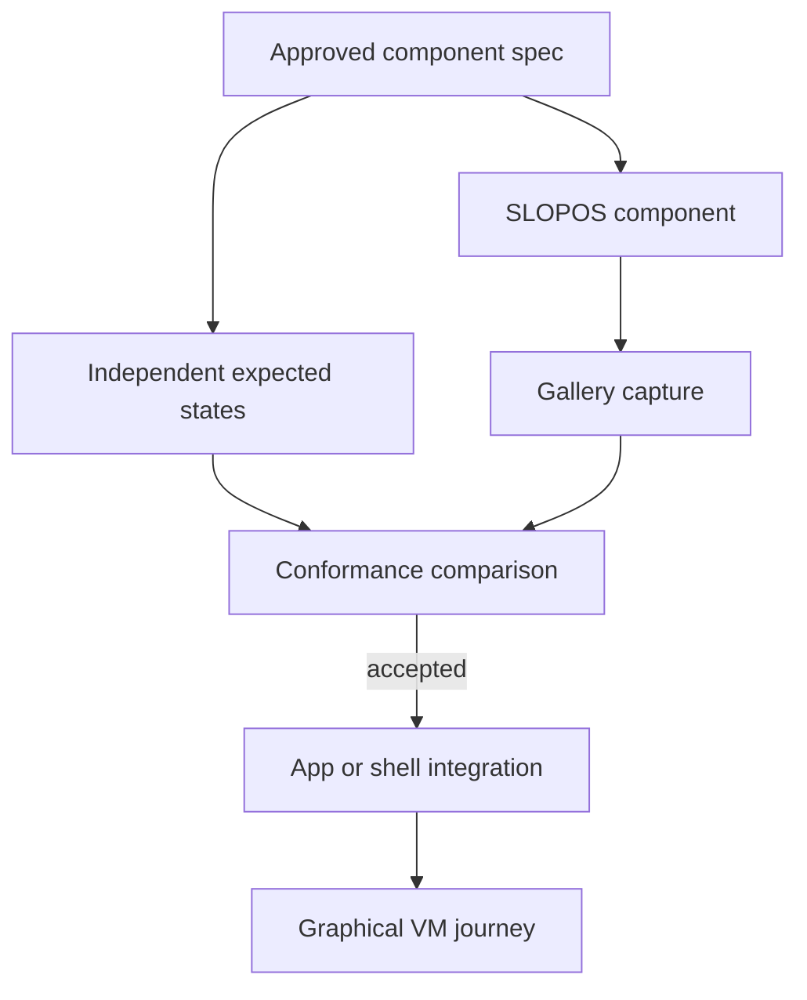
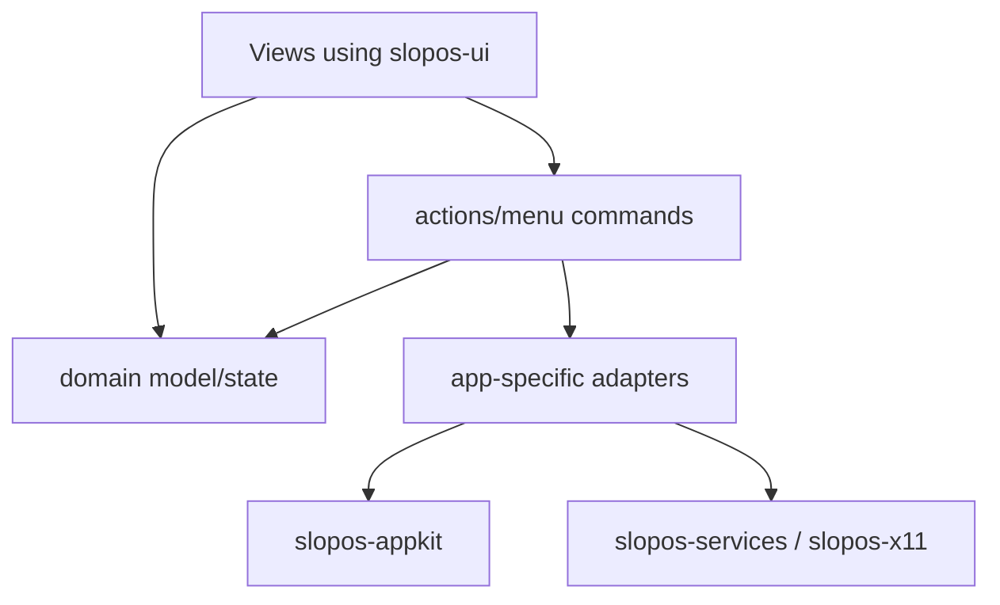

# AGENTS.md — SLOPOS-I Engineering Contract

**Status:** normative contract plus separately labelled evidence  
**Product:** SLOPOS-I / Platinum Classic  
**Primary branch:** `main`; one monorepo  
**Execution target:** Linux/X11; Openbox; primarily Rust  
**Visual authority:** Classic Macintosh UI Kit, Figma `LGMlwNCoVdakZxDBvPKg1W`, root `0:1`  
**Contract audit:** 2026-10-02 IST (2026-10-01 UTC), source `7639ccd0b89955fc2657a3d67a489822f70c0837`  
**Implementation readiness:** NOT COMPLETE; no new VM execution is claimed by this documentation change.

This is the single project-wide source for requirements, architecture, work sequencing, audit findings and evidence. Root/subproject `README.md` files provide scoped orientation only. Do not create competing plans, `TRUTH.md`, design documents or per-agent Markdown ledgers. Machine-readable specifications, tests and raw execution artifacts are permitted; see §34.

Current explicit user instructions take precedence over this file, subject to the execution environment's higher-priority rules. Old chats, branches, comments and screenshots do not override the latest adopted contract. Requirements describe the target; only evidence establishes implementation truth.

# 0. Agent execution contract — read first

This file is deliberately comprehensive. A harness may supply only its beginning. Every coordinator reads the whole file; every worker explicitly reads this section, §§20–21, §§28–30, its assigned component sections and Part II before changing code. Do not assume an automatically injected excerpt contains the entire contract.

## 0.1 Decisions to preserve

| Decision | Current instruction |
|---|---|
| Product generation | SLOPOS-I is an X11 desktop environment. Keep Openbox as the current WM; no Wayland/Smithay revival or custom display server in this tranche. |
| Language and appearance | Primarily Rust; Platinum Classic geometry and interaction. Earlier Cheetah/Aqua, Cutefish, tucch and C/C++ explorations do not authorize a rename or rewrite of this tree. |
| UI first | Build and verify `slopos-ui`, then `slopos-appkit`; native applications and shell surfaces consume them. GTK3/GDK/Pango/GIO may remain hidden infrastructure. |
| Required shell | Dock, global menu, status applets, launcher, desktop, notifications, workspaces and volume/brightness OSDs. The later Dock requirement supersedes the former “no Dock” rule. |
| Applications | Preserve the full inventory in §§16–18. Start with the component gallery and small proof apps, then core daily-use apps; do not start every app at once. |
| Repository | One monorepo, agreed 2026-09-29. Use temporary task branches/worktrees, never permanent compositor/app branches that each contain a different product. |
| Execution | All local project compilation, tests, formatting, lint, runtime, packaging and visual QA run inside a Linux VM. A host container is not a substitute. |
| Documentation | This file is the central contract and evidence ledger; Git history archives superseded prose. |
| Later capabilities | Keep HDR/VRR/color-management and live-wallpaper ambitions visible, but require supported-backend/hardware evidence before exposure. They do not authorize Wayland work now or fake controls in an X11 VM. Kindle/AI/vision and office-suite expansion do not displace the core desktop. |

The September 2026 X11/UI-library decisions and the merged Dock amendment in PR #14 are the operative baseline. Do not revive an older architecture because it sounds more ambitious.

## 0.2 Start and resume procedure

1. Read `git status --short`, `git diff --stat`, `git log -5 --oneline`, `git rev-parse HEAD` and `git worktree list`. Preserve unrelated changes. Record the exact base SHA, branch and dirty state.
2. Read Part II and inspect the assigned source paths. Distinguish **existing**, **to create**, **historical** and **unverified**. No `slopos-ui`, `slopos-appkit`, gallery or `xtask` exists at the audited baseline.
3. The coordinator establishes the VM and resource record (§§28–29), selects a dependency-ready task from §21 and records ownership in Part II.M. No worker self-assigns overlapping paths.
4. Agree the narrow acceptance criteria, interface shape and test command before implementation. Missing UI atoms become UI tasks, not app-local workarounds.
5. On resume, recheck the coordinator's integration SHA, task ownership and upstream interface changes. Stop only the affected task if its dependency changed; continue independent authorized work.
6. A documentation-only audit may read/edit source and perform text consistency checks without a VM. It must not run repository code or claim project test/visual passes.

## 0.3 Coordinator and worker ownership

Use one coordinator/integrator, a small number of workers and an independent review pass. Start with two or three workers; increase only after measuring RAM, disk and build contention. Agent count is not permission to launch that many Cargo builds or graphical sessions.

The coordinator alone owns:

- root `AGENTS.md`, `Cargo.toml`, `Cargo.lock`, `rust-toolchain.toml` and the integration branch;
- shared public interfaces, crate/module registration (`lib.rs`, `mod.rs`), gallery registries and specification manifests;
- CI/workspace-wide policy, shared theme/token changes and packaging entry points;
- task assignment, resource reservations, integration order and final evidence reconciliation.

An owner may explicitly delegate one of these paths in a task packet; record the handoff and suspend other edits to it. Leaf-module workers send proposed registration/dependency changes to that owner. Only one owner changes a file at a time, even if worktrees would let Git merge it.

Workers own only the exact listed paths and tests. They do not rewrite shared APIs, reformat the workspace, update lockfiles, weaken goldens, edit another worker's files, change the product contract or push to `main`. A blocker report includes the smallest needed upstream change. The coordinator either schedules it or reassigns a non-conflicting task. Workers do not spawn additional implementers without coordinator allocation.

The coordinator updates Part II for the integrated change set. Workers return evidence and proposed ledger text instead of independently editing this file.

## 0.4 Task packet and handoff

Every assignment includes these fields; a broad role such as “finish Settings” is not a task.

| Field | Required content |
|---|---|
| Identity | Stable task ID from §21, named owner, branch/worktree and base SHA |
| Outcome | One reviewable user behavior or infrastructure contract; explicit exclusions |
| Dependencies | Integrated prerequisite SHAs, accepted spec/state IDs and public API signatures |
| Ownership | Exact writable files/directories, read-only references and coordinator-owned registration paths |
| Acceptance | Positive behavior, failure/cancellation behavior, accessibility where relevant and observable result |
| Verification | Existing exact commands; planned tests clearly marked as to be implemented; required VM/visual/hardware evidence |
| Resources | Build permit, maximum Cargo jobs, target/artifact paths and any exclusive runtime/system-service lease |
| Handoff | Commit SHA(s), changed paths, commands/exit codes, artifact paths/hashes, limitations and next dependency |

Task states are `PLANNED → READY → CLAIMED → IMPLEMENTED → VERIFIED → INTEGRATED`; `BLOCKED` records a precise missing dependency and unblock condition. `IMPLEMENTED` is not `VERIFIED`. `INTEGRATED` also requires review and the relevant integration gates. A planning row does not establish that a component exists.

A task is small enough when it can be reviewed, reverted and tested independently. Split provider state discovery from mutations, control rendering from interaction, and application commands from their views when that produces clear ownership. Do not split into empty crates or stub callbacks merely to increase the completed-task count.

## 0.5 Branches and worktrees

Keep all clones, worktrees, targets and test data on guest-local storage. Start each task from the coordinator's recorded integration commit, not an arbitrary latest remote branch.

Example **inside the established guest** (replace paths and SHA before use):

```bash
git -C /work/rust-slopos worktree add -b agent/ui-02-buttons /work/slopos-worktrees/ui-02-buttons <integration-sha>
```

Use `agent/<task-id>-<description>` and a temporary `integration/<tranche>` branch. The coordinator commits workspace/interface bootstrap first, then publishes that SHA to workers. Dependent tasks start only after their prerequisites integrate; do not independently invent the same API.

Each worker uses its own target directory if the disk reservation allows it. Existing QA scripts often hard-code `target/debug` or `target/release`; they must use the expected worktree-local target until QA-01 makes path handling explicit. Do not set a shared `CARGO_TARGET_DIR` and assume legacy launchers honor it. Sharing Cargo's download cache is acceptable; sharing mutable build outputs across simultaneous workers is not.

Workers deliver small commits. The coordinator reviews diffs, integrates in dependency order, resolves shared-file conflicts and reruns affected integration gates at the integrated SHA. No automatic force-push, broad reset, branch deletion or cleanup of unmerged work. Remove a worktree only after its changes and evidence are preserved. Keep branch/PR work reviewable; merge upstream only when authorized.

## 0.6 VM concurrency and runtime leases

Separate **editing concurrency**, **build concurrency** and **runtime-test concurrency**.

- Start with one build/test permit; cap `CARGO_BUILD_JOBS` explicitly for the guest. Raise parallel build permits only after measuring available memory and aggregate target growth (§29).
- One coordinator-owned runtime lease covers all graphical/Xvfb sessions, global hotkeys, session D-Bus ownership, audio/network/display mutations, package installs and session restart/lock tests in a shared guest.
- At the audited baseline, run existing QA suites **serially in a dedicated test account/session**. Fixed displays, shared output paths and name-based `pkill` make separate worktrees alone insufficient isolation.
- New harnesses must use unique display allocation, per-run XDG/runtime/config/data directories, isolated session buses, explicit child PID/process-group cleanup and unique evidence directories. A private session bus does not isolate the system bus or physical devices.
- Do not run crash/restart QA against a guest desktop someone is using. Retain a recovery console and coordinate any network/display/locker tests that may disconnect the agent.
- Never “clean up” with global `pkill`, `killall`, `cargo clean`, removal of shared caches or another agent's targets. Before using a legacy script with those behaviors, QA-01 must isolate or repair it; until then use only a disposable, exclusive test session.
- The lease records owner, command, guest/session and start time outside versioned product files. Release it after owned children exit; reclaim an abandoned lease only after checking those processes. Parallel runtime testing is allowed only after isolation is demonstrated.

Locks and task messages may be kept in a coordinator's scratch directory outside the checkout. They are transient orchestration state, not another project roadmap.

## 0.7 Evidence and completion

For each gate retain: task ID, source SHA, clean/dirty state, command, exit code, UTC timestamp, guest/hypervisor/OS, toolchain, relevant dependency versions, artifact location/checksum and explicit result. Visual evidence additionally records resolution, scale, fonts, backend and spec/golden revision. Dirty-tree experiments are provisional until rerun from the recorded commit.

Use `PASS`, `FAIL`, `NOT_RUN`, `BLOCKED` and `NOT_APPLICABLE` precisely. A skip needs a reason and cannot become PASS. Fixture-backed protocol tests, real guest-service tests, graphical VM tests and physical-device tests are separate evidence categories. A VM without Wi-Fi, Bluetooth or a backlight can verify unavailability and test fixtures; it cannot prove real-device support.

Avoid the self-referencing-commit trap: test code commit A, then add a documentation-only evidence commit B that explicitly cites A. The coordinator may retain A's evidence if a diff proves B changes only documentation. Never relabel it as a run of B; runtime/build/spec/golden changes require the affected gates again. Release candidates require evidence for the actual candidate code.

Scoped tasks may finish while the overall product remains incomplete. Report partial work as `IMPLEMENTED / NOT VERIFIED`, and external dependencies as `BLOCKED`; do not run indefinitely or invent evidence to satisfy a demand for “100%.” Completion of this contract edit is not completion of SLOPOS.

## 0.8 Reading map

| Work | Read before editing |
|---|---|
| Every task | §0, §§20–21, §§28–30, §33–34 and Part II |
| UI/spec/gallery | §§2, 4–5, 7–11, 25, 27, 35 |
| Appkit and native apps | §§6, 12, 15–19, 26, 31, 36 |
| Services, X11 and shell | §§6, 13–14, 18, 22–26, 31 |
| Integration/release | §§28–32, 37 and the complete ledger |

## 0.9 Coordinator launch instruction

Use this as the initial instruction to an agent running with access to the intended VM:

> Read the full AGENTS.md in this checkout and audit the current SHA before acting. Coordinate a bounded implementation tranche using §21, starting with VM-00, SPEC-01 and QA-00 where access permits. Use one coordinator and up to three workers with non-overlapping task packets/worktrees. Integrate the bootstrap interfaces before dispatching dependent code. Preserve Rust/X11/Openbox, Platinum Classic, the UI-library-first architecture and the full required inventory. Serialize builds/runtime tests until resource and isolation evidence allows more concurrency. Keep implementing ready tasks, report exact blockers for unavailable dependencies, and update Part II through the coordinator with verified commits and artifacts. Do not claim desktop completion from a task pass.

If a subagent facility is unavailable, perform the same dependency-ready tasks sequentially. The plan does not require a particular model, agent vendor or VM automation tool.

---

# Part I — Product and engineering requirements

# 1. Product mission

SLOPOS-I is a first-party Linux desktop environment designed to be viable for normal daily use and engineered to the quality level expected of mature environments such as GNOME and KDE while retaining its own deliberately compact Classic-Macintosh-inspired interaction and visual language.

Build one coherent desktop platform: shared design specification and UI components, reusable application services, real platform adapters, native applications and an integrated shell/session. The dependency graph in §6 is authoritative; providers and UI foundations can be developed independently.

The system must feel intentional from login to shutdown:

- session startup and recovery;
- desktop composition;
- windows, focus and workspaces;
- a first-party Dock;
- a global application menu bar;
- menu-bar system applets;
- non-focus-stealing on-screen displays for volume, brightness and related hardware state;
- application launching and search;
- file browsing and removable media;
- network, Wi-Fi, VPN, Bluetooth, audio, brightness, displays and power;
- settings and defaults;
- clipboard and drag-and-drop;
- notifications;
- screenshots and screen recording;
- file dialogs and application choosers;
- authentication and session dialogs;
- accessibility;
- first-party utilities;
- normal third-party X11 application compatibility;
- packaging, installation, upgrade, removal and recovery.

SLOPOS is a desktop environment, not merely a window manager plus themed applications. The Dock, menu bar, applets, OSD layer, notification service, global shortcuts, system providers and native daily-use applications are first-class platform components.

The product must never contain an enabled control that merely looks functional. Preserve the existing MIT license, COPYRIGHT attribution and third-party notices.

---

# 2. Non-negotiable architectural principle

## 2.1 The UI library comes first

The first architectural dependency of every first-party SLOPOS surface is the SLOPOS UI component library. Backend and QA work may proceed independently under §21; application UI may consume only the verified atoms it needs, and missing atoms must be completed in the library.

The project must create:

```text
crates/slopos-ui
```

before attempting to finish or visually polish the native application suite.

Every visible first-party component is designed as a SLOPOS component.

First-party applications must not independently invent:

- buttons;
- checkboxes;
- radio controls;
- text fields;
- menus;
- list rows;
- scrollbars;
- dialogs;
- alerts;
- toolbars;
- status bars;
- icon grids;
- file items;
- spacing;
- typography;
- focus treatment;
- selection treatment;
- window-content chrome.

Applications consume the component system; they do not define it.

## 2.2 No raw-GTK first-party UI architecture

GTK3/GDK/Pango/GIO may remain mature infrastructure beneath SLOPOS.

They are not the first-party design system.

First-party apps depend on `slopos-appkit`/`slopos-ui`; those SLOPOS abstractions own presentation over GTK3/GDK/Pango/GIO/AT-SPI infrastructure. Follow the explicit “depends on” graph in §6.3.

A first-party application crate must not directly build its user interface from arbitrary `gtk::Button`, `gtk::Entry`, `gtk::Dialog`, `gtk::ListBox`, CSS fragments, or ad-hoc layout constants.

Direct GTK/GDK/Pango UI dependencies are permitted only in explicitly designated boundary crates such as:

- `slopos-ui`;
- low-level engine adapters where required;
- compatibility adapters whose API is hidden behind SLOPOS-owned abstractions.

CI must enforce this architectural boundary.

When a native app needs a missing control, stop the dependent UI slice and request a UI task from the coordinator. The assigned UI owner adds it to `slopos-ui` and verifies conformance before app integration resumes. Continue independent app model/test work within the existing packet; do not edit another owner's component or bypass it.

## 2.3 "Designed from scratch" definition

"Designed from scratch" means SLOPOS owns:

- geometry;
- measurement;
- padding;
- visual hierarchy;
- colors;
- state appearance;
- interaction state machines;
- focus behavior;
- accessible semantics;
- keyboard behavior;
- hit testing;
- drawing composition;
- public widget API;
- conformance tests.

It does **not** require reimplementing invisible mature infrastructure such as:

- Unicode shaping;
- text rasterization;
- input-method protocols;
- AT-SPI transport;
- terminal escape parsing;
- PDF rendering engines;
- video codecs;
- TLS;
- filesystem syscalls.

SLOPOS owns the user-facing component. Mature engines may remain underneath it.

---

# 3. Scope and non-goals

## 3.1 In scope

SLOPOS-I is:

- Linux-only;
- X11-only for this generation;
- Openbox-based unless an evidence-backed limitation requires another solution;
- implemented primarily in Rust;
- built around the first-party `slopos-ui` component library and `slopos-appkit`;
- allowed to use GTK3/GDK/Pango/GIO underneath the SLOPOS component system;
- allowed to use mature engines such as VTE, WebKitGTK, Poppler, libarchive and libmpv where appropriate;
- allowed to delegate system ownership to NetworkManager, PipeWire/WirePlumber or PulseAudio-compatible APIs, BlueZ, UPower, systemd/logind, udev, CUPS/IPP, UDisks2/GIO and XRandR;
- required to provide a coherent first-party shell including Dock, global menu bar, status applets, OSDs, launcher, notifications, desktop surface and session UI.

## 3.2 Out of scope

Do not introduce:

- a Wayland session or fallback in SLOPOS-I;
- a custom display server merely for ownership;
- a custom kernel;
- a speculative future SLOPOS generation;
- a general-purpose GUI toolkit unrelated to SLOPOS;
- the retired legacy Application Strip;
- a Dock copied from modern macOS or any other vendor;
- Aqua / modern macOS visual language;
- GNOME/libadwaita card-heavy design;
- KDE Breeze design;
- Windows Fluent design;
- touch-first spacing as the default desktop density;
- fake compatibility;
- fake state;
- fake application actions.

A proper first-party **SLOPOS Dock is required**. The former "no dock" rule applied to the retired ad-hoc Application Strip and is superseded by this contract.

Wayland work remains paused until the X11 product is mature.

---

# 4. Source-of-truth precedence

Normative precedence is: current explicit user direction (subject to higher-priority environment rules), this contract, the approved machine-readable design specification, approved clean-room assets and component contracts, then implementation conventions. Resolve a genuine product conflict with the user; the coordinator resolves ordinary implementation choices.

Evidence is not beneath prose in this hierarchy. A requirement cannot overrule a failing test, missing component or measured runtime behavior. Part II describes facts separately from Part I's target. Static presence is not runtime verification.

Existing `qa/reference/` files predate the atomic reset and are historical composition references. They cannot override extracted Figma geometry or serve as current conformance goldens. Example measurements in §5 are not a complete or freshly re-extracted specification.

No old numeric readiness score is authoritative. Scoped task verification and product readiness are different claims.

---

# 5. Canonical visual reference

The canonical visual/component reference is:

- **Classic Macintosh UI Kit (Community)**
- Figma file key: `LGMlwNCoVdakZxDBvPKg1W`
- root node: `0:1`

Treat the Figma file as a component specification, not vague inspiration.

Observed examples from the 2026-09-24 audit include:

- menu bar example: 19 px high;
- menu row example: 16 px high;
- large Finder item example: 71×44 px;
- large Finder icon example: 32×32 px;
- large Finder label region example: 71×12 px;
- regular button example: 80×20 px;
- default button example: 88×28 px;
- secondary button example: 80×16 px;
- explicit Rest / Pressed / Disabled button states;
- Action / Hierarchical menu row variants;
- Active / Hover / Disabled menu states;
- Active / Inactive title-bar variants;
- 1-bit and 8-bit reference variants.

These measurements are examples only. The implementation must extract all relevant component data into the machine-readable specification before claiming exact conformance.

## 5.1 Clean-room rule

SLOPOS may reproduce:

- geometry;
- hierarchy;
- spacing;
- density;
- interaction affordances;
- state treatment;
- visual grammar.

Do not ship:

- Apple logos;
- proprietary Macintosh artwork;
- copied proprietary icons;
- proprietary Apple fonts;
- proprietary sounds;
- copied wallpapers;
- copied documentation text.

Third-party assets or fonts require verified redistribution licenses.

If a reference font cannot legally be redistributed, choose or create a redistributable metrically appropriate replacement and document the decision.

---

# 6. High-level architecture

SLOPOS has design/UI, application, platform-service, shell and session/runtime layers. Preserve these boundaries while migrating the existing four crates.

## 6.1 Design and implementation authority

The Figma reference and approved SLOPOS extension specs feed `qa/spec/classic/`. Those definitions drive `slopos-ui` implementations and independent conformance assertions. `slopos-appkit`, shell surfaces and apps compose verified controls. Spec-derived assertions must not simply call the same implementation formula they are supposed to check.

## 6.2 Shell-to-provider rule

A domain has one authoritative backend implementation and shared typed contracts, consumed by any number of views. For example, Volume applet, OSD, Sound panel and media keys use the same AudioProvider API. They may not implement independent `pactl`, `amixer` or PipeWire behavior.

“One provider” means consistent ownership and API, not necessarily one new daemon for the whole desktop. Within a process share its provider instance. Across processes use the same adapter implementation and subscribe/read back from the real OS service; a dedicated SLOPOS daemon is justified only when a recorded requirement needs it. Shell restarts must resubscribe instead of inventing state.

Minimum provider contract:

| Concern | Required behavior |
|---|---|
| Availability | Distinguish loading, available, unsupported hardware, missing service, permission denied, disconnected and failed. Never substitute fixture values. |
| Snapshot/events | Typed state with stable device IDs and an update revision; subscribe without leaking callbacks on reconnect. Handle hotplug and service-owner changes. |
| Command | Typed request, capability/authorization check, bounded completion, error propagation and cancellation where meaningful. |
| Mutation result | Show pending state; confirm success by authoritative reply/read-back or event. Roll back optimistic UI if the action fails. |
| Concurrency | Serialize/conflict-resolve writes to the same device; discard stale completions after device removal or a newer request. |
| Test seam | Injectable transport/clock/filesystem where needed. Fixture data is only available to tests/gallery, never a production fallback. |
| Credentials | Secret-agent integration; no credentials in logs, screenshots or command lines. |

System I/O and blocking D-Bus work do not run on the UI thread. GTK/GDK/Pango objects remain on their required main thread; worker results cross through typed messages. Bound queues and define shutdown/cancellation ownership before adding background loops.

## 6.3 Dependency direction

**Every arrow below means “depends on”; runtime ownership is shown separately in §6.4.**


```mermaid
flowchart TD
    APPS["Native applications"] --> APPKIT["slopos-appkit"]
    SHELL["slopos-shell"] --> APPLETS["slopos-applets"]
    SHELL --> UI["slopos-ui"]
    SHELL --> SERVICES["slopos-services"]
    SHELL --> X11["slopos-x11"]
    APPLETS --> UI
    APPLETS --> SERVICES
    APPKIT --> UI
    APPKIT --> SERVICES
    APPKIT --> X11
    SERVICES --> X11
    UI --> CORE["slopos-core"]
    X11 --> CORE
    SERVICES --> CORE
```

Apps may also consume typed services directly for domain-specific operations. No lower layer imports apps, shell or applets. `slopos-core` has no GUI/system-service dependencies. `slopos-x11` is UI-free; `slopos-services` is UI-free and may use it for display state. Engine adapters expose SLOPOS-owned APIs and may not leak raw GTK widgets into app code.

`slopos-session` supervises processes; it must not depend on UI libraries to keep a broken UI from preventing recovery. The graph describes allowed dependencies, not an instruction to add every dependency to every crate.

## 6.4 Runtime process topology


```mermaid
flowchart TD
    LOGIN["Display-manager X11 session"] --> SESSION["slopos-session"]
    SESSION -->|"supervises"| WM["Openbox"]
    SESSION -->|"supervises"| SHELL["slopos-shell"]
    SESSION -->|"supervises"| AUTH["Authentication and locker integration"]
    SHELL -->|"launches or activates"| APPS["Native and third-party applications"]
    SHELL -->|"reads and requests"| OS["OS services and X11"]
    APPS -->|"reads and requests"| OS
    WM -->|"manages windows"| OS
```

The display manager/Xorg own the X server lifecycle; Openbox is a window manager, not the X server. Shell modules initially share one process with explicit state/lifecycle boundaries. Their UI, model and provider contracts must allow later process isolation without a desktop rewrite.

Session startup establishes the session bus, launches supervised components, detects crash loops with bounded backoff, and offers a recoverable failure path. Restarting the shell/WM must not terminate unrelated applications, duplicate global grabs or lose their window/menu state. Test clean logout, bounded shutdown and recovery separately.

## 6.5 UI construction pipeline


```mermaid
flowchart TD
    SPEC["Approved component spec"] --> IMPLEMENT["SLOPOS component"]
    SPEC --> ASSERT["Independent expected states"]
    IMPLEMENT --> GALLERY["Gallery capture"]
    ASSERT --> COMPARE["Conformance comparison"]
    GALLERY --> COMPARE
    COMPARE -->|"accepted"| COMPOSE["App or shell integration"]
    COMPOSE --> JOURNEY["Graphical VM journey"]
```

There is no application-specific styling step. For Dock, OSD or other absent reference compositions, write a SLOPOS extension spec built from canonical atoms before production UI implementation. Missing Figma access blocks exact extraction/conformance for affected atoms; it does not block unrelated provider, VM or QA work.

## 6.6 Extensibility contracts

Use `SystemProvider`, `SystemApplet`, `ShellSurface`, `ControlPanel`, `Application` and shared `Action` concepts. Add later capabilities through those interfaces rather than miscellaneous shell conditionals. HDR/VRR/color management require a separately validated backend/capability plan; no generic XRandR toggle or VM fixture proves them. Live wallpaper requires lifecycle, resource-budget and fullscreen behavior evidence before exposure.

---

# 7. Target repository structure

These are **target paths**, not a claim they already exist. Part II lists the current four-crate workspace. Every Rust crate has `Cargo.toml` and `src/lib.rs` and/or `src/main.rs`; the module directories below live beneath `src/`, not next to the manifest.

| Path | Owned modules/responsibilities |
|---|---|
| `crates/slopos-core/` | config, errors, IDs, XDG paths, build metadata, capability/IPC identifiers |
| `crates/slopos-ui/` | foundation, render, input, layout, primitives, controls, containers, menus, dialogs, views, accessibility, theme, testing |
| `crates/slopos-appkit/` | lifecycle, actions, menus, documents, undo, clipboard, drag/drop, file dialogs, recent items, MIME, restore, jobs, errors |
| `crates/slopos-x11/` | connection, EWMH, windows, monitors/RandR, workspaces, selections and input |
| `crates/slopos-services/` | network, audio, brightness, Bluetooth, power, media, session, timedate, displays, printers, storage/removable media, applications, input; additional Control Panel providers as required |
| `crates/slopos-applets/` | framework and per-domain models/presenters: Wi-Fi/VPN, Bluetooth, volume, brightness, battery, displays, keyboard, media, removable media, notifications, clock |
| `crates/slopos-session/` | process supervision and recovery |
| `crates/slopos-shell/` | desktop, global menu, Dock, launcher, notifications, OSD, status area, workspace/session UI and shell IPC |
| `apps/` | files, control-panels, terminal, notes, calculator, software, system-monitor, screenshot, system-information, image-viewer, archive-utility, disks, fonts, help, media, documents |
| `utilities/` | auth/locker adapters, shortcuts/media keys, clipboard, removable media, wallpaper, chooser/default-apps, display confirmation, secrets/pairing, URI/desktop-entry launch, session dialogs |
| `tools/` | `slopos-ui-gallery`, `slopos-conformance`, `slopos-qa-driver`, `figma-spec-import` as needed |
| `qa/` | `spec/classic/`, goldens, interaction tests, journeys, fixtures; raw run output follows §30 |
| `assets/`, `themes/` | reviewed clean-room assets and transitional GTK/Openbox theme integration |
| `packaging/`, `scripts/`, `.github/workflows/` | install/release integration and gate runners |

The utility inventory describes responsibilities, not a requirement for a separate process/crate per row. Keep shortcuts and media-key registration under one runtime owner. Keep file dialogs in appkit rather than duplicating them in a Files-only implementation.

New app Cargo package names should consistently use `slopos-<app-name>`; directory and executable compatibility changes are coordinated with packaging. Do not rename the four legacy crates before their replacements preserve session/install behavior. Central manifest/module registration belongs to the coordinator. Prefer focused modules with private implementation details over large shared files.

---

# 8. slopos-core

`slopos-core` contains shared non-UI, non-platform primitives.

It may define:

- application IDs;
- stable IPC identifiers;
- common result/error types;
- XDG path handling;
- configuration serialization;
- version/build metadata;
- resource lookup;
- logging conventions;
- capability descriptors.

It must not depend on GTK.

It must not become a dumping ground for unrelated helpers.

---

# 9. slopos-ui — first-party component library

`slopos-ui` is the foundation of every native SLOPOS interface.

Its public API must make the correct visual language easier than bypassing it.

## 9.1 UI library responsibilities

`slopos-ui` owns:

- all first-party visual tokens;
- all first-party component geometry;
- state rendering;
- input state machines;
- focus behavior;
- accessibility semantics;
- layout primitives;
- icon rendering;
- menu presentation;
- dialog presentation;
- list/table/icon views;
- common content chrome;
- deterministic test rendering.

Applications supply data, actions and domain logic.

Applications do not draw their own design language.

## 9.2 Foundation modules

Required foundation concepts:

```text
foundation/
├── geometry.rs
├── scale.rs
├── metrics.rs
├── insets.rs
├── color.rs
├── typography.rs
├── font_metrics.rs
├── patterns.rs
├── bevel.rs
├── border.rs
├── focus.rs
├── selection.rs
├── icon_metrics.rs
├── animation.rs
└── theme.rs
```

Canonical 1× geometry is the primary coordinate system.

Supported integer HiDPI scaling must preserve deterministic geometry.

Fractional scaling is not required until explicitly added to this contract.

## 9.3 Rendering

Use mature rendering/text infrastructure underneath the SLOPOS API.

Acceptable low-level facilities include:

- Cairo;
- GDK;
- Pango;
- GdkPixbuf;
- GTK widget subclassing/composition where appropriate.

SLOPOS-owned components must not rely on arbitrary distro GTK theme defaults for their canonical appearance.

Pixel-oriented artwork must use pixel-preserving scaling.

Do not use bilinear filtering for reference pixel art where it produces blur.

## 9.4 Required primitive components

At minimum:

- `Surface`
- `Text`
- `Icon`
- `Image`
- `Separator`
- `Rule`
- `PatternFill`
- `Bevel`
- `FocusRing`
- `SelectionHighlight`
- `Spacer`

## 9.5 Required layout components

At minimum:

- `Row`
- `Column`
- `Grid`
- `Overlay`
- `Stack`
- `SplitPane`
- `ScrollView`
- `GroupBox`
- `Inset`
- `Align`
- `FixedCanonicalLayout` for exact reference compositions where appropriate.

Do not use arbitrary magic padding in application crates.

## 9.6 Required input/control components

At minimum:

### Buttons

- Regular Button
- Default Button
- Secondary Button
- Icon Button
- Repeat/Arrow Button where referenced

Required states:

- rest;
- hover if the platform uses hover feedback;
- pressed;
- focused;
- disabled;
- default;
- destructive only if explicitly defined by the SLOPOS language.

### Selection controls

- Checkbox
- Radio Button
- Toggle where a real use case exists
- Disclosure Triangle

Required states include:

- unchecked/unselected;
- checked/selected;
- pressed;
- focused;
- disabled;
- mixed/indeterminate where semantically required.

### Text entry

- Text Field
- Search Field
- Password Field
- Multi-line Text Area
- Numeric Field
- Editable Label where required for file rename

Text-editing implementation may reuse mature GTK text infrastructure internally, but visible geometry, focus, selection, disabled state and surrounding chrome are SLOPOS-owned.

### Choice controls

- Pop-up Button
- Combo/Choice control
- Stepper
- Slider
- segmented control only if the canonical specification explicitly requires one.

### Progress/state controls

- determinate progress;
- indeterminate progress;
- busy indicator if required;
- meter where required.

## 9.7 Required collection/view components

At minimum:

- List View;
- List Row;
- Table View;
- Table Header;
- Tree/Outline View;
- Icon View;
- File Item;
- Desktop Item;
- Empty State;
- Status Row.

Collection components must support keyboard navigation and accessible selection semantics.

## 9.8 Required scrolling components

At minimum:

- Vertical Scrollbar;
- Horizontal Scrollbar;
- Scroll Thumb;
- Scroll Arrow;
- Track;
- Corner/resize affordance where applicable.

Scrolling behavior must be consistent across all native apps.

## 9.9 Required menu components

At minimum:

- Menu Bar;
- Menu;
- Menu Item;
- Hierarchical/Submenu Item;
- Checked Menu Item;
- Radio Menu Item where needed;
- Disabled Menu Item;
- Separator;
- Shortcut/Command label;
- Application menu host;
- Context menu.

Menu state and geometry must derive from the Figma specification.

## 9.10 Required dialog/window-content components

Window-manager decorations are owned by the WM/theme integration, but native window content uses SLOPOS components.

Required:

- Alert;
- Confirmation Dialog;
- Error Dialog;
- Information Dialog;
- Progress Dialog;
- File Open Dialog;
- File Save Dialog;
- Open With Dialog;
- Properties Dialog;
- Preferences/Control Panel content;
- About/System Information content;
- utility-window layout;
- modal/transient host behavior.

## 9.11 Required navigation/content components

Where needed:

- Toolbar;
- Status Bar;
- Path/Location Bar;
- Breadcrumb/Path control if adopted by Files;
- Sidebar only where an explicit application workflow requires it and where it can be reconciled with the canonical visual language;
- Tab strip only where product requirements justify tabs;
- Inspector/Info panel;
- split-view divider.

Do not default to modern sidebars or cards merely because GTK makes them convenient.

## 9.12 Icon system

SLOPOS must define:

- canonical icon sizes;
- device icons;
- folder icons;
- file-type icons;
- action icons;
- status icons;
- application icons;
- high-DPI variants.

Assets must be original or license-compatible.

The UI library controls icon alignment and scaling.

## 9.13 Typography

The library must define shared roles:

- global menu text;
- window/title text;
- body text;
- secondary text;
- list text;
- icon-label text;
- section title;
- utility display text;
- monospace text.

Each role defines:

- family;
- size;
- weight;
- baseline;
- line height;
- scaling rule.

First-party applications may not invent unrelated font sizes.

## 9.14 Accessibility

Every public interactive component must expose:

- accessible role;
- accessible name;
- state;
- selection where applicable;
- keyboard reachability;
- logical focus order;
- disabled semantics.

Accessibility is part of component completion, not a later application patch.

## 9.15 UI Gallery

Create:

```text
tools/slopos-ui-gallery
```

The gallery must display every component and every required state without needing to launch a production application.

It is the canonical component-development environment.

The gallery must support:

- deterministic window size;
- deterministic component fixture data;
- 1× capture;
- integer HiDPI capture;
- keyboard navigation;
- pointer-state tests;
- accessibility inspection;
- stable screenshot names.

No component is complete until it appears in the gallery and its state matrix passes.

---

# 10. Figma-derived machine-readable design specification

Create:

```text
qa/spec/classic/
```

The exact format may be JSON, TOML or another reviewable text format.

It must include:

```text
qa/spec/classic/
├── manifest.*
├── colors.*
├── typography.*
├── metrics.*
├── patterns.*
├── icons.*
├── buttons.*
├── selection-controls.*
├── text-fields.*
├── menus.*
├── scrollbars.*
├── lists.*
├── windows.*
├── file-items.*
└── dialogs.*
```

For each Figma component classify it:

- `REQUIRED`
- `OPTIONAL_VARIANT`
- `NOT_USED`

`NOT_USED` requires a reason.

Each required component/state records as appropriate:

- Figma node/source;
- width;
- height;
- padding;
- margins;
- text baseline;
- icon box;
- border;
- bevel;
- pattern;
- colors;
- state transitions;
- hit target;
- keyboard behavior;
- accessibility semantics.

A completed release may not have required `UNKNOWN` specification entries.

---

# 11. slopos-ui conformance testing

For every required atom/state produce:

- specification fixture;
- rendered fixture;
- geometry assertion;
- state assertion;
- accessibility assertion;
- visual comparison where useful.

Geometry has zero tolerance unless a documented platform-specific exception exists.

Anti-aliased text may use a fixed justified raster threshold, but geometry remains exact.

Do not increase tolerance merely to pass a regression.

Goldens must never auto-update during normal CI.

Changing a golden requires an explicit reviewed specification change.

---

# 12. slopos-appkit — native application framework

`slopos-appkit` is the common application layer above `slopos-ui`.

It prevents every native application from separately reinventing normal desktop behavior.

## 12.1 Application lifecycle

Provide:

- stable application identity;
- single-instance policy where appropriate;
- open-file/open-URI dispatch;
- new-window behavior;
- quit lifecycle;
- session shutdown handling;
- state restoration hooks;
- clean error propagation.

## 12.2 Action/command model

All native apps use a real action model.

Actions define:

- ID;
- label;
- enabled state;
- checked/stateful value where needed;
- shortcut;
- callback;
- menu visibility.

The same action must back:

- menu entries;
- toolbar entries;
- keyboard shortcuts;
- contextual commands.

Do not duplicate action logic across UI surfaces.

## 12.3 Global menu export

Native SLOPOS apps must export their menu/action model through the shared appkit transport so `slopos-shell` displays the same real actions in the global menu bar. Follow the protocol contract in §21.4; keep GTK/GIO transport mechanics behind SLOPOS-owned APIs. Verify enabled/checked state, window-specific actions, exporter disappearance and focus switching with a real producer/consumer test.

No guessed keyboard injection is allowed.

## 12.4 Standard application services

Provide shared APIs for:

- clipboard;
- drag-and-drop;
- undo/redo;
- recent files;
- MIME/default apps;
- file open/save dialogs;
- open-with dialogs;
- error presentation;
- background jobs;
- progress/cancellation;
- notifications;
- preferences;
- persistent window geometry;
- restoration of documents/windows;
- application help;
- About integration.

## 12.5 Document model

For document-based apps define a reusable document lifecycle:

```text
new
→ edited
→ save/save-as
→ clean
→ external modification handling
→ close
```

Support:

- unsaved-change confirmation;
- autosave/recovery where appropriate;
- atomic writes;
- recent documents;
- reopen;
- failure recovery.

## 12.6 Asynchronous work

Long-running work must not block the UI event loop.

Use cancellable jobs for:

- filesystem operations;
- network operations;
- installation;
- archive operations;
- thumbnail generation;
- media metadata;
- document rendering.

Standardize progress/error/cancellation presentation.

---

# 13. Platform integration libraries

## 13.1 slopos-x11

Maintain one authoritative X11 layer using `x11rb` and stable X11 mechanisms.

It owns:

- active window;
- EWMH state;
- root properties;
- window metadata;
- workspaces;
- monitor/RandR model;
- work area;
- placement;
- input integration where appropriate;
- clipboard/selection integration where appropriate.

Do not use `xdotool`, `xprop`, `wmctrl` or `xrandr` as high-frequency polling infrastructure.

Tests may use those tools to drive an isolated VM session.

## 13.2 slopos-services

System providers must be typed and testable.

Required provider modules:

- NetworkManager;
- audio;
- BlueZ;
- UPower/logind;
- timedate;
- display/RandR;
- CUPS/IPP printers;
- removable media/udisks/GIO;
- storage;
- session;
- default applications;
- MIME database;
- desktop entry/application index.

Providers expose real state and real actions.

No provider may return sample state in production.

Fixtures are allowed only behind test-only code paths.

---

# 14. SLOPOS shell

`slopos-shell` is a first-party consumer of the same design system, not a separate visual universe.

It must consume `slopos-ui` and typed provider/applet APIs.

The shell owns:

- global top menu bar;
- application-menu host;
- menu-bar status area;
- first-party Dock;
- desktop surface integration;
- desktop objects;
- launcher/search;
- notification service/presentation;
- OSD manager;
- workspace UI;
- session actions;
- global keyboard shortcuts;
- shell-level media-key routing.

The shell must not create duplicate versions of controls already implemented in `slopos-ui`.

## 14.1 Global menu bar

The menu bar has two regions:

| Region | Content/authority |
|---|---|
| Application region | Focused application's real App/File/Edit/View/Window/Help actions, where exported |
| System/status region | Provider-backed Wi-Fi, Bluetooth, volume, brightness, battery and clock applets |

The left region is backed by the focused application's real action/menu model.

There must be exactly one application-menu bridge.

Native SLOPOS applications export their real `slopos-appkit` action model.

Third-party applications may be integrated only when they expose a supported real menu/action protocol.

If a third-party app does not export one:

- leave its local menu intact; or
- expose only guaranteed shell/window actions.

Do not fabricate Cut/Copy/Paste/Select All by blindly injecting shortcuts.

The right region hosts system applets backed by shared typed providers.

## 14.2 First-party Dock

The Dock is a required shell component and replaces the retired Application Strip.

Required behavior:

- pinned applications;
- running applications;
- active/focused application state;
- multiple-window indication;
- launch;
- raise/focus existing window;
- minimize where the interaction design specifies;
- application/window context menus;
- drag-to-reorder;
- pin/unpin;
- attention state;
- badges/progress only where a real source exists;
- workspace awareness;
- multi-monitor policy;
- configurable auto-hide, dodge and always-visible behavior;
- keyboard accessibility;
- drag/drop where meaningful;
- correct work-area reservation only when visible policy requires it.

The Dock must use `slopos-ui` and a dedicated SLOPOS Dock specification. It must not copy modern macOS Dock appearance or behavior blindly.

Control Panels must expose a Dock panel for at least:

- visibility mode;
- position if multiple positions are supported;
- size/density where supported;
- animation/reveal timing if configurable;
- running-app indicators;
- pinned application management;
- monitor policy where supported.

## 14.3 System applet framework

System applets are reusable projections of `slopos-services` state into the menu bar.

Required initial applets:

- Wi-Fi / Network;
- VPN where NetworkManager exposes it;
- Bluetooth;
- Volume / microphone state;
- Brightness;
- Battery / Power;
- Displays;
- Keyboard layout/input state where applicable;
- Media playback;
- Removable media;
- Notifications / Do Not Disturb where implemented;
- Clock / Date.

Every applet must support a consistent contract equivalent to:

~~~text
identity
current icon/state
accessible label/tooltip
summary state
popup/menu model
real actions
deep link to the relevant Control Panel
availability/unavailable state
~~~

No applet may shell out independently to implement state already owned by a provider.

## 14.4 On-screen display manager

SLOPOS requires a shell-level OSD manager.

Initial OSD events include:

- volume up/down;
- mute/unmute;
- microphone mute;
- display brightness;
- keyboard backlight where available;
- Caps Lock / Num Lock where useful;
- touchpad enable/disable where supported;
- airplane/network mode where supported;
- display-switching feedback where supported.

OSDs must:

- never steal keyboard focus from the active application;
- never appear in Alt+Tab;
- never appear in normal task lists;
- preserve the active X11 window/focus;
- work over fullscreen applications where the X11/compositor stack permits;
- coalesce repeated key presses into one updating overlay;
- dismiss automatically;
- be monitor-aware;
- be accessible without behaving like a normal focus-taking window;
- use actual provider state after the requested change;
- be click-through unless an OSD is intentionally interactive.

Implementation must explicitly test `_NET_ACTIVE_WINDOW`/focus preservation around OSD mapping. Do not accept an OSD implementation that causes a fullscreen game/video/application to lose focus.

## 14.5 Desktop

The desktop supports:

- desktop objects;
- selection;
- keyboard navigation;
- drag/drop;
- Trash;
- mounted volumes where exposed;
- context menus;
- wallpaper;
- multi-monitor placement.

PCManFM may remain temporarily during migration but is not the final source of first-party desktop UI if it prevents conformance.

## 14.6 Launcher/search

The launcher must support:

- application discovery from desktop entries;
- keyboard-first invocation;
- incremental search;
- launch;
- focus/raise existing applications where policy calls for it;
- recent or suggested items only when backed by real data;
- accessibility;
- no fake search categories.

Search providers may expand later, but application launch must remain fast and deterministic.

## 14.7 Notifications

Implement the freedesktop notification protocol truthfully.

Support:

- stable notification IDs;
- replacement/update;
- expiry;
- close;
- application attribution;
- actions only where correctly supported;
- monitor-aware placement;
- Do Not Disturb when implemented;
- notification history only if persistence and privacy behavior are explicitly designed.

## 14.8 Global shortcuts and media keys

One shell-level shortcut service owns global hotkeys.

It routes:

- launcher;
- screenshots;
- volume;
- brightness;
- media playback;
- workspace switching;
- window switching;
- lock/session shortcuts;
- user-configurable shortcuts.

Do not scatter global shortcut registration across unrelated applications.

## 14.9 Shell isolation and restartability

Dock, applets, OSD, notifications and launcher may initially share one executable, but must have clear module/state boundaries.

A failure in one shell surface must not corrupt provider state.

Long-term process separation is permitted when it materially improves reliability.

---

# 15. First-party application suite

A mature SLOPOS desktop needs a coherent set of native applications. The applications below are the canonical first-party product inventory.

Applications are divided into release-critical core applications and extended daily-use applications.

Every first-party application must use `slopos-ui` through `slopos-appkit` unless explicitly documented as a lower-level system utility.

---

# 16. Release-critical core applications

These applications are required for a first-class SLOPOS desktop release.

## 16.1 SLOPOS Files

Target path:

```text
apps/files
```

Purpose: first-party file management and desktop filesystem interaction.

Required functionality:

- directory navigation;
- back/forward/up;
- location/path navigation;
- icon view;
- list view if included;
- keyboard navigation;
- single/multiple selection;
- open;
- default-application/MIME launch;
- rename;
- new folder;
- create supported basic files where exposed;
- copy;
- cut/move;
- paste;
- duplicate if exposed;
- Trash;
- restore from Trash if exposed;
- empty Trash;
- permanent-delete confirmation;
- file/folder properties;
- context menus;
- drag-and-drop;
- hidden files;
- filesystem change watching;
- error handling;
- removable volumes;
- mount/unmount/eject where supported;
- thumbnailing where appropriate;
- network mounts if exposed.

Suggested mature backends:

- GIO/GVfs;
- freedesktop MIME database;
- udisks/GIO volume APIs.

PCManFM is a temporary migration dependency only if it cannot meet the final visual/interaction contract.

## 16.2 SLOPOS Control Panels

Target path:

```text
apps/control-panels
```

This replaces the current first-party Settings UI architecture.

Required panels for production daily use:

### Desktop and appearance
- Appearance
- Desktop / Wallpaper
- Dock
- Menu Bar / Status Items
- Fonts
- Notifications
- Default Applications

### Hardware
- Displays
- Brightness where hardware supports it
- Sound
- Keyboard
- Mouse
- Touchpad where present
- Bluetooth
- Printers

### Connectivity
- Network
- Wi-Fi
- Wired
- VPN integration through NetworkManager where available
- Proxy if supported by platform policy

### System
- Power
- Date & Time
- Region & Language
- Users
- Storage
- Removable Media
- Autostart / Session
- Keyboard Shortcuts
- Accessibility
- About / System Information entry point

Every panel reads real provider state.

No sample SSIDs, IPs, device names, volume values or hardware state may appear in production.

## 16.3 SLOPOS Terminal

Target path:

```text
apps/terminal
```

Use a mature terminal engine such as VTE.

SLOPOS owns:

- window;
- menus;
- tabs if supported;
- preferences;
- keyboard shortcut model;
- appearance;
- dialogs;
- search UI;
- profile UI.

Required:

- shell launch;
- terminal resize;
- scrollback;
- copy/paste;
- selection;
- search;
- Unicode;
- IME compatibility;
- links;
- working-directory launch;
- command exit behavior;
- accessibility;
- tabs only if completed coherently.

Do not write a terminal emulator parser from scratch.

## 16.4 SLOPOS Notes

Target path:

```text
apps/notes
```

Purpose: lightweight first-party writing and text-note application.

Required:

- new/open;
- save/save-as;
- plain text;
- Unicode;
- undo/redo;
- cut/copy/paste;
- find;
- basic formatting only if explicitly supported;
- modified-document warning;
- autosave/recovery if adopted;
- recent documents;
- drag/drop file opening;
- print only when genuinely implemented.

It may later support Markdown, but unsupported formatting controls must not be exposed.

## 16.5 SLOPOS Calculator

Target path:

```text
apps/calculator
```

Calculator is both a real utility and an early conformance proving ground.

Required:

- keyboard and pointer input;
- basic arithmetic;
- decimal;
- sign;
- clear;
- backspace;
- operator precedence policy documented/tested;
- divide-by-zero/error state;
- copy result;
- predictable focus.

Its UI must be composed entirely from `slopos-ui`.

## 16.6 SLOPOS Software

Target path:

```text
apps/software
```

This evolves from `slopos-catalogue`.

It manages SLOPOS-curated application delivery according to the release policy.

Required:

- catalogue search;
- application detail;
- install;
- integrity verification;
- launch;
- uninstall;
- version display;
- error reporting;
- background/cancellable downloads;
- progress;
- architecture validation.

Initial delivery policy: evolve the existing curated AppImage catalogue. Installed user applications and desktop entries live in user-owned XDG locations; downloads require an explicitly trusted source, integrity verification, architecture checks, atomic installation, cancellation cleanup and uninstall that preserves unrelated user data. A checksum alone does not establish publisher trust. Do not invent a public SLOPOS package repository.

Distribution package management remains owned by the base distribution unless the product contract explicitly expands scope. Native distro-package management is not silently part of the AppImage store task.

## 16.7 SLOPOS System Monitor

Target path:

~~~text
apps/system-monitor
~~~

This is SLOPOS's full task-manager/system-observation application.

Required views:

- Processes;
- CPU;
- Memory;
- Storage activity where practical;
- Network activity where practical;
- GPU activity where a stable provider exists.

Process view must expose at least:

- name;
- PID;
- CPU usage;
- memory usage;
- state;
- user;
- command/details on inspection.

Required actions:

- search/filter;
- inspect process;
- end/terminate process;
- force kill with explicit confirmation;
- process priority adjustment only when correctly authorized;
- refresh without UI stalls.

No process action may silently claim success. Read back process state.

Use procfs/sysfs and stable system APIs.


## 16.8 SLOPOS Screenshot & Recorder

Target path:

~~~text
apps/screenshot
~~~

Screenshot is a first-party shell-integrated capture utility.

Required screenshot modes:

- entire screen;
- selected monitor where useful;
- selected window;
- selected region.

Required output paths:

- save;
- clipboard;
- open captured image in SLOPOS Image Viewer.

Required behavior:

- configurable delay;
- multi-monitor awareness;
- predictable filenames;
- visible success/error feedback;
- global keyboard shortcuts owned by the shortcut service;
- non-destructive cancellation.

Recording is enabled only when functional.

Target recording modes:

- entire screen;
- selected monitor;
- selected window where technically reliable;
- selected region;
- optional microphone;
- optional system audio.

Use a mature capture/encoding stack such as PipeWire, FFmpeg or GStreamer as appropriate for X11. Do not implement codecs.

Do not ship a Record control until the selected recording path passes real VM tests. The required “open captured image in SLOPOS Image Viewer” path also makes APP-08's minimum viewer slice a capture-release dependency; an unimplemented handoff is not a completed action.


## 16.9 SLOPOS System Information / About

Target path:

```text
apps/system-information
```

Required:

- SLOPOS version;
- source/build revision where appropriate;
- OS;
- kernel;
- architecture;
- CPU;
- memory;
- storage summary;
- graphics/display information where available;
- X11/session information;
- license/credits.

Every displayed value must be real.

This app also provides the canonical compact About composition required for visual QA.

---

# 17. Extended first-party daily-use applications

These are part of the target SLOPOS application suite. They may be implemented after the release-critical core is stable, but they must follow the same architecture.

## 17.1 SLOPOS Image Viewer

Target:

```text
apps/image-viewer
```

Required:

- common image formats through mature loaders;
- next/previous;
- zoom;
- fit;
- actual pixels;
- rotate where supported;
- fullscreen;
- file metadata;
- copy;
- set as wallpaper integration where appropriate.

## 17.2 SLOPOS Archive Utility

Target:

```text
apps/archive-utility
```

Use mature engines such as `libarchive`.

Required:

- inspect common archive formats;
- extract;
- create supported archive formats;
- drag/drop integration;
- overwrite/conflict handling;
- path traversal protection;
- progress/cancel;
- error reporting.

Files should invoke it transparently for archive operations.

## 17.3 SLOPOS Disks

Target:

```text
apps/disks
```

Purpose: storage inspection and safe user-level disk operations.

Use mature storage APIs such as UDisks2.

Required scope may include:

- device/partition information;
- mount/unmount;
- eject;
- SMART information where safely available;
- filesystem usage;
- formatting only when properly authorized and guarded by explicit destructive confirmations.

Destructive functionality must not be enabled until thoroughly tested.

## 17.4 SLOPOS Fonts

Target:

```text
apps/fonts
```

Required:

- browse installed fonts;
- preview;
- metadata;
- install user font;
- remove user-installed font;
- refresh font cache;
- clear distinction between system-owned and user-owned fonts.

## 17.5 SLOPOS Help

Target:

```text
apps/help
```

Required:

- offline-first SLOPOS help;
- searchable topics;
- keyboard navigation;
- deep links from applications/settings;
- release-appropriate troubleshooting;
- no stale generated feature claims.

## 17.6 SLOPOS Media

Target:

```text
apps/media
```

Use a mature media engine such as libmpv or GStreamer.

SLOPOS owns:

- menus;
- transport controls;
- playlist;
- open dialogs;
- subtitles/audio track UI;
- fullscreen UI;
- preferences.

Do not implement codecs from scratch.

## 17.7 SLOPOS Documents

Target:

```text
apps/documents
```

Purpose: PDF/document viewing.

Use a mature rendering engine such as Poppler for PDF.

Required:

- open;
- page navigation;
- zoom;
- search;
- thumbnails if implemented;
- print only if fully integrated;
- metadata;
- keyboard navigation.

## 17.8 SLOPOS Browser — optional ecosystem application

A first-party browser shell may be built only around a maintained secure engine such as WebKitGTK.

Do not build a browser engine.

Until this application exists and meets security/update expectations, SLOPOS must integrate established browsers such as Firefox/Chromium cleanly.

A browser is not allowed to delay core desktop correctness.

---

# 18. System utilities and background infrastructure

A production desktop depends on many components that users do not launch as ordinary applications. These are first-class requirements, not afterthoughts.

## 18.1 Authentication agent

Target:

~~~text
utilities/polkit-agent
~~~

Provide a SLOPOS-native Polkit authentication UI backed by the real Polkit agent API.

Required:

- requesting application/action identity;
- password prompt;
- cancellation;
- error state;
- correct secure entry;
- no credential logging.

## 18.2 Lock screen

Target:

~~~text
utilities/lock-screen
~~~

SLOPOS may initially use a mature external locker if necessary.

A first-party lock screen becomes acceptable only when:

- PAM/authentication path is correct;
- secure keyboard handling is reviewed;
- failure cannot expose the session;
- multi-monitor behavior is correct;
- suspend/resume behavior is correct.

Security takes priority over ownership. A working, tested locker integration is mandatory for daily-use release readiness even when a mature external locker supplies it; an unavailable Lock item is an honest alpha limitation, not a production pass.

## 18.3 File chooser

Native SLOPOS apps use a SLOPOS file chooser implemented through `slopos-appkit` and `slopos-ui`.

It must support:

- open;
- save;
- folder selection;
- filters;
- recent locations;
- filename validation;
- overwrite confirmation;
- keyboard operation.

Third-party GTK apps may continue using GTK dialogs unless a safe toolkit integration mechanism exists.

## 18.4 Open With / Default Apps

Provide:

- application chooser;
- default association selection;
- MIME-aware candidate list;
- persistent default update;
- one-time open without changing default.

## 18.5 Global shortcut service

One service owns shell-level shortcuts and media keys.

It must provide conflict detection, configured bindings, provider dispatch and real feedback.

## 18.6 Clipboard manager

Provide base X11 clipboard/selection correctness first.

Persistent clipboard history is optional until explicitly designed with:

- privacy policy;
- exclusion rules;
- secret/sensitive content behavior;
- storage lifecycle.

## 18.7 Removable-media handler

Respond to real media events and integrate with:

- Files;
- notifications;
- menu-bar applet;
- safe unmount/eject;
- configured autorun/open behavior.

## 18.8 Wallpaper manager

Own:

- configured wallpaper;
- per-monitor policy where supported;
- static wallpaper application;
- live wallpaper only when explicitly implemented and performance-tested.

## 18.9 Display-change confirmation

Risky display changes must offer an automatic rollback countdown so an unusable mode does not strand the user.

## 18.10 Network-secret UI

Network authentication/secrets must use NetworkManager's supported secret-agent mechanism or another appropriate stable API.

Do not log secrets.

## 18.11 Bluetooth pairing UI

Pairing requests must present:

- device identity;
- PIN/passkey/confirmation state;
- cancel/failure;
- trusted/connected result.

## 18.12 Printer authentication UI

Where CUPS/IPP requires credentials or authorization, present a truthful native prompt with no credential logging.

## 18.13 Low-battery and hardware-state notifications

Power/provider events may trigger:

- low battery;
- critical battery;
- device removal;
- network loss;
- other actionable hardware state.

Rate-limit repetitive notifications.

## 18.14 URI opener and desktop-entry launcher

Provide one safe launch path for:

- URIs;
- MIME/default applications;
- desktop entries;
- files.

Avoid every application inventing process-spawn rules.

## 18.15 Session dialogs

Provide SLOPOS-native:

- Log Out;
- Restart;
- Shut Down;
- Sleep confirmation where appropriate.

Actions must use real logind/session provider capability checks.

## 18.16 Crash/error presentation

Unexpected first-party application failures should produce useful logs and recoverable user-facing errors where practical.

Do not silently restart forever or hide repeated failure.

## 18.17 Infrastructure inventory rule

When a later requirement is remembered, first classify it as one of:

- provider;
- applet;
- shell surface;
- Control Panel;
- native application;
- background utility.

Add it through the appropriate stable interface instead of putting miscellaneous code into `slopos-shell`.

---

# 19. Native application anatomy

Every native application should follow a common internal structure:

```text
apps/<name>/
├── Cargo.toml
├── src/
│   ├── main.rs
│   ├── app.rs
│   ├── actions.rs
│   ├── menu.rs
│   ├── model/
│   ├── services/
│   ├── views/
│   └── tests/
└── resources/
```

Recommended layering:


```mermaid
flowchart TB
    VIEW["Views using slopos-ui"]
    ACTIONS[actions/menu commands]
    MODEL[domain model/state]
    SERVICES[app-specific adapters]
    APPKIT[slopos-appkit]
    PLATFORM[slopos-services / slopos-x11]

    VIEW --> ACTIONS
    VIEW --> MODEL
    ACTIONS --> MODEL
    ACTIONS --> SERVICES
    SERVICES --> APPKIT
    SERVICES --> PLATFORM
```

Views must not directly shell out to command-line tools.

Views must not contain system-provider logic.

---

# 20. Architectural enforcement

Add automated architecture tests.

At minimum enforce:

- first-party app crates do not directly depend on `gtk`, `gdk`, `pango` or arbitrary CSS files;
- first-party app UI goes through `slopos-ui`/`slopos-appkit`;
- duplicated UI constants are rejected where practical;
- production source does not contain known fixture/sample SSIDs, IP addresses or hardware labels;
- there is one global-menu implementation;
- no new `xdotool` runtime application-action injection;
- no enabled empty callbacks;
- no TODO placeholder controls in release-visible code.

Record each temporary exception in Part II.N with exact path, reason, owner, test and removal task. Do not create a competing architecture document or allow whole new app directories to bypass the boundary.

Inspect Cargo metadata by resolved package identity (including dependency aliases) and combine it with source/behavior checks; a grep for `gtk::Button` alone is not enforcement. Test-only fixture strings are allowed in test fixtures; production sample values are not. Keep domain logic testable without initializing GTK.

Legacy crates initially need a bounded migration exception. Freeze the exception list at the audited baseline; no new raw-GTK surface is allowed under it. Narrow/delete entries as migration lands. An exception is acknowledged debt, never a conformance pass.

QA-01 must also check task path ownership, specification completeness, Markdown policy, duplicate menu ownership, and unregistered required gates. Until that checker exists, the coordinator reviews these constraints manually and records the limitation.

---

# 21. Dependency-driven implementation plan

The current tree is a migration donor. Preserve boot/session behavior and introduce one tested slice at a time. “UI first” forbids app-local controls and premature application completion; it does not prevent independent VM, backend, protocol or QA work while UI atoms are built.

The following task IDs are a starting backlog. At the audited baseline **none is assigned or verified**. The coordinator records actual status in Part II.M and expands any multi-step row into leaf packets before dispatch. A path prefix is a boundary, not permission to edit every file underneath it.

## 21.1 Bootstrap and first dispatch

1. Coordinator: establish VM-00, record the baseline and reserve resource/runtime ownership.
2. Parallel read/preparation: SPEC-01 extracts the authoritative component inventory; QA-00 inspects and measures the existing baseline. Neither invents current passes.
3. Coordinator: integrate BOOT-01's minimal shared interfaces/manifests and publish an immutable starting SHA. New crates must contain a useful implemented invariant/test, not empty “completed” scaffolds.
4. Dispatch UI-01, QA-01 and PLAT-01 or one SVC task against that SHA if resources allow. They can edit in parallel; build/runtime permits remain separately scheduled.
5. Unlock controls, appkit, apps and shell only when their actual dependencies integrate. A worker waiting on UI can take a provider/model/test task with distinct ownership.

Do not launch “an agent for every app” at the start. Do not make each agent update this contract or reinvent tokens, menus, providers, file choosers and command dispatch.

## 21.2 Foundation tasks

| ID | Depends on | Writable area to allocate | Concrete acceptance |
|---|---|---|---|
| VM-00 | none | Guest setup/evidence; coordinator | Confirm hypervisor/guest, guest-local checkout, disk/RAM budget, X11 test account, recovery access and execution policy. |
| QA-00 | VM-00 | Baseline evidence only | Record existing build/test results or exact failures at baseline SHA; inventory script side effects, dependencies and inherited defects. No “all green” inference. |
| SPEC-01 | source access | `qa/spec/classic/`, licensed asset provenance | Machine-readable schema, complete required-component inventory, source node IDs, revision/scale/font/license metadata and first foundation/button/menu/text specs. Unknowns explicit. |
| BOOT-01 | QA-00 recorded | Coordinator: workspace, core, initial UI/gallery manifests and module roots | Freeze IDs/errors/capabilities and crate APIs; compile first meaningful invariant tests; keep existing session/package names working. Record exact Rust version; choose and test a toolchain pin before reproducibility claims. |
| QA-01 | BOOT-01 | Assigned QA runners/tests and CI changes | Isolate displays, buses, child cleanup and output paths; enforce architecture/migration exceptions; validate required-gate inventory, failure exit codes and fixture separation. |
| UI-01 | BOOT-01, SPEC-01 | `crates/slopos-ui/src/foundation,render,layout,primitives,accessibility`; assigned gallery fixtures | Real surface/text/icon/bevel/focus/layout at 1×/2×; deterministic measurements and independent geometry assertions; AT-SPI base. |
| UI-02 | UI-01 | `crates/slopos-ui/src/controls/` allocated button/selection modules | Button, checkbox, radio and disclosure states; pointer press/release/cancel, focus and keyboard activation; disabled controls cannot fire actions. |
| UI-03 | UI-01 | Allocated text-entry modules | Text/search/password/numeric/multiline entry as required; selection, IME, clipboard, Unicode, validation and password privacy. |
| UI-04 | UI-01 | `crates/slopos-ui/src/menus/` | Menu bar/items/submenus/check states; keyboard traversal, dismissal, enabled actions, exact geometry and focus restoration. |
| UI-05 | UI-01, UI-02 | Allocated scrolling, list/table/tree/icon-view modules | Scroll, selection, keyboard navigation, long labels/large collections, accessible selection and pixel-preserving icon scale. |
| UI-06 | UI-03, UI-04, UI-05 | Allocated dialogs/window-content/navigation modules | Dialog/alert/toolbar/status/path compositions, modal focus/escape/default behavior, overflow handling and accessibility. |
| SPEC-02 | SPEC-01 | Allocated extension specs, no app styling | Approved Dock, OSD, status-area and modern system-dialog compositions built from Classic atoms; independent acceptance fixtures. |
| PLAT-01 | BOOT-01 | `crates/slopos-x11/` plus explicitly assigned donor extraction | One X11 connection/event/monitor/window authority; preserve active window, workspace and work-area state across hotplug and WM restart. |
| KIT-01 | UI-02, UI-03, UI-04, PLAT-01 | `crates/slopos-appkit/src/application,actions,menus,jobs,errors` | Lifecycle plus real action/menu export; one command invoked from keyboard/local/global menu; state changes and cancellation cross process boundaries correctly. |
| KIT-02 | KIT-01, UI-05, UI-06, SVC-07 | Appkit documents/undo/clipboard/drag-drop/dialogs/MIME/restore | Atomic save and recovery, unsaved-close prompt, chooser overwrite handling, clipboard/drag-drop and safe MIME/URI dispatch. |
| PROOF-01 | KIT-01, required verified atoms | `apps/calculator/` | Arithmetic/error/keyboard/copy journeys; no direct GTK UI. |
| PROOF-02 | KIT-01, required verified atoms | `apps/system-information/` | Real system/build values, truthful unavailable fields, compact About scene and accessibility. |

Gallery entry files and tests belong to their component task; shared gallery registration belongs to the coordinator. Unextracted required variants remain SPEC-01/UI work and must be closed before §35 component completion.

## 21.3 Providers and shared infrastructure

Provider work may overlap UI development after BOOT-01. Register modules centrally; workers own distinct domain files. Split a row by discovery, mutations and reconnect tests where necessary.

| ID | Depends on | Area | Acceptance |
|---|---|---|---|
| SVC-01 | BOOT-01 | services/network state/transport | Real NetworkManager adapters, APs, connection/IP state; missing daemon, no adapter, disconnect and hotplug tests. |
| SVC-02 | SVC-01 | services/network actions/secrets model | Connect/disconnect/toggle/VPN capability; authorization/cancel/timeouts; authoritative read-back; no sample SSIDs or logged secrets. |
| SVC-03 | BOOT-01 | services/audio | Real outputs/inputs/defaults/volume/mute and events; denied/failed writes and hotplug; one API for Sound, applet and OSD. |
| SVC-04 | BOOT-01 | services/brightness and power, separately allocated | Real capability/state/change paths, bounds/read-back, no-backlight/no-battery behavior, low-battery and suspend capability. |
| SVC-05 | PLAT-01 | services/displays | Real modes/layout, hotplug, timed apply/confirm/rollback; recover from loss of the controlling output. |
| SVC-06 | BOOT-01 | services/Bluetooth, media, timedate, input; one domain per packet | Real API plus unavailable/denied/reconnect fixtures per domain; same state consumed by panel and applet. |
| SVC-07 | BOOT-01 | services/storage, removable-media, applications | Safe media events/mounts, desktop-entry/MIME discovery and launch; command argument handling and untrusted filename tests. |
| SVC-08 | BOOT-01 | Additional Control Panel providers, one per packet | Printers, users, region/language, autostart, accessibility/preferences and other §16.2 panels get explicit authority/capability/read-back contracts; none is silently forgotten. |
| SYS-01 | KIT-01, UI-06 | Auth/locker/session integration, exact paths allocated | Native Polkit flow; mature locker integration first; cancellation, logout, shell/WM crash recovery, lock/suspend/resume and all-monitor behavior. |
| SYS-02 | KIT-02, relevant SVC tasks | Remaining §18 utilities, one per packet | Chooser/defaults, secret/pairing prompts, wallpaper, media events and session dialogs integrated without duplicate providers or shortcut owners. |

System-service tests use isolated fixtures or an exclusive disposable guest session. Fixture success must not be relabelled real hardware success.

## 21.4 Applications and shell

The small proof applications validate the common platform before larger native UI migrations. Reuse already verified atoms; schedule any missing atom back into the UI queue.

| ID | Depends on | Area | First acceptance slice, then remaining section contract |
|---|---|---|---|
| APP-01 | KIT-02, UI-05, SVC-07, proof apps | `apps/files/` | Navigation/watch/open/selection, then independently reviewed copy/move/conflict/cancel/Trash/removable-media tasks (§16.1). |
| APP-02 | KIT-02, relevant SVC tasks, proof apps | `apps/control-panels/` | Real provider-backed panel host; one panel per task; applet deep links and persistence (§16.2). |
| APP-03 | KIT-02, proof apps | `apps/terminal/` and named engine adapter | PTY/VTE launch/resize/exit; later search, Unicode/IME, clipboard and accessible chrome (§16.3). |
| APP-04 | KIT-02, proof apps | `apps/notes/` | New/edit/save/reopen/error/unsaved-close journey and undo/find (§16.4). |
| APP-05 | KIT-02, SVC-07, proof apps | `apps/software/` and assigned catalogue donor paths | Trusted fixture search/install/integrity/launch/uninstall; cancel/failed download and architecture rejection (§16.6). |
| APP-06 | KIT-01, UI-05, proof apps | `apps/system-monitor/` | Real process/resource snapshots; PID-reuse-safe terminate confirmation/read-back; permission failures (§16.7). |
| APP-07 | KIT-02, PLAT-01, SHELL-04, APP-08 | `apps/screenshot/` | Screen/window/region capture, clipboard/save/open-in-viewer; cancellation and multiple monitors (§16.8). Recording is a separate task. |
| APP-08 | KIT-02, proof apps | `apps/image-viewer/` | Open/fit/zoom/actual pixels; this minimum is required by Screenshot's advertised viewer handoff. Finish remaining §17.1 functions subsequently. |
| SHELL-01 | KIT-01, UI-04, PLAT-01, proof apps | Shell global-menu module and named donor paths | One protocol-aware bridge; correct app/window focus tracking and action state; preserve local menus for unsupported apps. |
| SHELL-02 | SPEC-02, UI-05, PLAT-01, SVC-07, proof apps | Shell Dock module | Pin/launch/activate/reorder/persist; multiple windows, hide/dodge/work-area and focus behavior (§14.2). |
| SHELL-03 | KIT-01, SPEC-02, relevant SVC tasks, proof apps | `slopos-applets/` and shell status host | One applet per provider: real state/action/read-back, unavailable states and Control Panel deep links. |
| SHELL-04 | SPEC-02, PLAT-01, SVC-03/04/06, proof apps | Assigned OSD and global-shortcut modules | One key owner; coalesced real-state OSD; active X11 window and input focus unchanged through fullscreen use. |
| SHELL-05 | KIT-02, PLAT-01, SVC-07, APP-01 | Desktop, launcher, notifications, workspace/session UI; separate packets | Native surface migration with real launch/notification/desktop actions and restart restoration; retain working migration path until replacement passes. |
| EXT-01 | Core desktop stable, required appkit/providers | Remaining §17 apps; one app/behavior per packet | Archive Utility, Disks, Fonts, Help, Media, Documents and remaining Image Viewer requirements; browser remains optional. |
| INT-01 | Required core tasks integrated, QA-01 | Integration worktree, journeys, packaging and ledger | Exact-SHA workspace gates; graphical VM daily-use journeys; install/upgrade/remove/recovery; no hidden failing required gate. |

“Proof apps” means PROOF-01 and PROOF-02 verified/integrated. Runtime wiring files (`main.rs`, startup scripts, menu registries, desktop entries and package manifests) are integrated by their single designated owner. Independent workers must not each migrate `topbar.rs`.

Native menu transport initially follows the existing GTK/GIO GMenu/action-group path, hidden behind appkit and a SLOPOS menu model. GTK GMenu and DBusMenu are distinct adapters; discovering a service/object path is not protocol validation. Consolidate to one bridge owner with explicitly supported adapters, not one decoder pretending every exporter uses the same protocol. Add producer/consumer integration tests before claiming an adapter supported.

## 21.5 Milestone gates and migration cutover

| Milestone | Entry/exit condition |
|---|---|
| Foundation | VM baseline recorded; spec inventory and all atoms used by the proof apps verified; shared APIs, gallery and boundary checks integrated. No desktop-readiness claim. |
| Platform proof | Both proof apps complete; appkit menus/actions, async/error lifecycle and necessary providers verified. |
| Desktop alpha | Native core apps/shell integrated; enabled actions truthful; core journeys usable; unresolved device/release gates enumerated. Alpha does not mean production-ready. |
| Daily-use release candidate | All §37 requirements for the declared scope, mandatory app dependencies, graphical VM evidence and install/upgrade/remove/recovery gates pass on the candidate. |
| Production | §37 and declared release matrix satisfied with current evidence; no blocking defect or unverified required claim. Extended inventory remains tracked, not silently deleted. |

For each replacement, first record the legacy entry point, desktop ID/config migration, behavior to preserve and rollback path. Integrate the new implementation behind an explicit development selection if needed. After it passes, switch launcher/session/package wiring atomically and remove the obsolete path/exception. Do not delete PCManFM or other working fallback before the native replacement covers its required journeys; do not keep fallback use hidden in a “native complete” claim.

Keep fixes for fabricated production state and misleading readiness text in the migration queue. A truthful unavailable state is a valid temporary repair, not completion of a required provider. A blocked specification or device task does not block unrelated ready work.

---

# 22. System providers and truthful state

An enabled control must execute the behavior it advertises.

A stateful control must display real state.

Providers are the single owners of system state. Menu-bar applets, OSDs and Control Panels observe the same provider rather than implementing separate backends.

## 22.1 Network

Use NetworkManager APIs/D-Bus.

Support real:

- Ethernet adapters;
- Wi-Fi adapters;
- Wi-Fi enabled state;
- AP enumeration;
- SSID;
- signal;
- security;
- active connection;
- IP information;
- connect/disconnect;
- errors;
- VPN entries where supported.

No synthetic production networks.

## 22.2 Audio

Use the active PipeWire/WirePlumber/PulseAudio-compatible APIs.

Support:

- outputs;
- default output;
- volume;
- mute;
- inputs;
- default input;
- microphone level;
- microphone mute;
- device hotplug.

Read back changes.

The Volume applet, volume OSD, Sound Control Panel and media keys all use this provider.

## 22.3 Brightness

Provide one brightness abstraction over the correct platform facility, such as backlight sysfs/logind-compatible mechanisms, with explicit capability detection.

Support:

- current brightness;
- min/max or normalized range;
- increment/decrement;
- direct set where supported;
- read-back;
- unavailable state.

The Brightness applet, brightness OSD, Display/Power settings and brightness keys all use this provider.

Do not fabricate brightness support on displays without a controllable backlight.

## 22.4 Bluetooth

Use BlueZ D-Bus.

Support:

- adapter availability;
- power;
- discovery;
- device list;
- pairing;
- connect/disconnect;
- trusted/paired state where exposed.

The applet and Control Panel share this provider.

## 22.5 Power

Use UPower/logind.

Support:

- battery status;
- charge;
- power source;
- suspend capability;
- lid behavior where supported;
- critical/low-battery events;
- power profiles only when provider support is real.

## 22.6 Media

Provide a shared media-session abstraction over supported mechanisms such as MPRIS.

Expose:

- current player;
- title/artist where available;
- play/pause;
- next/previous;
- playback state.

The menu-bar media applet and media keys use this provider.

## 22.7 Date/time

Prefer `org.freedesktop.timedate1`.

Support:

- current timezone;
- current NTP state;
- real date/time;
- authorized changes;
- permission errors.

The menu-bar clock and Control Panel use shared time/locale state where applicable.

## 22.8 Displays

Use XRandR/X11 state.

Support:

- real outputs;
- modes;
- current mode;
- layout;
- primary display;
- rotation where supported;
- apply;
- automatic rollback/confirmation for risky changes;
- hotplug.

## 22.9 Printers

Use CUPS/IPP.

Support:

- printer discovery;
- queue status;
- default printer;
- jobs;
- add/remove only when correctly authorized.

## 22.10 Removable media

Use GIO/UDisks2 as appropriate.

Support:

- mount;
- unmount;
- eject;
- errors;
- volume labels;
- safe removal.

The Files app, removable-media applet and notifications share this state.

## 22.11 Input and hardware keys

Provide a single capability/routing layer for:

- media keys;
- brightness keys;
- keyboard backlight;
- Caps/Num state where surfaced;
- touchpad toggles where supported;
- layout/input-source state.

Global shortcut handling must not be duplicated across apps.

---

# 23. Window management and X11

Openbox provides ICCCM/EWMH window management.

SLOPOS integration must support:

- overlapping windows;
- predictable focus;
- drag and resize;
- minimize;
- maximize with accessible title-bar controls and correct menu/Dock work area;
- restore to the previous usable geometry;
- fullscreen as a distinct state from maximize;
- transient/modal relationships;
- Alt+Tab;
- workspaces;
- top-bar reserved area;
- multi-monitor placement;
- dynamic monitor changes;
- integer HiDPI.

If Openbox prevents a required behavior:

1. reproduce the limitation;
2. document it;
3. test alternatives;
4. change architecture only with evidence.

Never lower the UI specification merely to match Openbox limitations.

---

# 24. Multi-monitor and scaling

Maintain an explicit monitor model.

Define which monitor owns:

- primary menu bar;
- launcher;
- notifications;
- desktop objects;
- new first-party dialogs.

Respond to RandR topology changes without restarting the session.

Normal panels and the Dock must yield to fullscreen applications according to policy. Transient hardware OSDs may overlay fullscreen only as specified in §14.4, without focus theft.

Canonical geometry is 1×.

Support integer scaling predictably.

---

# 25. Accessibility

Production quality requires accessibility parity as a core feature.

At minimum:

- AT-SPI names/roles/states;
- keyboard-only navigation;
- logical focus order;
- visible focus;
- screen-reader-compatible labels;
- accessible collection selection;
- disabled-state semantics;
- high-contrast mode only if fully specified;
- scalable text policy without layout corruption.

Accessibility must be tested in the UI library and again in application workflows.

---

# 26. Application interoperability

SLOPOS must remain a good Linux citizen.

Support:

- `.desktop` entries;
- XDG MIME applications;
- default applications;
- XDG user directories;
- XDG autostart;
- clipboard;
- drag/drop;
- notifications;
- X11 ICCCM/EWMH;
- standard D-Bus services;
- portals only where useful on X11 and supported.

Third-party apps must remain usable even when they cannot adopt SLOPOS global menus or styling.

---

# 27. Visual acceptance

Required current composed scenes include:

- UI Gallery component sheets;
- empty desktop;
- menu open;
- Files;
- Control Panels;
- Terminal;
- Notes;
- Calculator;
- System Information/About;
- launcher;
- notification;
- modal alert;
- Software;
- System Monitor;
- representative upstream GTK application;
- representative ordinary X11 application.

Required resolutions:

- 800×600 canonical composition;
- 1280×800;
- 1920×1080;
- 3440×1440;
- supported integer HiDPI.

The 800×600 canonical scene must be produced by real components, not a mockup.

---

# 28. Mandatory VM-only execution policy

This applies to every local human and autonomous agent. An agent running in a container/cloud shell must establish that its underlying execution environment satisfies this policy; `uname` reporting Linux is insufficient.

## 28.1 Native host restrictions

The host may read/edit source and documentation, perform Git operations and non-executing text/diff reviews, manage the hypervisor, copy artifacts and check host disk space. It must not compile or execute SLOPOS code, run repository scripts, Cargo formatting/lint/tests, build packages/media, run X11/visual QA, or use native-host Docker/Podman as a VM substitute.

All project validation runs in the guest. A docs-only change may receive static text/link/consistency review on the host; that is not project runtime validation. Do not install system dependencies on the host to get around missing VM access.

## 28.2 Guest preflight

Use UTM, QEMU/KVM (including a verified remote VM), VirtualBox or VMware. Ubuntu LTS is the default general development guest; Debian/Arch guests provide distribution-specific acceptance. Record the exact tested release and architecture instead of “latest Ubuntu.”

Before any project execution the coordinator records:

- hypervisor/VM identity, guest OS/kernel/architecture and how they were established;
- whether the agent is directly in the VM or in a container inside it;
- guest-local repository/worktree/output locations and available CPU/RAM;
- host backing-volume free space and guest free space (§29);
- test account, X11 graphical session/recovery console and scheduled runtime lease.

Inside the guest, OS-only checks such as `systemd-detect-virt --vm`, `cat /etc/os-release`, `uname -m`, `df -h`, `free -h` and `nproc` help document the environment. Detection can be incomplete inside containers; use hypervisor/provisioning evidence, not a fabricated success override.

For remote infrastructure where physical-host storage telemetry is unavailable, record that limitation and the provider's virtual-disk quota/free space plus any administrator-supplied backing-storage assurance. Without adequate storage assurance, heavy build/media work remains blocked; source editing and task preparation can continue. Do not invent a host-space number or block every independent task.

Use guest-local storage for source builds, target directories, package caches and QA scratch. Do not build through a host-shared directory. Set up dependencies once under coordinator ownership, from the current distro manifests and CI prerequisites; do not run `sudo ./install.sh` in every worktree.

## 28.3 Graphical and hardware QA

Primary visual acceptance comes from the real graphical X11 session in the Linux VM. Xvfb and containers inside the VM are secondary deterministic layers. Record them as such.

Every visible UI change needs the affected component states and composed scene, plus real interaction assertions. Screenshot generation alone is not visual approval. A desktop running in Xvfb does not prove display-manager login, graphics performance, lock security or physical-device behavior.

Use virtual devices and isolated service fixtures for reproducible failure tests. Validate real hardware claims with relevant device access/passthrough or a separately authorized hardware matrix; do not substitute “unavailable passed” for a required connect/brightness/suspend test. Keep unsupported capabilities honestly unavailable.

## 28.4 Hosted CI

Hosted CI supplements guest evidence and may build release artifacts. It does not authorize local host execution or replace graphical VM journeys. Record the actual checkout SHA and CI run URL; distinguish a PR head from a tested merge result.

# 29. Disk-space and resource safety

Before heavy work record host backing-volume space, guest filesystem space, repository/worktree sizes, target/cache sizes, QA retention and the planned output reservation.

| Work | Minimum free host space | Minimum free guest space |
|---|---|---|
| Routine build/test | 20 GiB | 12 GiB |
| Package/ISO/image/installed-VM generation | 30 GiB | 25 GiB |

These are **floors**, not per-agent allowances. Schedule simultaneous workers against aggregate target/package/image/snapshot growth plus those safety margins. Measure a representative build before increasing concurrency; do not give every worker the same remaining 12 GiB. Lower `CARGO_BUILD_JOBS` or serialize builds if memory pressure/OOM occurs; do not mask OOM as a product failure or success.

Prefer one maintained development VM, sparse virtual disks, bounded evidence retention and a dedicated guest-local build volume. Snapshots consume host storage and must be included in the budget. Recheck headroom before each heavy phase.

Only the coordinator cleans known obsolete SLOPOS-owned guest targets/artifacts after confirming no active owner or needed evidence. Never delete other projects, unrelated VM images, unmerged worktrees or caches currently in use. If required space is unavailable, stop that heavy action and record a precise blocker.

# 30. Verification commands and evidence

## 30.1 Existing baseline commands

Run these **inside the verified guest**, from the selected worktree after the coordinator has installed dependencies and granted a build permit:

```bash
git status --short
git rev-parse HEAD
rustc -Vv
cargo -V
cargo metadata --locked --format-version 1 --no-deps
cargo fmt --all -- --check
cargo build --workspace --all-targets --locked
cargo clippy --workspace --all-targets --locked -- -D warnings
cargo test --workspace --locked
```

The baseline workspace has `slopos-session`, `slopos-shell`, `slopos-settings` and `slopos-catalogue`. A focused worker check may use, for example:

```bash
cargo test -p slopos-shell --locked
cargo clippy -p slopos-shell --all-targets --locked -- -D warnings
```

Use the new package's actual registered name only after its manifest lands. Scope edits/formatting to owned files; the coordinator runs workspace checks at integration. Pure/unit tests may be parallelized when isolated. Any test requiring X11, D-Bus service ownership or system state must follow the runtime lease.

At the audited revision `rust-toolchain.toml` tracks `stable`, not a fixed version. Record `rustc -Vv`; BOOT-01 must establish a tested pin for reproducible builds. `Cargo.lock` changes require deliberate coordinator review and a fresh locked build.

## 30.2 Existing QA is evidence infrastructure, not the new gate implementation

| Existing entry point | What inspection establishes | Execution constraint/remaining gap |
|---|---|---|
| `scripts/run-release-qa.sh` | Runs Cargo and selected legacy suites | Conditional `-x` checks can omit suites; PASS means selected commands passed. Not the complete §37 gate. |
| `scripts/run-canonical-visual-qa.sh` | Captures legacy desktop/app scenes with Xvfb | Shared output path, fixed default display, name-based signals/cleanup; no atom-state conformance or real graphical-VM pass. |
| `scripts/test-session-gui.sh` | Drives legacy session-menu dialogs | Fixed `:95`, global process-name operations and hard-coded release paths; use only exclusive disposable sessions until repaired. |
| `scripts/run-atspi-qa.sh`, `run-settings-service-qa.sh`, `run-appmenu-qa.sh` | Existing scoped QA entry points | Inspect each script's prerequisites/side effects first; passing legacy expectations does not establish native UI/provider parity. |
| `scripts/run-resolution-qa.sh`, `run-multimonitor-qa.sh` | Existing display-test entry points | Coordinate X server/system-state ownership; extend for new menu/Dock/OSD and required resolutions. |
| `packaging/vm/`, package/installed-VM workflows | Existing release/guest tooling | Budget storage, inspect mutating steps, pin source, and verify actual install/boot/upgrade behavior. |

Do not run all of these automatically for a leaf change. Select tests for the changed behavior and dependencies; full candidate gates belong to INT-01.

At baseline there is no `cargo xtask`, component conformance CLI or VM lease manager. QA-01 must implement the required harness before documenting commands as usable. Keep existing scripts working during migration.

## 30.3 Required acceptance gates

| Gate | Required proof |
|---|---|
| G-BUILD | Formatting, locked workspace build/checks, Clippy, meaningful unit/integration tests and changed-script syntax. |
| G-ARCH | Dependency/UI boundaries, bounded migration exceptions, unique provider/menu/shortcut ownership, no production fixture state. |
| G-ATOM | Approved spec and gallery states; independent geometry/state/hit-testing/accessibility assertions; 1× and supported integer scale. |
| G-PROVIDER | Real API and isolated fixture cases: absent/denied/failure/cancel/reconnect/hotplug; changes read back; UI remains responsive. |
| G-X11 | ICCCM/EWMH/window/work-area/focus/fullscreen/monitor behavior; observe both `_NET_ACTIVE_WINDOW` and input focus for OSD. |
| G-A11Y | AT-SPI roles/names/states, keyboard-only workflows and usable focus on components and apps. |
| G-VISUAL | Reviewed graphical VM scenes at §27 resolutions with spec, font and scale provenance. |
| G-JOURNEY | Applicable §31 workflows including error/recovery paths; output artifacts/system effects verified. |
| G-RELEASE | Candidate source/artifact checksums; clean install, upgrade, remove, boot/session and recovery in the declared distro/architecture matrix. |

A task packet selects applicable gates with reasons. The integration/candidate gate covers every required product gate. Missing harnesses are `NOT_RUN/BLOCKED`, never silently skipped. Required-script absence or a failed assertion must make the gate fail; retries preserve the original failure log. Best-effort cleanup may tolerate an already-exited child, but required assertions must not use `|| true`.

Record baseline defects separately from regressions. A pre-existing failure still blocks the relevant completion claim; it is not permission to weaken tests or expand an unrelated worker's scope.

## 30.4 Artifact and evidence ownership

Use unique guest-local output such as `artifacts/qa/<source-sha>/<task-id>/<run-id>/` with machine-readable metadata, logs, screenshots and results. Retain source/spec/golden/toolchain provenance and hashes. Do not overwrite a prior run's evidence.

Existing scripts that require fixed output locations run serially, then their output is archived under a unique run path before the next run. QA-01 should remove that limitation. Do not copy old screenshot files and change only their manifest SHA.

Large/binary raw evidence may live in retained CI/VM artifact storage with stable links/checksums. Part II remains the concise interpretation and status ledger. Review final integrated changes and repeat only gates affected by integration, shared interfaces or changed requirements.

---

# 31. Required end-to-end daily-use journeys

A production-ready desktop must pass workflows, not just unit tests.

## Session

```text
login/session start
→ desktop
→ shell healthy
→ launch apps
→ logout
→ clean shutdown
```

## Applications

```text
launcher
→ search
→ keyboard selection
→ launch
→ global menu
→ switch
→ minimize
→ maximize
→ restore
→ close
```

## Files

```text
open Files
→ navigate
→ create folder
→ create/open document
→ rename
→ copy
→ move
→ Trash
→ restore where supported
→ empty Trash
→ removable media
```

## Network

```text
Control Panels
→ real adapters
→ Wi-Fi state
→ AP list
→ connect/disconnect fixture or real network
→ read-back
```

## Audio

```text
Control Panels
→ actual output
→ volume
→ mute
→ input
→ mic level
→ read-back
```

## Displays

```text
detect monitor
→ available modes
→ apply supported mode
→ verify
→ recover/rollback
```

## Documents

```text
Notes
→ edit
→ save
→ reopen
→ modify
→ unsaved close prompt
→ recover from error
```

## Terminal

```text
launch
→ shell prompt
→ type command
→ output
→ select/copy/paste
→ search
→ exit
```

## Screenshot

```text
capture region/window/screen
→ preview/save/clipboard
→ verify output
```

## Dock

~~~text
pin application
→ launch from Dock
→ observe running indicator
→ open second window
→ activate correct app/window
→ reorder
→ unpin
→ verify persistence
→ test auto-hide/dodge without stealing focus
~~~

## Menu-bar applets

~~~text
open Wi-Fi/Bluetooth/Volume/Brightness/Battery applet
→ observe real provider state
→ perform supported action
→ verify read-back
→ deep-link to matching Control Panel
~~~

## OSD and fullscreen focus

~~~text
focus fullscreen application
→ press volume/brightness key
→ provider state changes
→ OSD appears and updates
→ fullscreen application remains _NET_ACTIVE_WINDOW
→ OSD dismisses
→ Alt+Tab list remains unchanged
~~~

## Software

~~~text
search
→ install trusted fixture
→ verify integrity
→ launch
→ uninstall
~~~

---

# 32. Release engineering

Source installation is not consumer readiness.

Release engineering must eventually prove:

- Debian/Ubuntu package;
- Arch package;
- clean install;
- upgrade;
- removal;
- X11 session registration;
- exact source provenance;
- checksums;
- bootable x86_64 media;
- boot to usable SLOPOS;
- installation from release artifact;
- post-install app launch;
- rollback/recovery where applicable.

Public package repositories may be advertised only after they actually exist and are signed and tested.

Architecture support is evidence-based.

ARM64 or RISC-V is not "supported" merely because a manifest names it.

---

# 33. No-cheating rules

Do not achieve a passing state by:

- weakening the specification;
- raising diff tolerance to hide regressions;
- deleting required tests;
- hard-coding test results into production;
- replacing a real workflow with a mock;
- screenshotting a mockup;
- using old screenshots as current evidence;
- marking UNKNOWN as PASS;
- silently disabling required behavior;
- changing goldens to match incorrect output;
- claiming an upstream limitation without evidence;
- inventing hardware/system state;
- self-awarding completion;
- adding application-specific CSS to hide missing UI-library work;
- bypassing `slopos-ui` to finish an app faster.

A required feature may be removed only through an explicit product-contract change.

---

# 34. Documentation and single-source truth

This file contains §0's execution rules, Part I's normative requirements and Part II's descriptive audit/evidence/task ledger. Root and scoped `README.md` files provide truthful usage/API orientation and link here for architecture and readiness.

Do not add competing `TRUTH.md`, `ROADMAP.md`, `PLAN.md`, `STATUS.md`, `AUDIT.md`, `DESIGN.md`, `ARCHITECTURE.md`, per-agent Markdown plans or dated hand-authored reports. If a generic agent workflow asks for one, put its plan/decision here through the coordinator. Git history is the archive; do not duplicate old ledgers.

The restriction concerns authored/tracked project documentation. Machine-readable specifications, fixtures, test outputs, PR discussion and temporary orchestration messages are not competing truth sources. Existing QA scripts may emit raw `report.md` files into ignored artifacts; those are execution output, must not become committed alternate ledgers, and cannot redefine readiness. Preserve license notices and upstream attribution even when their format differs from this policy.

Only the coordinator edits this contract during parallel work, unless ownership is explicitly delegated. Each integrated tranche updates Part II in the same PR with source SHA, findings changed, exact command results, VM identity, resource observations, links/hashes for evidence and remaining blockers. Workers supply that information in their handoff.

Keep historical results labelled with their tested revision. Apply §0.7's documentation-only evidence rule instead of demanding an impossible self-referencing commit or relabelling old evidence as fresh. Do not replace failures with scores, silence UNKNOWN fields or copy a PASS to changed code.

---

# 35. Definition of component completion

A `slopos-ui` component is complete only when:

- its spec entry exists;
- geometry is defined;
- states are defined;
- behavior is defined;
- keyboard behavior is defined;
- accessibility is defined;
- implementation exists;
- UI Gallery fixture exists;
- unit/state tests pass;
- visual conformance passes;
- HiDPI behavior passes.

"Looks correct in one screenshot" is not completion.

---

# 36. Definition of application completion

A first-party application is complete only when:

- it uses `slopos-ui`/`slopos-appkit`;
- no ad-hoc raw GTK presentation remains except approved engine adapters;
- every enabled action works;
- data shown is real;
- errors are visible;
- keyboard workflow passes;
- accessibility passes;
- application/global menu actions are real;
- persistence works;
- failure cases are tested;
- visual QA passes;
- end-to-end VM journey passes.

---

# 37. Definition of SLOPOS-I production readiness

SLOPOS-I may be described as production-ready for daily use only when all of the following are simultaneously true.

## UI platform

- Figma-derived design specification complete;
- `slopos-ui` complete for all required components;
- `slopos-ui-gallery` complete;
- atomic conformance green;
- no first-party ad-hoc toolkit UI remains.

## Application platform

- `slopos-appkit` provides common application behavior;
- global actions/menus are real;
- file dialogs, clipboard, drag/drop and MIME handling pass;
- state restoration/error handling pass;
- Polkit authentication, secure locker integration and session crash/recovery paths pass.

## Core applications

Release-critical applications pass:

- Files;
- Control Panels;
- Terminal;
- Notes;
- Calculator;
- Software;
- System Monitor;
- Screenshot/Recorder for exposed functionality;
- System Information/About;
- the minimum Image Viewer functionality required by Screenshot's native viewer handoff.

## Shell

- global menu bar;
- protocol-backed application menus;
- first-party Dock;
- system status applets;
- volume/brightness/hardware OSD;
- launcher;
- desktop;
- notifications;
- global shortcuts/media keys;
- workspaces;
- session actions;
- multi-monitor;
- fullscreen focus preservation

all pass.

## System integration

- Network;
- Audio;
- Displays;
- Bluetooth;
- Power;
- Date/Time;
- Input;
- Printers where shipped;
- Removable Media

all report real state and pass real/fixture actions.

## Quality

- fmt;
- clippy;
- tests;
- UI conformance;
- interaction tests;
- accessibility;
- VM runtime;
- visual QA;
- release-candidate packaging

all pass.

## Release

- consumer artifacts exist;
- installation is verified;
- upgrade/removal is verified;
- published documentation matches reality;
- no release-blocking defect remains.

For a **full product completion** assignment, `COMPLETE` means all required gates have current evidence for the declared distro/architecture/capability matrix. `BLOCKED` means a precise dependency prevents remaining required work, with an owner/unblock condition and independent work accounted for.

For a **bounded implementation task**, use §0.4's task states and report what was verified. A successful task does not require finishing the whole desktop. If execution is unavailable, preserve the implementation and report `IMPLEMENTED / NOT VERIFIED`; do not claim completion or loop indefinitely. A docs-only audit can be complete as documentation while SLOPOS remains incomplete.

Neither truthful unavailability nor a fixture pass proves hardware functionality. Unsupported optional capabilities may be excluded only explicitly; required features and enabled actions cannot be silently removed to make a release pass.


---

# Part II — Current Audit and Evidence Ledger

This part describes observed implementation truth. Normative targets above are not evidence.

## A. Audit identity and limits

| Field | Recorded value |
|---|---|
| Refresh | 2026-10-02 IST / 2026-10-01 UTC |
| Audited default-branch revision | `7639ccd0b89955fc2657a3d67a489822f70c0837` |
| Default-branch context | PR #14 merged: complete shell/Dock/applets/OSD contract. No open PR was returned during this audit. |
| Previous production-source audit | `a39dc523526dde0d02736ac29134c6af2cd63d3b` |
| Inspection performed | Recursive tree, workspace/README/toolchain/CI, release and visual/session QA runners, legacy network/sound panels, shell topbar, menu bridge modules, network/audio service code and source comparison. |
| Comparison scope | Base-to-current comparison contains 23 commits; no changes to Rust crate sources or themes. Documentation/reference files plus packaging/QA ledger references changed. Earlier source/style findings are retained as inherited static findings, not new runtime results. |
| New project execution | NONE. No Cargo, repository QA, package build or graphical test was run for this documentation audit. |
| Figma inspection | No fresh extraction in this audit. §5 measurements are inherited observations; a complete machine specification is still missing. |
| VM/hardware/CI pass | NOT ESTABLISHED by this audit. Existing CI configuration is not evidence that its latest run passed. |
| Product state | NOT COMPLETE; production readiness NOT PROVEN. |

The contract edit repairs planning/execution instructions. It does not implement the backlog or close the source defects below.

## B. Current source layout

The workspace contains only:

- `crates/slopos-session`;
- `crates/slopos-shell`;
- `crates/slopos-catalogue`;
- `crates/slopos-settings`.

GTK/GDK/GLib/GIO/Pango/GdkPixbuf dependencies are the 0.18-era stack; X11 uses `x11rb`. `rust-toolchain.toml` selects `stable`, so the compiler is not version-pinned. The target core/UI/appkit/services/X11/applets crates, `apps/` suite, gallery and atomic conformance tools are absent from the inspected tree.

The donor runtime is X11/Openbox plus session/shell, legacy Settings/Catalogue and external applications such as PCManFM. It is a migration base, not proof of the target architecture.

## C. Design and visual state

| Area | Evidence/status |
|---|---|
| Canonical authority | Classic Macintosh UI Kit is adopted by the contract; no fresh extraction here. |
| `qa/spec/classic/` | MISSING; atom inventory, tokens, source/state mapping and extension specs incomplete. |
| `slopos-ui` and gallery | MISSING; G-ATOM cannot run as specified. |
| Legacy `qa/reference/` | Explicitly historical/non-normative; not accepted new goldens. |
| Legacy GTK styling | Inherited static FAIL: mixed rounded/shadow/card styling and approximate bar/control geometry; not driven by canonical tokens. |
| Openbox chrome | Inherited directionally classic theme; exact conformance UNKNOWN. |
| Global bar | Present statically; canonical geometry and new provider architecture NOT PROVEN. |
| PCManFM file/desktop path | Delegated baseline; first-party Files/desktop conformance NOT IMPLEMENTED. |
| Control Panels | GTK migration donor with fake/partial state; final architecture NOT IMPLEMENTED. |
| Calculator/About proof apps | MISSING as target native applications; a legacy message dialog is not the System Information app. |

No contemporary screenshots in this audit establish graphical or pixel conformance.

## D. Reconfirmed source defects

| Finding | Inspected source | Status and required remediation |
|---|---|---|
| F-NET-01: invented Settings state | `crates/slopos-settings/src/panels/network.rs` | FAIL: hard-coded `eth0`, link speed, IP/gateway and named SSIDs; implement SVC-01/02 and APP-02. |
| F-NET-02: invented menu state | `crates/slopos-shell/src/topbar.rs` | FAIL: static “Connected (eth0)” and “Active (SLOPOS-Fast-5G)” menu labels; real provider state or explicit unavailability required. |
| F-AUDIO-01: partial/fake Sound state | `crates/slopos-settings/src/panels/sound.rs` | FAIL: sample device/initial levels, incomplete input/device control/read-back, direct command paths. SVC-03/APP-02. |
| F-MENU-01: guessed app actions | `crates/slopos-shell/src/topbar.rs` | FAIL: `xdotool` Cut/Copy/Paste/Select All and refresh fallbacks. Use real exported actions or guaranteed window actions. |
| F-MENU-02: duplicate menu code | Both `src/gmenu.rs` and `src/menu/gmenu.rs` under shell | FAIL: both declared; topbar imports the latter. Consolidate carefully and preserve valid tests/behavior. |
| F-MENU-03: adapter truth | `crates/slopos-shell/src/menu/gmenu.rs` | Static risk: GTK/KDE property fallbacks feed GIO GMenu construction. This is not evidence of DBusMenu support; define/test adapters before advertising compatibility. |
| F-SHELL-01: mixed responsibilities | `crates/slopos-shell/src/topbar.rs` | Migration required: menus, service UI, spawning, session actions and presentation share one large file. Allocate extraction to one owner at a time. |
| F-CLAIM-01: stale production claim | `crates/slopos-shell/src/topbar.rs` About text | FAIL: “consumer-ready” is unsupported by the ledger. Correct during the migration tranche. |
| F-DOCK-01: obsolete implementation assumption | `crates/slopos-shell/src/main.rs` | Contains a dockless comment; required new Dock is MISSING. Contract supersedes the comment; do not revive the old strip. |

Earlier Date/Time initialization/read-back uncertainty remains OPEN; this audit did not freshly inspect or execute that panel.

## E. Runtime and provider truth

Session supervision, bounded restart/backoff and X11/EWMH/monitor helpers are present in the inherited source baseline. Current runtime reliability is UNKNOWN until VM execution. Shared typed production providers as specified in §§6/22 are not implemented as the target architecture; partial command-based donor modules are not their completion.

Network, Sound and fallback-menu findings are release blockers. Brightness, Media/MPRIS, input-routing and applet/OSD work remain missing or unproven. Bluetooth, power, displays and other delegated integrations need fresh real-state/read-back tests.

## F. QA and parallel-execution hazards

| Finding | Static evidence | Required response |
|---|---|---|
| F-QA-01: required runner coverage (historical finding) | The original conditional-invocation defect was addressed by `qa/release-runner-inventory.json` and the fixed-template checker in `scripts/check-release-runner-inventory.py`; commit `daac08e3271d31fb7372f1e13459e391e88460a8` is an ancestor of `main` at `452e3d0f3441e1c38a7e53b9a9842e38e75e5fe7`. The current runner invokes its listed suites unconditionally. | Keep the inventory, template and workflow synchronized. The full release runner, GitHub workflow and product acceptance remain NOT_RUN; this repair is not a release pass. |
| F-QA-02: capture is not conformance | `scripts/run-canonical-visual-qa.sh` launches Xvfb and captures PNGs | Add independent component/state assertions and real graphical VM review. |
| F-QA-03: cross-worker interference | Visual runner defaults to `:90`, session GUI runner uses `:95`; both use process-name operations and shared paths | Serial exclusive test sessions until QA-01 isolates display/bus/process/artifact ownership. |
| F-QA-04: target-path mismatch | QA scripts launch `./target/release/...` | Custom shared target settings are unsafe until launch paths are made explicit; use worktree-local outputs. |
| F-QA-05: compiler drift | `rust-toolchain.toml` uses `stable` | Record actual compiler; test and pin through BOOT-01. |
| F-QA-06: inherited CI expectations | `.github/workflows/ci.yml` tests current four crates/binary names and legacy UI | Update checks together with each migration cutover; do not delete them to make the new layout pass. |
| F-QA-07: absent new harnesses | Recursive tree lacks target gallery/spec/conformance tools | QA-01/UI tasks implement them; do not advertise `xtask` or unimplemented CLIs. |

The existing repository includes workspace, Xvfb/Openbox, AT-SPI, resolution, package and installed-VM infrastructure. It has not yet demonstrated the new component, provider or concurrent-agent contract.

## G. Subsystem readiness

| Subsystem | Current state |
|---|---|
| X11/Openbox/session | Present statically; runtime revalidation required |
| Legacy Application Strip | Retired; do not restore |
| Dock | MISSING |
| Global menu | Partial GTK/GIO path; duplicate/injection/protocol issues above |
| Applet framework and real system applets | MISSING as final architecture |
| OSD/fullscreen focus guarantee | MISSING |
| Single global-shortcut/media-key integration | NOT PROVEN |
| Core/UI/appkit/X11/services target crates | MISSING |
| Native Files and desktop | MISSING; PCManFM donor |
| Native Control Panels | MISSING; legacy Settings donor |
| Native Terminal, Notes, Calculator, System Information | MISSING |
| Software | Legacy catalogue exists; migration/policy/runtime proof required |
| System Monitor and Screenshot/Recorder | MISSING as target apps |
| Image Viewer, Archive Utility, Disks, Fonts, Help, Media, Documents | MISSING as target apps |
| Native Polkit, secure locker integration, file chooser and other §18 utilities | Missing or unverified against the final contracts; do not equate external command presence with readiness |
| Legacy launcher and notifications | Present statically; native migration/runtime verification required |
| Atomic accessibility/conformance and graphical visual acceptance | MISSING current evidence |
| Public signed APT/Pacman repository | No verified publication evidence in this audit; README says none available |
| Current candidate package/install/upgrade/remove/media evidence | MISSING |
| ARM64/RISC-V/HDR/VRR production claims | NOT ESTABLISHED |

## H. Documentation audit resolution

This amendment:

- restores explicit precedence for current user directions and separates requirements from evidence;
- adds front-loaded VM/subagent rules, worktree ownership, serialized shared-file integration and task handoff contracts;
- replaces the monolithic phase queue with dependency-ready tasks and milestone gates;
- clarifies dependency arrows, Rust source layout, provider/process ownership and native menu transport;
- preserves the full UI/application/shell inventory and records deferred capabilities without changing generation;
- names existing QA commands and hazards separately from planned harnesses;
- resolves the single-Markdown policy versus generated raw reports;
- removes the requirement that every bounded task finish the entire product, and resolves exact-SHA evidence bookkeeping;
- records the Image Viewer dependency, Software delivery scope and mandatory secure locker integration.

These are **contract corrections**, not implementation passes. Root/subproject READMEs remain orientation documents; no separate truth ledger was added.

## I. Blocking set and next actions

The active blockers are the absent spec/UI/appkit platform and conformance harness, absent required apps/shell/providers, source defects D/E, QA hazards F, and missing compliant runtime/graphical/release evidence.

Start VM-00, SPEC-01 and QA-00 as in §21; then bootstrap common interfaces and dispatch independent foundation tasks. Do not begin native application polishing while its controls are missing. Fix misleading/fabricated production state under explicitly assigned migration tasks.

External access blockers (VM/storage, Figma source, physical devices, signing/publication credentials) must name the exact missing access and impacted gate. Continue independent ready work. Do not ask for new product choices already settled in §0.1.

## J. Justified and unjustified claims

Justified: experimental X11 Linux desktop, existing Rust/GTK3/Openbox donor architecture and QA tooling, adopted Classic component direction, required first-party UI/app suite and full shell contract, known gaps.

Not justified: production-ready daily-use desktop, exact Figma conformance, complete native apps/providers, all-real Settings state, complete menu compatibility, all-current CI/VM gates green, live signed package repositories, or supported hardware/architectures without evidence.

## K. Evidence register

| Evidence category | Status for this amendment |
|---|---|
| Repository/tree/source inspection | Static audit at the SHA in A; specific findings in C–F |
| Historical source/style audit | Retained with original baseline and unchanged-source comparison; not fresh execution |
| Project compilation/test/lint | NOT_RUN — documentation/source inspection only |
| Graphical/Xvfb/component/a11y QA | NOT_RUN |
| Physical devices/performance | NOT_RUN |
| Package/install/upgrade/release | NOT_RUN |

Actual project results are added here by the integrator as implementation proceeds. Record failures and skipped gates as well as successes.

### 2026-10-04 QA-01 release inventory and README captures

Commit A `daac08e3271d31fb7372f1e13459e391e88460a8` is pushed on `agent/qa-01-release-runner-inventory`; it does not modify `main`. The final QA run used a clean guest worktree at that exact commit in the reused UTM 4.7.5/QEMU-HVF Ubuntu 24.04.5 LTS ARM64 VM (kernel `6.8.0-142-generic`, Rust/Cargo 1.99.0, Python 3.12.3, pytest 9.1.1, PyYAML 6.0.1) at `2026-10-04T08:31:45Z`. The required pinned-venv command `python -m pytest -q scripts/test_check_architecture.py scripts/test_release_runner_inventory.py` passed with 98 tests. The live architecture checker exited 0 and explicitly reported zero workspace app packages and no app-conformance proof; the release inventory checker passed; `bash -n scripts/run-release-qa.sh`, Python bytecode compilation, workflow YAML parsing, `git show --check`, and a direct trailing-whitespace scan passed. Evidence directory `/home/slopos/evidence/20261004T083145Z-qa01-release-runner-inventory-daac08e/`; `summary.log` SHA-256 `be0f902dd330e73985f79b31d26f90881d17b326613ded9040a1b9485792c9ea`, `source-sha256.txt` `a0be17dec21075f5ee2051d9b2c97ed6578c5c0f90a58ced4a851e54e5ab2826`, and `SHA256SUMS` `ba4fc000be491368b18a17d9d8f9b912f4c07a414a212b917da073e8edc35593`.

The checker now compares `run-release-qa.sh` to a fixed verified template with gate invocations rendered from the inventory; this rejects unapproved shell statements instead of heuristically parsing arbitrary Bash. Independent reviews of earlier checker versions found command-hash poisoning, split/commented function declarations, glob-expanded script paths, dynamically expanded early exits, nested/negated conditionals, and duplicate JSON keys. The final implementation adds regressions for these cases and CI runs `bash -n`. A fresh independent review of commit A was not available after the review agents exhausted their thread capacity, so the task is recorded as IMPLEMENTED, not VERIFIED. The GitHub Actions job and full release runner were not executed. Workspace format/Clippy/tests, package/install gates, graphical journeys, and product readiness remain NOT_RUN by this scoped task.

README captures are byte-identical to the files in `/home/slopos/evidence/20261004-ui-gallery-progress/captures/`: `docs/screenshots/current-button-plate-1x.png` is 320×136, SHA-256 `d101bd748cf3836610d4e8249d762814665ec1de7d8f72022a933c5f5a95d82f`; `docs/screenshots/current-button-plate-2x.png` is 640×272, SHA-256 `3bf6ac76308bff55842088e54a7eb20abbdabf6e2dd1c20adfa4eef43c28463f`. They show nine button-plate fixtures only, have no text (font N/A), were captured from the dirty UI worktree based at `e2f8f6b902da3a3b9cbe707db0994b5ce87d5fd7`, and are pixel-identical to the October 2 fixture captures. Capture backend and a Figma/spec golden comparison were not recorded; the gallery logs note the AT-SPI bus was unavailable. The gallery implementation is not included in commit A, so these are qualitative snapshots, not commit-level UI or accessibility evidence. The 51 older documentation PNGs, 16 older QA PNGs, and their QA manifest were removed from the current tree; Git history still retains their prior objects.

Storage check: before creating the clean worktree the guest root filesystem showed 5.7 GiB used / 71 GiB free. The first `rustc --version` auto-installed the missing `stable-aarch64-unknown-linux-gnu` toolchain in the guest; after checks it showed 7.1 GiB used / 70 GiB free. No Cargo build target, new VM image, package install, or host toolchain was created.

### 2026-10-06 foundation-tranche preparation

This is an unintegrated, documentation/specification preparation pass at base SHA `452e3d0f3441e1c38a7e53b9a9842e38e75e5fe7`. The active host worktree is `agent/spec-01-schema-inventory`; its pre-existing `.serena/project.yml` modification was preserved. No SLOPOS code, repository scripts, Cargo commands, or QA tests were run on the host.

The October 4 note above records that commit A had not modified `main` at that time. At this preparation base, A is a direct parent and is in the `main` ancestry.

VM-00 remains BLOCKED. Host facts observed: macOS Darwin 27.0 ARM64; `df -h /` reported 460 GiB available; UTM 4.7.5 is installed. UTM reports VM `SLOPOS Ubuntu 24.04 ARM64 (reused disk)`, UUID `AFB33C5E-99E0-465B-B695-7C80CB619772`. The VM was started; its console currently shows an Ubuntu 24.04.5 LTS `slopos-dev` tty1 login prompt. `utmctl exec` and `utmctl ip-address` report that the QEMU guest agent is unavailable. Guest architecture/resources/free space, a logged-in X11 session, and a guest-local checkout were not revalidated. No runtime lease or build permit was issued.

SPEC-01 has a draft, not an extracted or verified specification. Eleven JSON files were created under `qa/spec/classic/`; the inventory has 130 contract-derived entries. Figma metadata returned root page `0:1` (`The Interface Elements`) and a few example frame/instance IDs (`85:18397`, `85:18399`, `85:18415`); none was established as the canonical source node for an inventory entry. The initial design-context request returned a no-selection message; later MCP calls hit the connected Starter-plan call limit, confirmed by `whoami`. The anonymous web viewer showed the board sections but did not expose component inspection. All component mappings, source revision, exact metrics, font details, and asset/font licenses remain unknown. Values retained from AGENTS.md §5 are labelled example-only. No Figma screenshot artifact was retained.

QA-00 static preparation completed through a read-only source/script audit; it ran no commands from the project. The current release runner invokes its listed legacy suites unconditionally, but overwrites the fixed `artifacts/qa/release/report.md`. Several nested suites use fixed X displays and `/tmp` paths, perform package installation, or use process-name cleanup. Workspace build/test outcomes remain NOT_RUN; `cargo test --workspace --locked` also needs the runtime lease because one inherited monitor test contacts system D-Bus and reads system state. Use a clean guest-local worktree at the recorded base after guest access is restored.

Recheck at 2026-10-06 11:29 UTC: the live UTM console still displayed Ubuntu 24.04.5 LTS at the `slopos-dev` login prompt. The current host shell does not resolve `utmctl`, so no fresh guest-agent or IP check was possible. A fresh read-only Figma metadata request for root `0:1` returned the same Starter-plan call-limit message and provided no additional source data.

At 2026-10-06 11:33 UTC, the bundled UTM CLI at `/Applications/UTM.app/Contents/MacOS/utmctl` reported the VM as `started`; its `ip-address` and `exec ... uname -a` calls both reported that the QEMU guest agent is not running or installed. The guest remains at the login prompt, with no authorized credentials or SSH path available in the project records.

Recheck at 2026-10-06 14:47 UTC: the local SSH config had no `Include` directives or likely VM aliases (`slopos`, `utm`, `ubuntu`, `vm`, `guest`, `linux`, `devbox`), and `ssh-add -l` showed zero loaded identities. CUA still showed the login prompt with only partial text `slopos-d`; no password was entered, and UTM input capture was released (`Capture Input=0`). The user was asked to clear the partial text, authenticate in UTM, and provide inspectable Figma access or a read-only export. A fresh root metadata request still returned the Starter-plan Figma call-limit message.

At 2026-10-06 14:51 UTC, UTM still reported the VM `started`. The guest console showed Ubuntu 24.04.5 LTS `tty1` at the `slopos-dev login:` prompt. A CUA username submission attempt did not reach a logged-in session; no password was entered, and input capture was released (`Capture Input=0`). VM-00/QA-00 remain blocked pending local guest login; SPEC-01 remains blocked pending inspectable Figma access or a source export.

At 2026-10-06 16:06 UTC, the prior VM UUID `AFB33C5E-99E0-465B-B695-7C80CB619772` and a failed replacement `DB05EAF1-5DA2-48BB-9A2A-C69E9F00A1F9` were deleted. Per the user's instruction, a fresh VM was created as `SLOPOS Ubuntu 24.04 ARM64 seeded`, UUID `946DB123-0FD5-4BA0-9BA2-DA19BF70EDC4`, using the preserved pristine Ubuntu Noble ARM64 cloud image, a sparse 64 GiB VirtIO disk, 6 GiB RAM, the seed ISO, Emulated VLAN, and loopback-only SSH forwarding on `127.0.0.1:22264`. UTM reports the VM `started`; the console reached early systemd boot output, but `utmctl ip-address` reports that QEMU guest agent is not running or installed, and an SSH probe timed out during banner exchange. Guest login, OS/kernel/resources, X11 session, guest-local checkout and recovery access therefore remain unverified. No VM build, test, or runtime permit was issued. Do not repeat VM rebuild attempts without a new access or boot path.

## L. Audit update protocol

### 2026-10-07 user-requested checkpoint

The user requested committing and pushing the completed preparation as-is. This checkpoint includes the release-runner failure-handling repair, cached Classic source mappings, integrity checker/regressions, CI registration and this ledger. These additions are **IMPLEMENTED / NOT VERIFIED**: their guest tests, GitHub CI and visual conformance remain **NOT_RUN**. The VM installation has not established VM-00 or QA-00 acceptance. The unrelated `.serena/project.yml` change is excluded from the checkpoint.

For each integrated tranche record the tested source commit, reviewed paths, task IDs, closed/new findings, commands/exit codes, VM/hypervisor/OS/toolchain, disk/resource observations, artifact paths/hashes and applicable gate results. Add graphical resolution/scale/spec provenance for UI work and real-vs-fixture device classification for provider work.

The coordinator owns this update in the same PR; workers provide the data. Follow §0.7 for a documentation-only ledger commit after a tested code commit. Never infer PASS from file existence, a successful screenshot capture, a previous revision or another agent's summary.

## M. Active task and ownership register

This register reflects the preparation state as of 2026-10-07 IST; the status at the original contract audit remains historical.

| Task | State | Owner/worktree/base | Dependencies or next action |
|---|---|---|---|
| VM-00 | CLAIMED | Coordinator; current host worktree `agent/spec-01-schema-inventory`, base `452e3d0f3441e1c38a7e53b9a9842e38e75e5fe7`; new UTM guest UUID `CE2BA300-6754-4904-AFFF-20751B54C5DD`; no guest-local checkout or build/runtime permit | Installing from user-provided Ubuntu Server 26.04 ARM64 ISO onto a fresh sparse 64 GiB disk. The HVF install hit a kernel Oops in overlayfs while extracting files; serial evidence is retained outside the checkout. The same VM is now running with QEMU TCG, two Cortex-A72 CPUs and 6 GiB RAM. Installation, SSH, guest resources, X11/test account and recovery access are not yet verified. |
| QA-01-RELEASE-FAILURE-HANDLING | IMPLEMENTED | Worker `/root/qa_inventory_review`; current host worktree/base as VM-00; exact writes `scripts/run-release-qa.sh`, `scripts/check-release-runner-inventory.py`, `scripts/test_release_runner_inventory.py`; no guest build/runtime permit yet | Independent static review found missing ERR-trap inheritance inside `run_gate` and acceptance of the aggregate runner as its own manifest leaf. Repair both existing QA contracts with focused regressions; coordinator reviews and runs them in the verified guest before integration. |
| SPEC-01-CACHED-MAPPING | IMPLEMENTED | Worker `/root/recover_source_inventory`; branch/worktree/base as VM-00; exact writes `qa/spec/classic/inventory.json`, `buttons.json`, `menus.json`, `source-nodes.json`, `source-metadata.xml`; coordinator retains schema/manifest ownership; no build/runtime permit | Reconcile the contract-derived inventory with retained Figma metadata from the same canonical file/root. Cached XML hash `9a0ee26ac340cccea6b5ca1ab019573a0ab3f8053e5df86b92eaa872570220d4` matches the archived spec manifest. Preserve unknown revision, style, font and license; historical geometry does not establish current conformance or complete SPEC-01. |
| SPEC-01-CACHED-VALIDATOR | IMPLEMENTED | Worker `/root/recover_source_inventory`; same worktree/base; exact writes `scripts/check-classic-source-mapping.py`, `buttons.json`, `menus.json`; coordinator owns registration; no execution permit | Independently reconcile retained XML, catalog and mapped records using the standard library. Guest positive and corrupted-data checks remain NOT_RUN; this integrity check cannot establish visual conformance. |
| SPEC-01-TEXT-MAPPING | IMPLEMENTED | Worker `/root/qa00_static`; same worktree/base; exact write `qa/spec/classic/text-fields.json`; no execution permit | Reconcile the proven text-field source correspondence with the recovered inventory. Preserve incomplete behavior/style/state information and historical bounds. Guest checks and independent review remain NOT_RUN. |
| SPEC-01-CACHED-REGRESSIONS | IMPLEMENTED | Worker `/root/qa_inventory_review`; same worktree/base; exact write `scripts/test_classic_source_mapping.py`; no execution permit | Positive integrity check and focused corrupted-data regressions for missing variants, unsupported authority claims, mismatched bounds/catalog and XML hash. Guest execution remains NOT_RUN. |
| SPEC-01-CACHED-CI | IMPLEMENTED | Worker `/root/qa_inventory_review` edited delegated `.github/workflows/ci.yml`; same worktree/base; CI ownership returned to coordinator; no build/runtime permit | Added the cached source checker and its regressions to the existing Python QA step without new dependencies or conformance claims. Guest execution and GitHub CI remain NOT_RUN. |
| QA-00 | BLOCKED | Read-only audit by `/root/qa00_static` on the current checkout at base `452e3d0f3441e1c38a7e53b9a9842e38e75e5fe7`; no write paths, build permit or runtime lease | Script side-effect inventory is complete. Guest build/test baseline waits on VM-00. Run from a clean guest-local worktree; schedule one build permit and an exclusive runtime lease for the full workspace tests. |
| QA-01-UI-BOUNDARY | VERIFIED | Coordinator; final read-only review by Godel `01a1059b-5d63-7982-b54a-6d9fb0414141`; task branch `agent/qa-01-release-runner-inventory`, commit A `daac08e3271d31fb7372f1e13459e391e88460a8`, now in `main` ancestry at `452e3d0f3441e1c38a7e53b9a9842e38e75e5fe7`; exact write scope `scripts/check-architecture.py`, `scripts/test_check_architecture.py`, plus CI/config integration in `.github/workflows/ci.yml` and `qa/requirements-architecture.txt`; guest test permit released | Enforces first-party app UI dependency by resolved package identity and alias, rejects malformed metadata, symlink/package-root escapes and external Cargo targets, masks Rust comments/strings, and fails closed on conditional path attributes. The exact commit A combined guest suite passed 98 tests; the live checker reports zero workspace app packages and explicitly disclaims app conformance. Prior focused architecture suite passed 61 tests and independent review found no remaining issue in this checker. GitHub CI, full Rust workspace gates, graphical journeys, and app conformance were not run. This verifies only the architecture-boundary slice, not overall QA-01 or SLOPOS completion. |
| QA-01-RELEASE-RUNNER-INVENTORY | IMPLEMENTED | Coordinator; task branch `agent/qa-01-release-runner-inventory`, commit A `daac08e3271d31fb7372f1e13459e391e88460a8`, now in `main` ancestry at `452e3d0f3441e1c38a7e53b9a9842e38e75e5fe7`; clean guest worktree tested at A; exact writes `qa/release-runner-inventory.json`, `scripts/check-release-runner-inventory.py`, `scripts/test_release_runner_inventory.py`, `scripts/run-release-qa.sh`, `.github/workflows/ci.yml`, QA prerequisites/tests, README screenshots and README section; one guest Python test permit released; final independent review NOT_RUN due agent capacity | Required-runner inventory and static runner template are implemented. On exact commit A, the combined pinned-venv suite passed 98 tests; both live checkers, Bash syntax, bytecode compilation, workflow YAML parsing, commit whitespace and direct trailing-whitespace gates passed. Prior independent reviews found false-pass shell forms in the heuristic scanner; it was replaced by exact-template validation with regressions. No independent review of the final rewrite, GitHub CI run, full release runner, full Cargo workspace gates, visual conformance, or product acceptance is claimed. Evidence and storage/toolchain details are in K; no product gates from §30.3 are inferred to pass. |
| Remaining §21 tasks | PLANNED | Unassigned | Instantiate rows when dependencies and exact path ownership are known |

For active rows include the concrete branch, worktree, base/prerequisite SHAs, exact write paths, build/runtime permit and evidence/commit handoff. READY means prerequisites are integrated and the task packet exists. Do not mark the table assigned merely because a future agent prompt mentions a role.

## N. Transitional architecture exceptions

These acknowledge existing debt only; they do not permit new ad-hoc UI.

| Existing boundary | Permitted migration use | Owner/removal condition |
|---|---|---|
| `crates/slopos-shell/` legacy GTK UI | Maintain existing behavior; critical truthful-state fixes; incremental extraction | Coordinator until assigned; remove exception per migrated shell module, SHELL-01–05 |
| `crates/slopos-settings/` legacy GTK UI | Maintain donor behavior while real providers/native panels replace it | APP-02; no additional raw-GTK panels |
| `crates/slopos-catalogue/` legacy GTK UI | Preserve AppImage lifecycle during Software migration | APP-05; verify/install new entry point before retiring donor |
| `assets/config/gtk-3.0/` and `themes/` | Existing external-app/Openbox compatibility and donor styling | Coordinator; separate legitimate external themes from obsolete first-party styling |
| PCManFM/external utility integration | Explicitly labelled interim/delegated behavior | APP-01/SHELL-05 or matching utility task; final native claims require the replacement |

New engine/compatibility exceptions must name exact crate/path, API boundary, reason, test and owner here. No blanket exemption for all applications, all GTK imports or all QA failures is allowed.
