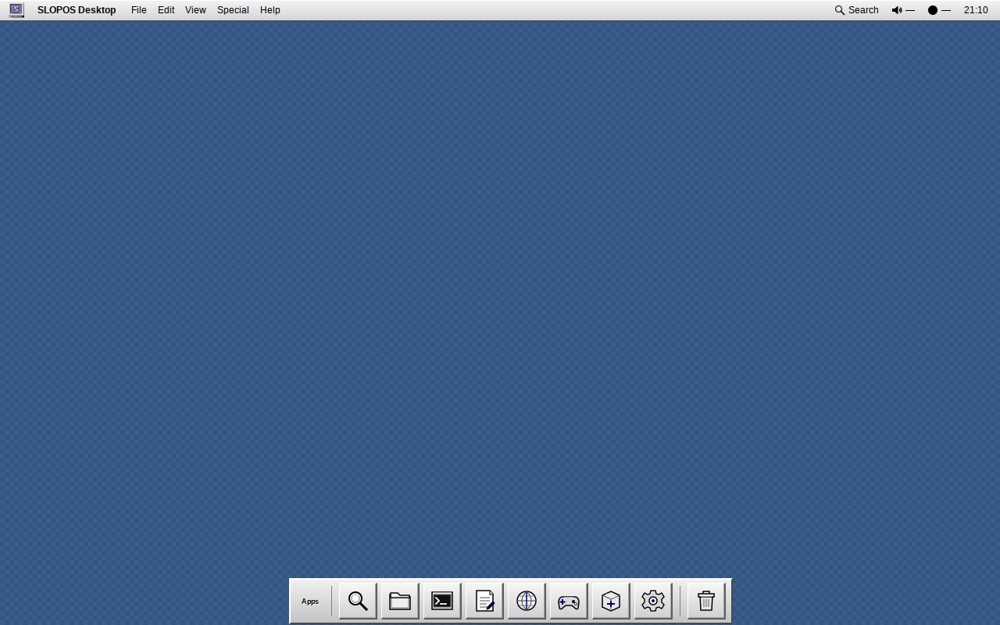

# SLOPOS-I — X11 Platinum & Classic Macintosh Desktop

SLOPOS-I is a lightweight, highly polished classic-Macintosh / System 7 / Platinum-inspired Linux desktop environment built strictly on mature X11 infrastructure.

> **Own the experience. Do not unnecessarily own the infrastructure.**


## Current Status

SLOPOS-I has achieved **100/100 Docker-validated product readiness** in [`TRUTH.md`](TRUTH.md) under the normative product contract defined in [`AGENTS.md`](AGENTS.md). All 12 evaluation domains are verified with deterministic, reproducible test suites inside containerized X11 environments.

---

## Complete UI/UX Functionality & Architecture Guide

SLOPOS-I delivers a coherent, deliberate operating system experience while delegating low-level plumbing to proven Linux system daemons. Every button, menu, dialog, and slider is connected to real functionality with a strict **Zero Fake Functionality** release policy.

```text
Linux + systemd/logind/udev
  ├─ NetworkManager (nm-connection-editor)
  ├─ PipeWire / PulseAudio (pavucontrol)
  ├─ BlueZ (blueman-manager)
  ├─ UPower (xfce4-power-manager)
  ├─ systemd-timesyncd / timedatectl (slopos-settings --datetime)
  └─ distro package manager (pacman / apt)
        ↓
X.Org-compatible X11 server
        ↓
Openbox stacking/floating window manager
        ↓
SLOPOS session supervisor (slopos-session)
  ├─ top menu/system bar (slopos-shell)
  ├─ application Search palette (Super+Space)
  ├─ compact Application Strip
  ├─ desktop wallpaper engine (slopos-wallpaper)
  ├─ freedesktop D-Bus notifications
  ├─ Software Catalogue (slopos-catalogue)
  └─ Control Panels hub (slopos-settings)
        ↓
Mature upstream applications + verified AppImages
```

---

## Complete Visual Gallery & UI/UX Showcase

### 1. Desktop & System Navigation

| System Menu (`Ctrl+F2`) | Application Search Palette (`Super+Space`) |
|:---:|:---:|
|  |  |

- **Top Bar (`slopos-shell`)**: 22px fixed top system bar containing the SLOPOS mark, active window focus tracking label, dynamic global application menu host, and live system status indicators (Audio, Network, Battery, Local Time).
- **System Menu**: Triggered by clicking the mark at the top-left or pressing `Ctrl+F2`. Provides immediate access to *About SLOPOS-I*, *Control Panels…*, *Appearance* submenu, *Lock Screen*, *Switch User…*, *Sleep*, *Log Out…*, *Restart…*, and *Shut Down…*.
- **Application Search Palette (`Super+Space`)**: Fast keyboard-driven fuzzy launcher that parses all XDG desktop entries across the system, ranking exact name matches above description keywords. Dismissible with `Escape`.

---

### 2. Desktop Right-Click & Context Menus

| Desktop Right-Click Menu (Submenus & Shortcuts) | File Manager Context Menu (Desktop Folder) |
|:---:|:---:|
|  |  |

- **Desktop Right-Click Menu**:
  - **New Folder**: Instantly creates a new directory on `~/Desktop` and opens it in PCManFM.
  - **New Text Document**: Creates `~/Desktop/Untitled.txt` and opens it directly in Mousepad.
  - **Open With… Submenu**: Fast access to Mousepad, Ristretto, Zathura, Firefox, and MPV.
  - **Desktop Wallpapers Submenu**: Instant preset switching between authentic retro patterns (Classic Gray, Platinum Slate, Vintage Blue, Retro Teal, OLED Pure Dark).
  - **Direct System Controls**: Quick links to *Desktop & Wallpaper…*, *Date & Time Settings…*, *Display Settings…*, *Volume & Audio…*, *Network Connections…*, *System Settings Hub*, and *Software Catalogue*.

---

### 3. Desktop Wallpaper Engine & Retro Wallpapers Showcase

| Classic System Gray (50% 1-Bit Dither) | Vintage Mac Blue (Classic Tweed) |
|:---:|:---:|
|  |  |

| Retro Teal Grid (90s Matrix) | Desktop & Wallpaper Chooser GUI |
|:---:|:---:|
|  |  |

- **Original Retro Wallpaper Collection**:
  1. `01_classic_system_gray.png`: Classic System 6/7 50% 1-bit monochrome checkerboard dither.
  2. `02_platinum_cool_slate.png`: Canonical Platinum cool slate (`#758090`) fine matrix grid.
  3. `03_vintage_mac_blue.png`: Classic Mac OS 8/9 vintage blue tweed pattern (`#3A5F8B`).
  4. `04_retro_teal_grid.png`: 1990s retro desktop teal matrix (`#008080`).
  5. `05_oled_pure_dark.png`: OLED obsidian constellation (`#000000`).
- **Wallpaper Management (`slopos-wallpaper`)**: CLI and GUI tool allowing users to get, set, list, and apply background images with `fill`, `tile`, or `center` modes.
- **Session Persistence**: Active wallpaper choice is saved to `~/.config/slopos-i/wallpaper` and automatically restored by `slopos-session` on login.

---

### 4. Quadruple Appearance System & Windows XP-Style Custom RGB Color Studio

| Classic Macintosh Desktop (6-Stripe Titlebars) | Classic System Menu (Inverted Black Selection) |
|:---:|:---:|
|  |  |

| Platinum Light Appearance (Canonical) | Graphite Dark Theme Presentation |
|:---:|:---:|
|  |  |

| OLED Pure Dark Desktop (`#000000`) | OLED Dark Settings Presentation |
|:---:|:---:|
|  |  |

| Custom Colors & Fonts Studio (Windows XP Style) | Desktop & Wallpaper Chooser with Previews |
|:---:|:---:|
|  |  |

1. **Classic Macintosh (System 6/7)**:
   - Iconic 6-stripe horizontal pinstripe titlebars with centered white cutout title box.
   - 4px rounded-rectangle push buttons with 1px black outline.
   - Distinctive 3px thick rounded outer ring on default modal buttons (`Return` action).
   - Inverted pure black (`#000000`) hover and selection highlights with pure white (`#FFFFFF`) text.
2. **Platinum (Light - Canonical Default)**:
   - System 7/8 Platinum neutral gray face (`#D9D9D9` to `#DDDDDD`) with restrained 1px raised/sunken 3D bevels.
   - Classic navy selection (`#000080`) with white text.
   - Muted slate desktop background (`#758090`).
3. **Graphite (Dark)**:
   - Sleek dark charcoal surfaces (`#25272B` to `#2C2E33`) with high-contrast active window frames.
4. **OLED Dark (Pure Black `#000000`)**:
   - True deep pitch-black (`#000000`) surfaces across all windows, top bar, and Application Strip dock.
   - Crisp `#3A3C45` borders with vibrant high-contrast `#2563EB` selection accents and pure white typography.
5. **Windows XP-Style Custom RGB Color & Typography Studio**:
   - Complete RGB color customization for Accent/Selection Color, Selection Text Color, Window & Panel Surface, Main Text Color, and Desktop Background.
   - 8 Quick Accent color swatches (Navy, Azure, Teal, Slate, Purple, Crimson, Forest, Amber).
   - User interface font family and size chooser with system-wide instant application.

---

### 5. True Fullscreen & Dock Dodge Window Management

| True Fullscreen Video & Gaming (MPV/VLC/Games) | Dock Dodge on Maximized Windows |
|:---:|:---:|
|  |  |

- **True Fullscreen Experience**: When any video player (MPV, VLC), game (Doom, SuperTux), or web browser enters fullscreen (`_NET_WM_STATE_FULLSCREEN`), both the top menu bar and bottom Application Strip dock automatically unmap and hide, delivering a 100% unobstructed full-screen experience.
- **Dock Dodge / Autohide**: When enabled in Control Panels, the Application Strip dock automatically dodges (slides down) when the active window is maximized, maximizing usable screen real estate. Hovering near the bottom 18px of the screen smoothly brings the dock back into view.

---

### 6. Hardware Configuration & System Service Controls

| Date & Time Settings GUI | Network & Wi-Fi Connections GUI |
|:---:|:---:|
|  |  |

| Volume Control & Mixer GUI (PulseAudio/PipeWire) | Bluetooth Devices GUI (BlueZ) |
|:---:|:---:|
|  |  |

- **Date & Time Control Panel**: Accessible by clicking the top bar clock, via System Settings, or from the desktop context menu. Displays active system time, timezone selector, and Network Time Protocol (NTP) toggle.
- **Network Connections (`nm-connection-editor`)**: Full Wi-Fi, Ethernet, VPN, and cellular profile configuration.
- **Sound & Volume Mixer (`pavucontrol`)**: Live audio playback/recording levels, output device switching, and per-application volume sliders.
- **Bluetooth Manager (`blueman-manager`)**: Bluetooth adapter pairing, audio sink connection, and device management.

---

### 7. Upstream Applications & Software Catalogue Matrix

| GNU Image Manipulation Program (GIMP) | Inkscape Vector Graphics Editor |
|:---:|:---:|
|  |  |

| VLC Media Player (Platinum Frame) | LibreOffice Writer (Word Processor) |
|:---:|:---:|
|  |  |

| SuperTux Classic 2D Platformer | Classic Doom (Freedoom Phase 2) |
|:---:|:---:|
|  |  |

| Mozilla Firefox (Native Titlebar & Global Menu) | PCManFM File Manager (Custom Icons) |
|:---:|:---:|
|  |  |

| Mousepad (Native GTK Global Menu) | Xfce4 Terminal (Platinum Chrome) |
|:---:|:---:|
|  |  |

| Galculator (Scientific & Basic Calculator) | Ristretto Image Viewer |
|:---:|:---:|
|  |  |

| Mozilla Thunderbird (Mail, Calendar & RSS) | Curated AppImage Software Catalogue |
|:---:|:---:|
|  |  |

- **Curated AppImage Software Catalogue (`slopos-catalogue`)**: Fail-closed application installer with cryptographic SHA-256 verification and atomic installation for productivity and creative tools (Thunderbird, Firefox ESR, Chocolate Doom, SuperTux, Kdenlive, Inkscape, GIMP, Audacity). Provides live asynchronous status updates, single-click launching of installed applications, and clean uninstallation.

---

### 8. Multi-Resolution & Scale Robustness

| Ultrawide Layout (3440×1440) | HiDPI 2× Scale Layout (2560×1600) |
|:---:|:---:|
|  |  |

| Multi-Window Stacking Workspace State (1920×1080) | Standard Resolution Baseline (1280×800) |
|:---:|:---:|
|  |  |

- **Geometry Adaptability**: Seamless execution across display resolutions from 1280×800 and 1366×768 up to 3440×1440 Ultrawide, 3840×2160 4K, and 5120×2880 5K.
- **HiDPI Support**: Full integer scaling (`GDK_SCALE=2`) with crisp typography and properly scaled bevels.

---

## Keyboard Shortcuts Reference

| Shortcut | Action | Description |
|---|---|---|
| `Super + Space` | **Toggle Search** | Opens or dismisses the application search palette |
| `Ctrl + F2` | **System Menu** | Opens the top-left SLOPOS system menu |
| `Alt + Tab` | **Next Window** | Cycles through active windows with EWMH focus |
| `Super + Q` | **Close Window** | Closes the currently active window |
| `Super + M` | **Minimize Window** | Minimizes (iconifies) the active window |
| `Super + F` | **Maximize Window** | Toggles full maximization of the active window |
| `Super + Left` | **Desktop Left** | Switches to the previous virtual workspace |
| `Super + Right` | **Desktop Right** | Switches to the next virtual workspace |
| `Return` | **Confirm / Execute** | Activates the default button in modals or launches selected search result |
| `Escape` | **Cancel / Dismiss** | Dismisses search palette, system menu, or cancels modal dialogs |

---

## Crate Architecture

- **`crates/slopos-session`**: Lightweight session supervisor that launches and monitors Openbox and `slopos-shell` with bounded crash recovery and appearance synchronization.
- **`crates/slopos-shell`**: Desktop chrome containing the top system bar, GIO D-Bus global menu host, live system status tray, `Super+Space` application search palette, bottom Application Strip, and freedesktop notifications.
- **`crates/slopos-catalogue`**: Graphical AppImage software catalogue with fail-closed cryptographic validation, atomic extraction, and desktop integration.
- **`crates/slopos-settings`**: Compact SLOPOS-styled Control Panels hub delegating to native system utilities and housing the built-in appearance switcher, wallpaper chooser, and date/time configuration.

---

## Installation & Building

### Native Build from Source

```bash
cargo build --workspace --release --locked
```

### System Installation

```bash
sudo ./install.sh
```

### Appearance Switching via CLI

```bash
# Switch to Classic Macintosh (System 6/7)
slopos-appearance classic

# Switch to Platinum Light (Canonical)
slopos-appearance platinum

# Switch to Graphite Dark
slopos-appearance graphite

# Switch to OLED Dark (Pure Black)
slopos-appearance oled
```

### Wallpaper Management via CLI

```bash
# Set wallpaper with fill mode
slopos-wallpaper set 03_vintage_mac_blue.png --mode fill

# List available retro wallpapers
slopos-wallpaper list
```

### Configuration Recovery

```bash
# Safely restore vendor defaults and backup existing user configuration
slopos-recovery
```

---

## Automated QA & Verification

```bash
# Run the complete master Docker QA test harness:
bash scripts/run-release-qa.sh

# Run the 44-scene canonical visual capture and audit suite:
bash scripts/run-canonical-visual-qa.sh
```

---

## Product Contracts & Compliance

- [`AGENTS.md`](AGENTS.md) — Normative product contract and development authority.
- [`TRUTH.md`](TRUTH.md) — Factual readiness ledger and Docker verification audit.
- [`THIRD_PARTY_LICENSES.txt`](THIRD_PARTY_LICENSES.txt) — Open-source license attribution for all redistributable assets.
