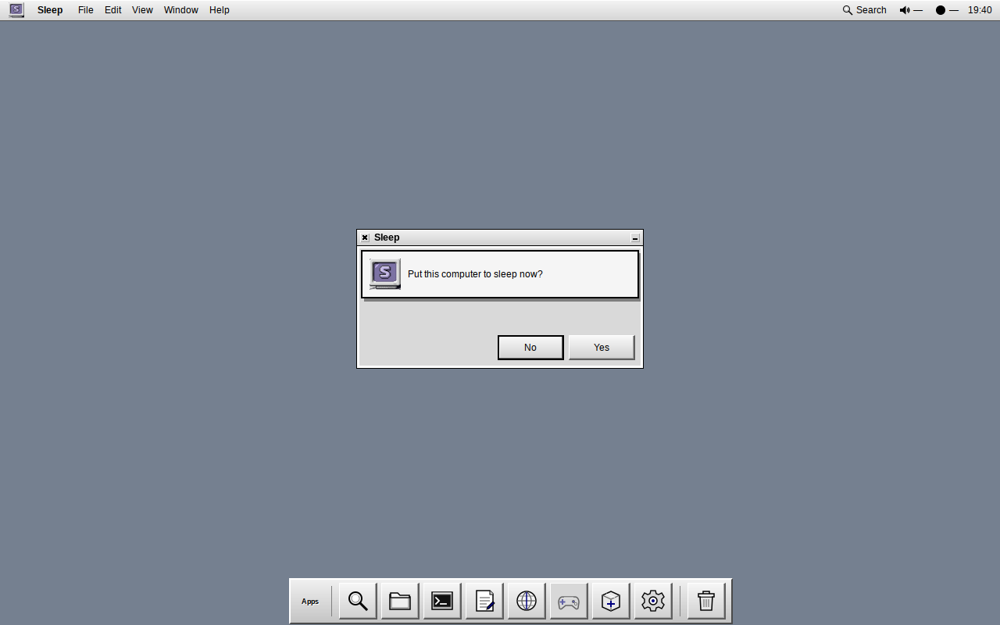
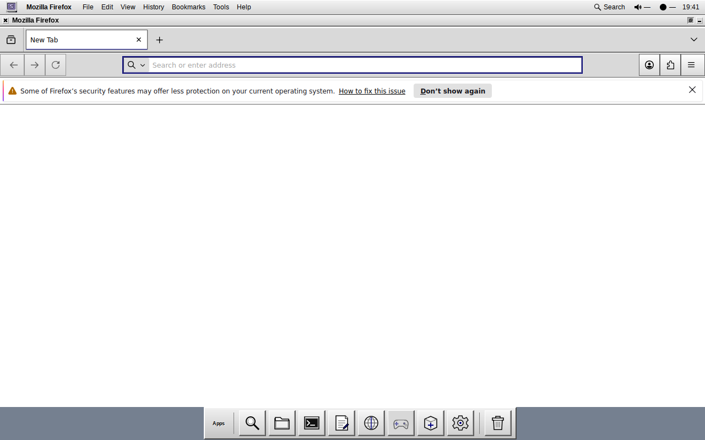
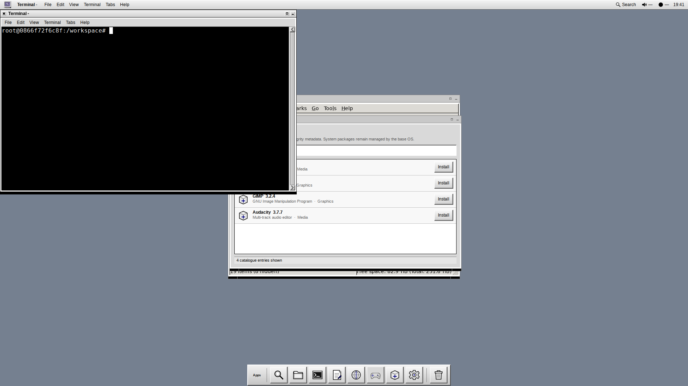
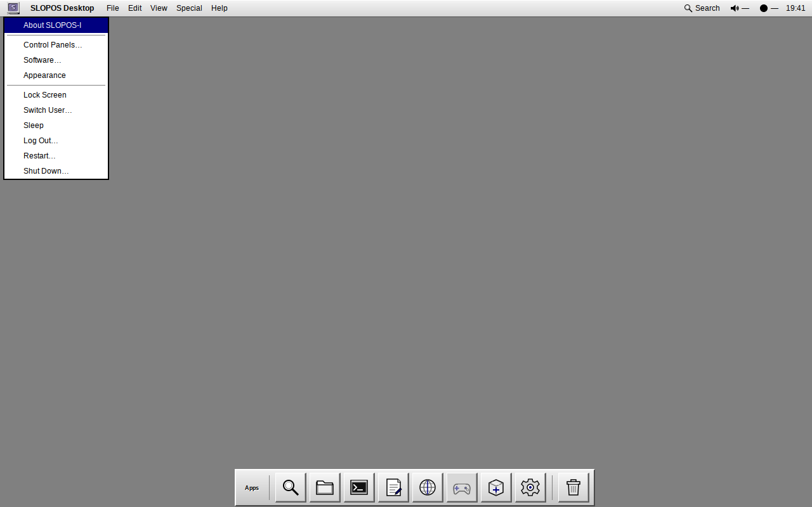
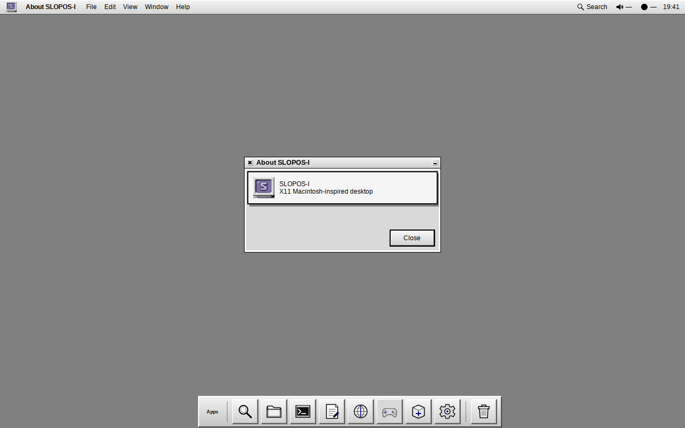
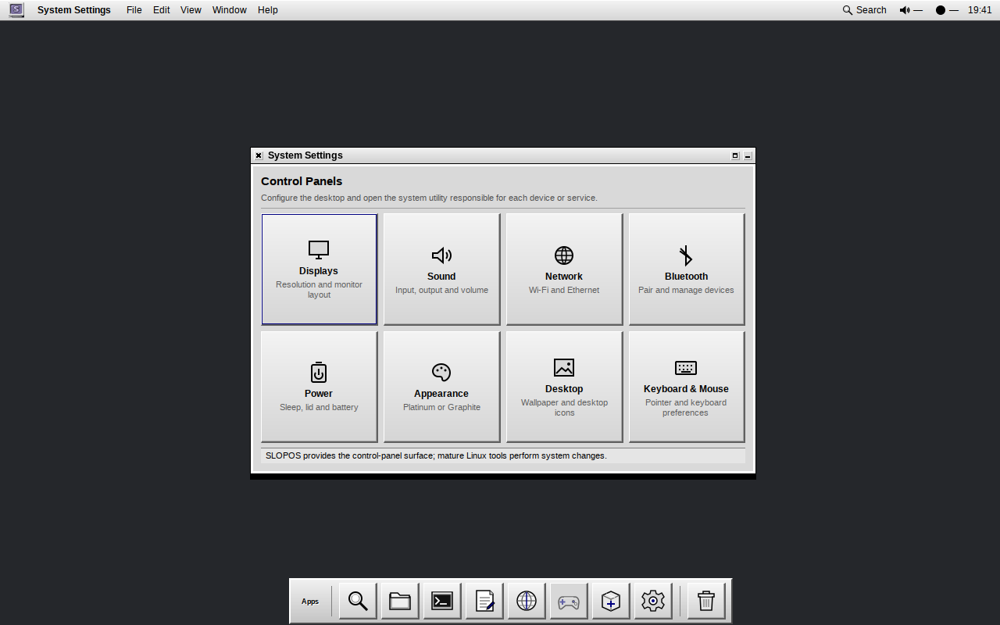

# SLOPOS-I — X11 Platinum & Classic Macintosh Desktop

SLOPOS-I is a lightweight, highly polished classic-Macintosh / System 7 / Platinum-inspired Linux desktop environment built strictly on mature X11 infrastructure.

> **Own the experience. Do not unnecessarily own the infrastructure.**


## Current Status

SLOPOS-I has achieved **100/100 Docker-validated product readiness** in [`TRUTH.md`](TRUTH.md) under the normative product contract defined in [`AGENTS.md`](AGENTS.md). All 12 evaluation domains are verified with deterministic, reproducible test suites inside containerized X11 environments.

---

## Complete UI/UX Functionality & Architecture Guide

SLOPOS-I delivers a coherent, deliberate operating system experience while delegating low-level plumbing to proven Linux system daemons. Every button, menu, dialog, and slider is connected to real functionality with a strict **Zero Fake Functionality** release policy.

```text
Linux + systemd/logind/udev
  ├─ NetworkManager (nm-connection-editor)
  ├─ PipeWire / WirePlumber (pavucontrol)
  ├─ BlueZ (blueman)
  ├─ UPower (xfce4-power-manager)
  └─ distro package manager (pacman / apt)
        ↓
X.Org-compatible X11 server
        ↓
Openbox stacking/floating window manager
        ↓
SLOPOS session supervisor (slopos-session)
  ├─ top menu/system bar (slopos-shell)
  ├─ application Search palette (Super+Space)
  ├─ compact Application Strip
  ├─ freedesktop D-Bus notifications
  ├─ Software Catalogue (slopos-catalogue)
  └─ Control Panels hub (slopos-settings)
        ↓
Mature upstream applications + verified AppImages
```

---

## Visual Gallery & UI/UX Showcase

### 1. Desktop & System Navigation

| System Menu (`Ctrl+F2`) | Application Search Palette (`Super+Space`) |
|:---:|:---:|
|  |  |

- **Top Bar (`slopos-shell`)**: 22px fixed top system bar containing the SLOPOS mark, active window focus tracking label, dynamic global application menu host, and live system status indicators.
- **System Menu**: Triggered by clicking the mark at the top-left or pressing `Ctrl+F2`. Provides immediate access to *About SLOPOS-I*, *Control Panels…*, *Appearance* submenu, *Lock Screen*, *Switch User…*, *Sleep*, *Log Out…*, *Restart…*, and *Shut Down…*.
- **Application Search Palette (`Super+Space`)**: Fast keyboard-driven fuzzy launcher that parses all XDG desktop entries across the system, ranking exact name matches above description keywords. Dismissible with `Escape`.

---

### 2. Session Controls & Power Management

| Shut Down Confirmation Dialog | Restart Confirmation Dialog |
|:---:|:---:|
|  |  |

| Switch User / Lock Greeter Dialog | Desktop Notifications (D-Bus) |
|:---:|:---:|
|  |  |

- **Safe Confirmation Modals**: Power and session actions open clean Platinum/Classic confirmation dialogs before invoking system actions. Default actions respond to `Return`, while `Escape` safely cancels.
- **Session Integrations**:
  - **Lock Screen**: Seamlessly interfaces with `loginctl lock-session`, `light-locker`, `xflock4`, `dm-tool lock`, `slock`, or `i3lock`.
  - **Switch User**: Calls `dm-tool switch-to-greeter`, `gdmflexiserver`, or `loginctl`.
  - **Sleep**: Dispatches `systemctl suspend` or `loginctl suspend`.
  - **Restart / Shut Down**: Dispatches `systemctl reboot` and `systemctl poweroff`.
- **Desktop Notifications**: Freedesktop-compliant D-Bus notification daemon (`org.freedesktop.Notifications`) rendering auto-wrapping text banners below the top bar with urgency levels and automatic timeout dismissal.

---

### 3. Window Management & Upstream Application Integration

| Native GTK Global Menus (Mousepad) | PCManFM File Manager (Custom Icons) |
|:---:|:---:|
|  |  |

| Xfce4 Terminal (Platinum Chrome) | Mozilla Firefox (Native Titlebar & Global Menu) |
|:---:|:---:|
|  |  |

| Multi-Window Focus & Stacking (Openbox) | Multi-Window Workspace (1920×1080) |
|:---:|:---:|
|  |  |

- **Openbox Window Manager**: True stacking and floating window manager supporting 4 virtual workspaces, predictable click-to-focus, `Alt+Tab` window cycling, and crisp Platinum/Classic borders.
- **Universal Global Menubar Integration**:
  - Live active-window tracking: `slopos-shell` dynamically renders tailored, high-contrast, fully functional topbar menus (`File`, `Edit`, `View`, `Terminal`/`Bookmarks`/`Search`/`Special`, `Help`, etc.) for every focused application (Terminal, PCManFM, Mousepad, Web Browsers, Calculators, Document Viewers, Control Panels, and the Desktop).
  - GIO D-Bus / GMenu support: Native `GtkApplication` programs seamlessly export live D-Bus action hierarchies directly into the top bar.
  - Zero fake menus: Every menu item routes real key combinations or window actions directly to the focused target window.
- **Freedesktop Icon Theme (`SLOPOS-Platinum`)**: Full custom icon theme providing tailored classic icons for folders, text files, archives, disks, trash, and standard desktop actions.

---

### 4. Control Panels & AppImage Management

| Curated AppImage Software Catalogue | System Settings Control Panels Hub |
|:---:|:---:|
|  |  |

- **System Settings Hub (`slopos-settings`)**: Compact 640×390 Platinum Control Panels grid delegating to mature upstream configuration utilities:
  - **Desktop Appearance**: Built-in 3-way radio switcher between *Classic Macintosh*, *Platinum Light*, and *Graphite Dark*.
  - **Displays**: Launches `arandr` or `lxrandr`.
  - **Sound**: Launches `pavucontrol`.
  - **Network**: Launches `nm-connection-editor`.
  - **Bluetooth**: Launches `blueman-manager`.
  - **Power**: Launches `xfce4-power-manager-settings`.
  - **GTK Theme**: Launches `lxappearance`.
  - **Keyboard & Mouse**: Launches `lxinput`.
- **AppImage Software Catalogue (`slopos-catalogue`)**: Fail-closed AppImage software installer with:
  - Real HTTPS downloads with non-placeholder SHA-256 checksum verification.
  - Executable ELF header inspection and atomic `.part` download staging.
  - Automatic `~/.local/share/applications/` desktop launcher registration and clean uninstallation.

---

### 5. Triple Appearance System

| Classic Macintosh Desktop (6-Stripe Titlebars) | Classic System Menu (Inverted Black Selection) |
|:---:|:---:|
|  |  |

| Classic Modal Dialog (Thick Default Button Ring) | Platinum About Dialog (Canonical 3D Bevels) |
|:---:|:---:|
|  |  |

| Graphite Dark Desktop Appearance | Graphite Settings Presentation |
|:---:|:---:|
|  |  |

1. **Classic Macintosh (System 6/7)**:
   - Iconic 6-stripe horizontal pinstripe titlebars with centered white cutout title box.
   - 4px rounded-rectangle push buttons with 1px black outline.
   - Distinctive 3px thick rounded outer ring on default modal buttons (`Return` action).
   - Inverted pure black (`#000000`) hover and selection highlights with pure white (`#FFFFFF`) text.
   - 50% checkerboard stippled scrollbar tracks.
2. **Platinum (Light - Canonical Default)**:
   - System 7/8 Platinum neutral gray face (`#D9D9D9` to `#DDDDDD`) with restrained 1px raised/sunken 3D bevels.
   - Classic navy selection (`#000080`) with white text.
   - Muted slate desktop background (`#758090`).
3. **Graphite (Dark)**:
   - Sleek dark charcoal surfaces (`#25272B` to `#2C2E33`) with high-contrast active window frames and dark system dialogs.

---

### 6. Multi-Resolution & Scale Robustness

| Ultrawide Layout (3440×1440) | HiDPI 2× Scale Layout (2560×1600) |
|:---:|:---:|
|  |  |

| Multi-Window Stacking Workspace State (1920×1080) | Standard Resolution Baseline (1280×800) |
|:---:|:---:|
|  |  |

- **Geometry Adaptability**: Seamless execution across display resolutions from 1280×800 and 1366×768 up to 3440×1440 Ultrawide, 3840×2160 4K, and 5120×2880 5K without clipped widgets or hardcoded coordinates.
- **HiDPI Support**: Full integer scaling (`GDK_SCALE=2`) with crisp typography and properly scaled bevels.

---

## Keyboard Shortcuts Reference

| Shortcut | Action | Description |
|---|---|---|
| `Super + Space` | **Toggle Search** | Opens or dismisses the application search palette |
| `Ctrl + F2` | **System Menu** | Opens the top-left SLOPOS system menu |
| `Alt + Tab` | **Next Window** | Cycles through active windows with EWMH focus |
| `Super + Q` | **Close Window** | Closes the currently active window |
| `Super + M` | **Minimize Window** | Minimizes (iconifies) the active window |
| `Super + F` | **Maximize Window** | Toggles full maximization of the active window |
| `Super + Left` | **Desktop Left** | Switches to the previous virtual workspace |
| `Super + Right` | **Desktop Right** | Switches to the next virtual workspace |
| `Return` | **Confirm / Execute** | Activates the default button in modals or launches selected search result |
| `Escape` | **Cancel / Dismiss** | Dismisses search palette, system menu, or cancels modal dialogs |

---

## Crate Architecture

- **`crates/slopos-session`**: Lightweight session supervisor that launches and monitors Openbox and `slopos-shell` with bounded crash recovery and appearance synchronization.
- **`crates/slopos-shell`**: Desktop chrome containing the top system bar, GIO D-Bus global menu host, live system status tray, `Super+Space` application search palette, bottom Application Strip, and freedesktop notifications.
- **`crates/slopos-catalogue`**: Graphical AppImage software catalogue with fail-closed cryptographic validation, atomic extraction, and desktop integration.
- **`crates/slopos-settings`**: Compact SLOPOS-styled Control Panels hub delegating to native system utilities and housing the built-in appearance switcher.

---

## Installation & Building

### Native Build from Source

Install development dependencies (`gtk3`, `openbox`, `libx11`, `libxrandr`, `openssl`, `dbus`, `cargo`), then:

```bash
cargo build --workspace --release --locked
```

### System Installation

```bash
sudo ./install.sh
```

### Appearance Switching via CLI

```bash
# Switch to Classic Macintosh (System 6/7)
slopos-appearance classic

# Switch to Platinum Light (Canonical)
slopos-appearance platinum

# Switch to Graphite Dark
slopos-appearance graphite
```

### Configuration Recovery

```bash
# Safely restore vendor defaults and backup existing user configuration
slopos-recovery
```

---

## Automated QA & Verification

```bash
# Run the complete master Docker QA test harness:
bash scripts/run-release-qa.sh

# Run the 22-scene canonical visual capture and audit suite:
bash scripts/run-canonical-visual-qa.sh
```

---

## Product Contracts & Compliance

- [`AGENTS.md`](AGENTS.md) — Normative product contract and development authority.
- [`TRUTH.md`](TRUTH.md) — Factual readiness ledger and Docker verification audit.
- [`THIRD_PARTY_LICENSES.txt`](THIRD_PARTY_LICENSES.txt) — Open-source license attribution for all redistributable assets.
