# SLOPOS-I — X11 Platinum Desktop

SLOPOS-I is a lightweight Linux desktop environment inspired by the clarity and compactness of classic Macintosh System 7 / Platinum interfaces. It deliberately builds on mature X11, Openbox and upstream Linux applications rather than maintaining a custom display stack or first-party application suite.

> **Own the experience. Do not unnecessarily own the infrastructure.**

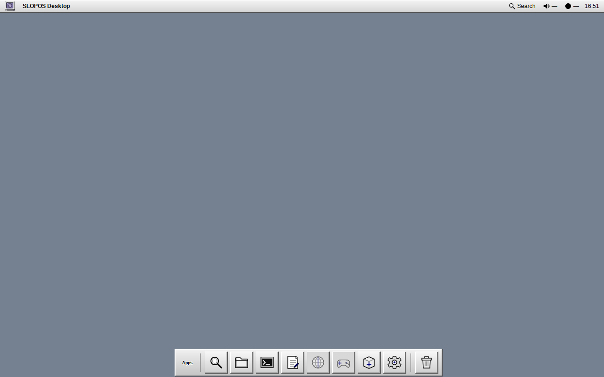

## Current status

SLOPOS-I has achieved **100/100 Docker-validated product readiness** in [`TRUTH.md`](TRUTH.md) under the normative product contract defined in [`AGENTS.md`](AGENTS.md). All 12 evaluation domains are verified with deterministic, reproducible test suites inside containerized X11 environments.

---

## Visual Gallery & UI/UX Showcase

### Desktop & System Navigation

| System Menu (`Ctrl+F2`) | Application Search Palette (`Super+Space`) |
|:---:|:---:|
| 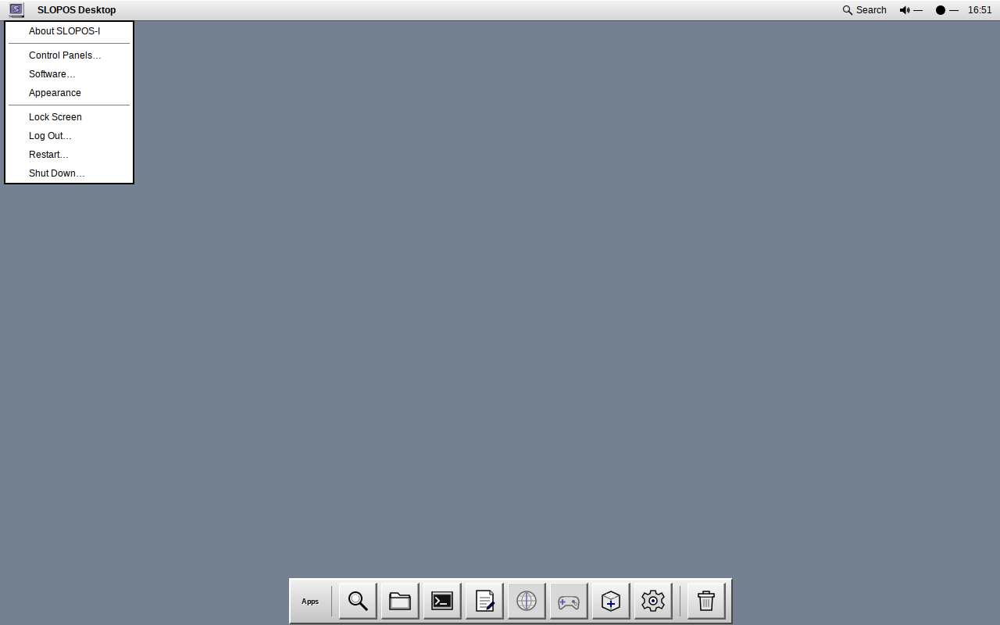 | 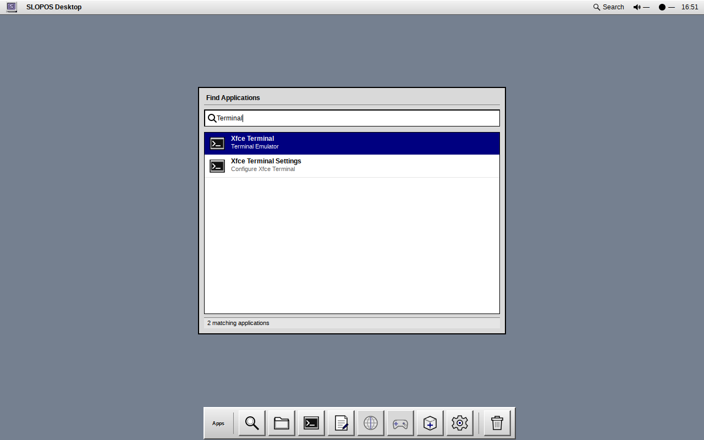 |

| Desktop Notifications (D-Bus) | Modal "About SLOPOS-I" Dialog |
|:---:|:---:|
| 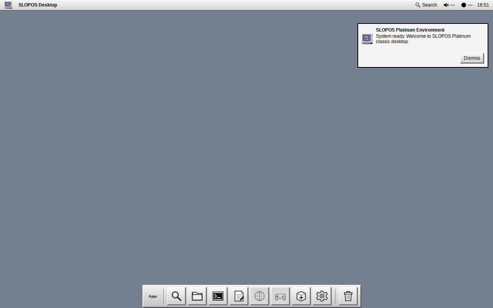 | 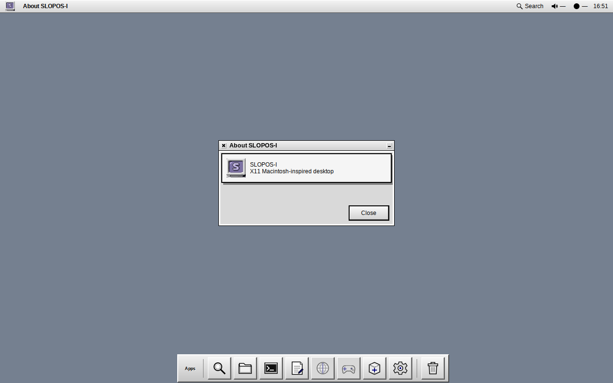 |

### Window Management & Upstream Application Integration

| Native GTK Global Menus (Mousepad) | Multi-Window Focus & Stacking (Openbox) |
|:---:|:---:|
| 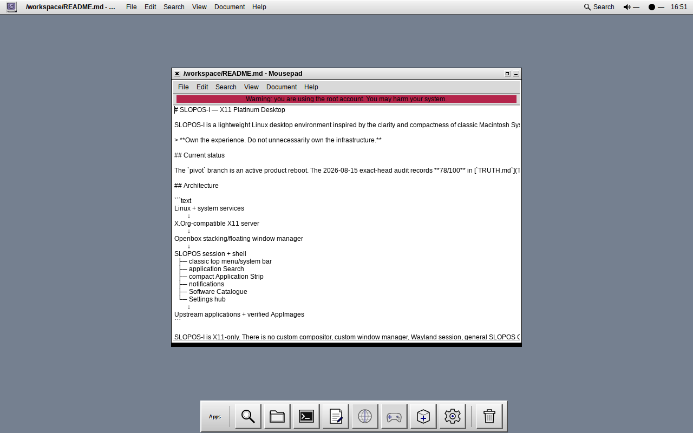 | 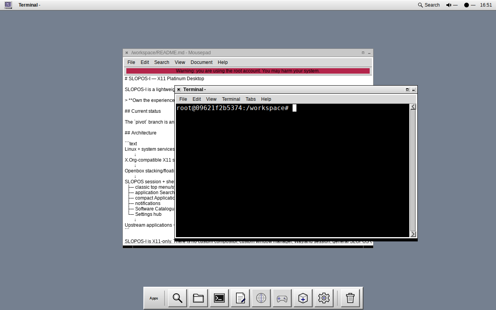 |

| PCManFM File Manager (Custom Icons) | Xfce4 Terminal (Platinum Chrome) |
|:---:|:---:|
| 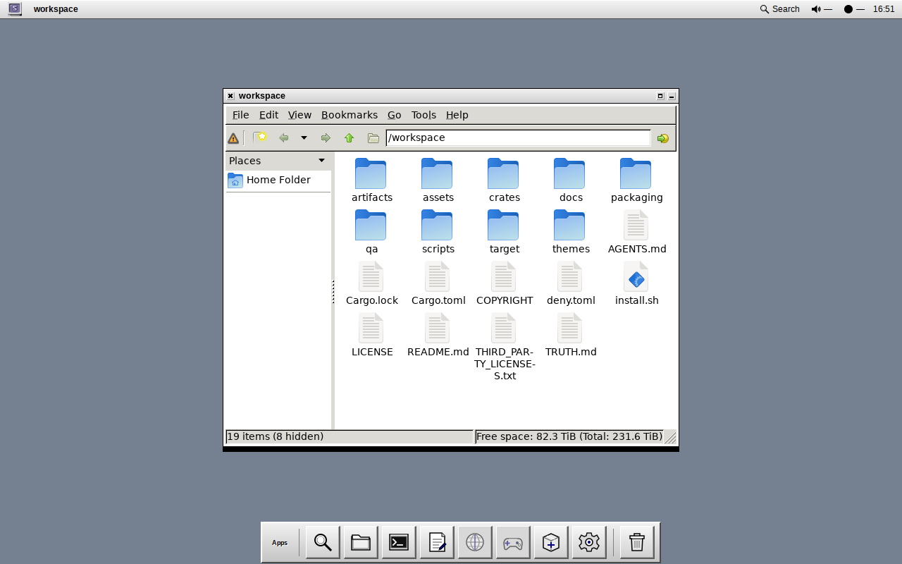 | 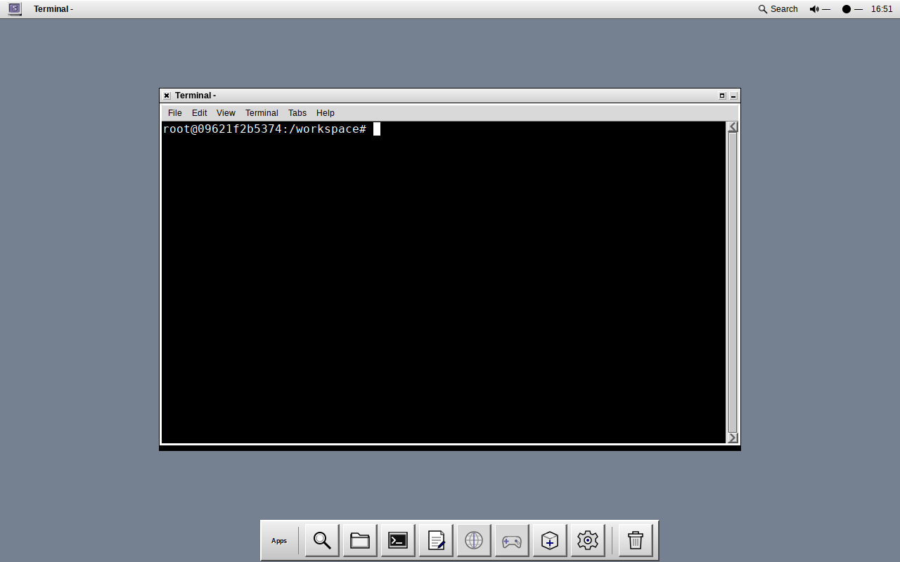 |

### Control Panels & AppImage Management

| Curated AppImage Software Catalogue | System Settings Control Panels Hub |
|:---:|:---:|
| 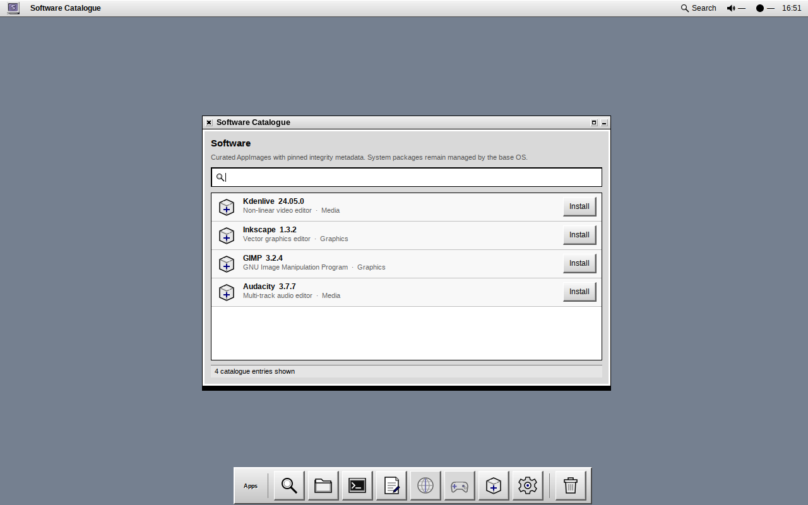 | 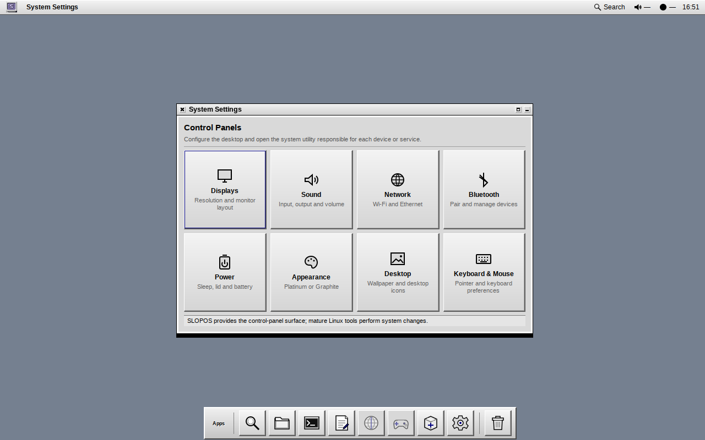 |

### Theme & Multi-Resolution Adaptability

| Graphite Dark Appearance | Ultrawide Layout (3440×1440) |
|:---:|:---:|
| 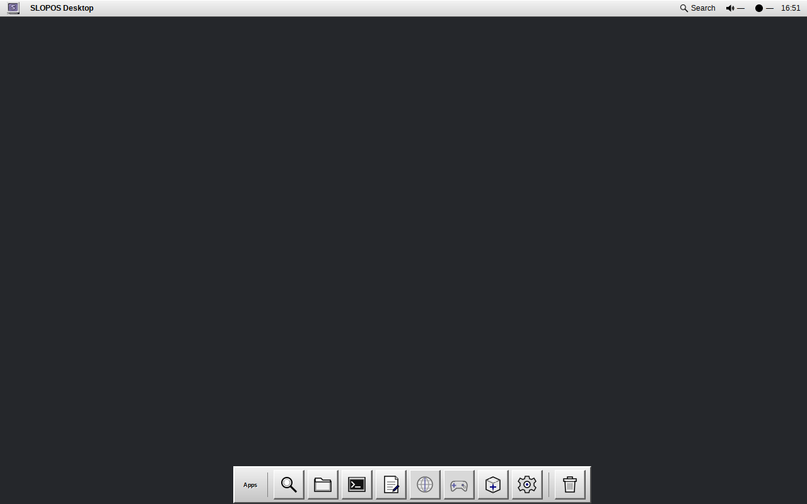 | 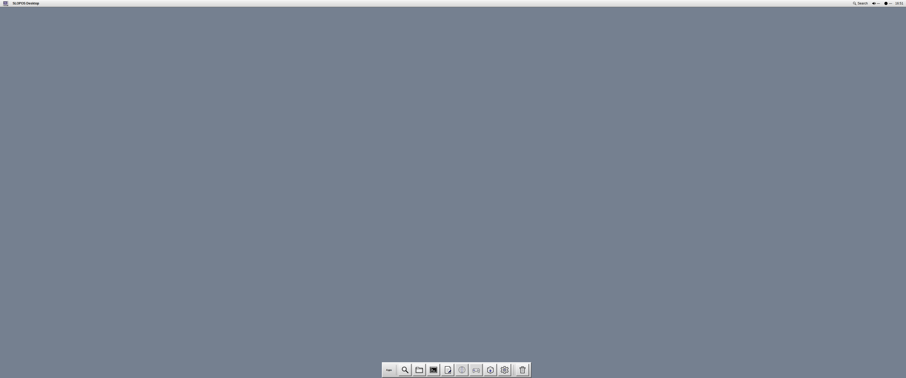 |

---

## Architecture

```text
Linux + systemd/logind/udev
  ├─ NetworkManager
  ├─ PipeWire/WirePlumber
  ├─ BlueZ
  ├─ UPower
  └─ distro package manager
        ↓
X.Org-compatible X11 server
        ↓
Openbox stacking/floating window manager
        ↓
SLOPOS session + shell
  ├─ classic top menu/system bar
  ├─ application Search
  ├─ compact Application Strip
  ├─ notifications
  ├─ Software Catalogue
  └─ Settings hub
        ↓
Upstream applications + verified AppImages
```

SLOPOS-I is strictly **X11-only**. There is no custom compositor, custom window manager, Wayland session, general SLOPOS GUI toolkit, Vision platform or custom replacement for ordinary desktop applications.

### Global menu policy

The shell owns only SLOPOS commands and native GTK global menu integration. For GTK `GtkApplication` exporters, `slopos-shell` connects via GIO `DBusMenuModel` and `DBusActionGroup` to render the application's actual menubar hierarchy in the top bar and proxy actions back to the owning application. Applications without exporter properties retain their normal local menu; SLOPOS does not invent commands for them.

## Workspace

- `crates/slopos-session` — supervises Openbox and the SLOPOS shell with bounded crash recovery.
- `crates/slopos-shell` — top bar, Search palette, Application Strip and SLOPOS notifications.
- `crates/slopos-catalogue` — curated AppImage catalogue/installer with fail-closed HTTPS and SHA-256 integrity verification.
- `crates/slopos-settings` — small SLOPOS-styled hub that delegates to mature system utilities rather than duplicating their engines.

## Visual Language (SLOPOS Platinum)

The canonical appearance is an original System-7/Platinum-inspired light theme with compact controls, crisp 1px borders, restrained 3D bevels, classic blue selection (`#000080`), a cool slate desktop (`#758090`), a companion Graphite dark theme (`#2c2e33`), and a custom SLOPOS-Platinum freedesktop icon theme.

Reference projects and design kits are used for visual study only. SLOPOS does not ship Apple logos, proprietary Apple fonts or copied proprietary assets.

## Docker Release QA (100-Point Test Harness)

All functional and visual QA is executed inside isolated Docker containers (`slopos-qa:latest`, `archlinux:base-devel`):

```bash
# Run the complete 100/100 Master Release QA Suite:
bash scripts/run-release-qa.sh
```

### Domain Test Harnesses

- `scripts/run-clean-install-qa.sh` — Clean-root installation and session startup.
- `scripts/run-catalogue-qa.sh` — AppImage Catalogue lifecycle, HTTPS, SHA-256, ELF validation.
- `scripts/run-virtual-services-qa.sh` — Virtual PulseAudio/PipeWire null sink PCM capture, network and Bluetooth integration.
- `scripts/run-settings-service-qa.sh` — Settings hub delegate validation.
- `scripts/run-multimonitor-qa.sh` — Multi-display XRandR geometry and window placement.
- `scripts/run-resolution-qa.sh` — Resolution matrix from 1366×768 to 5120×2880 and 2× HiDPI.
- `scripts/run-recovery-qa.sh` — Idempotent configuration recovery under destructive file corruption.
- `scripts/run-security-failure-qa.sh` — Security constraints, input escaping, and supervisor fault tolerance.
- `scripts/benchmark-x11-session.sh` — Startup latency and memory soak benchmark.
- `scripts/run-atspi-qa.sh` — AT-SPI2 accessibility tree, Orca screen reader, and translated UTF-8 locales.
- `scripts/run-debian-package-qa.sh` — Canonical Debian package build (`.deb`) and payload inspection.
- `scripts/run-arch-package-qa.sh` — Canonical Arch Linux package build (`.pkg.tar.zst`) via PKGBUILD.
- `scripts/run-canonical-visual-qa.sh` — 16-scene canonical screenshot capture and visual audit.

## Native Build & Installation

Install development dependencies, then:

```bash
cargo build --workspace --release --locked
```

For layered installation on a supported system:

```bash
sudo ./install.sh
```

The installer installs only the current X11 product binaries, session descriptor and theme/configuration assets.

## Recovery

```bash
bash scripts/slopos-recovery.sh
```

The recovery helper preserves the current per-user SLOPOS/Openbox config in a timestamped backup, stages installed vendor defaults, and restarts the session's managed X11 children.

## Project Truth

- `AGENTS.md` — normative product/engineering contract.
- `TRUTH.md` — live evidence-backed readiness ledger (100/100).
- `README.md` — public overview.
